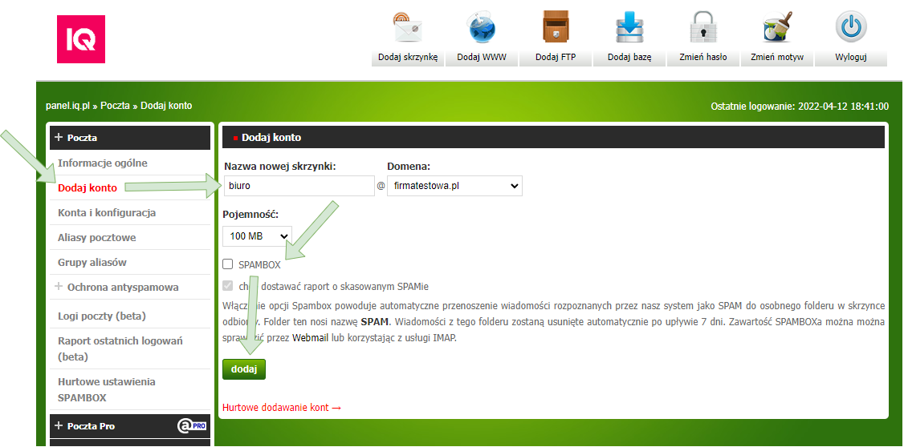
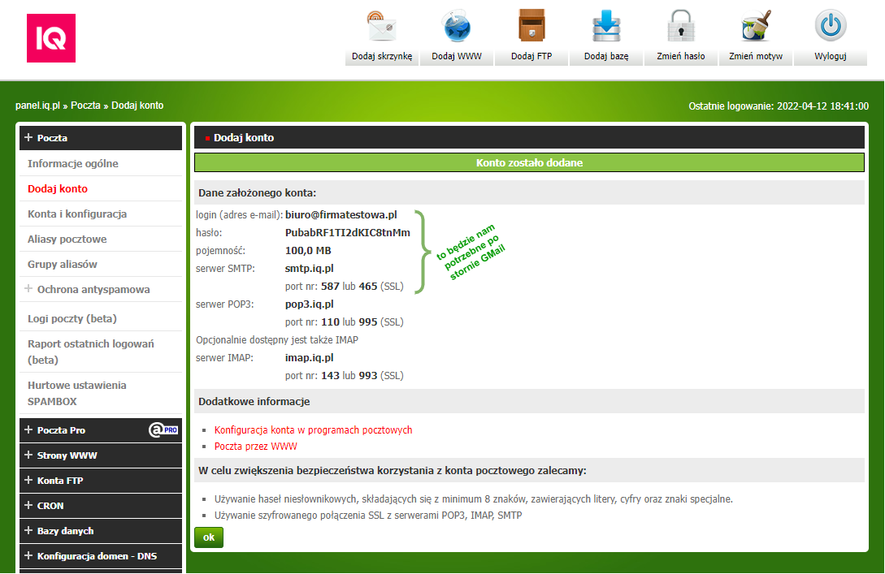
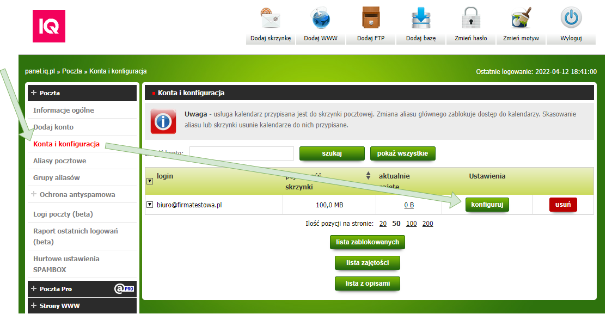
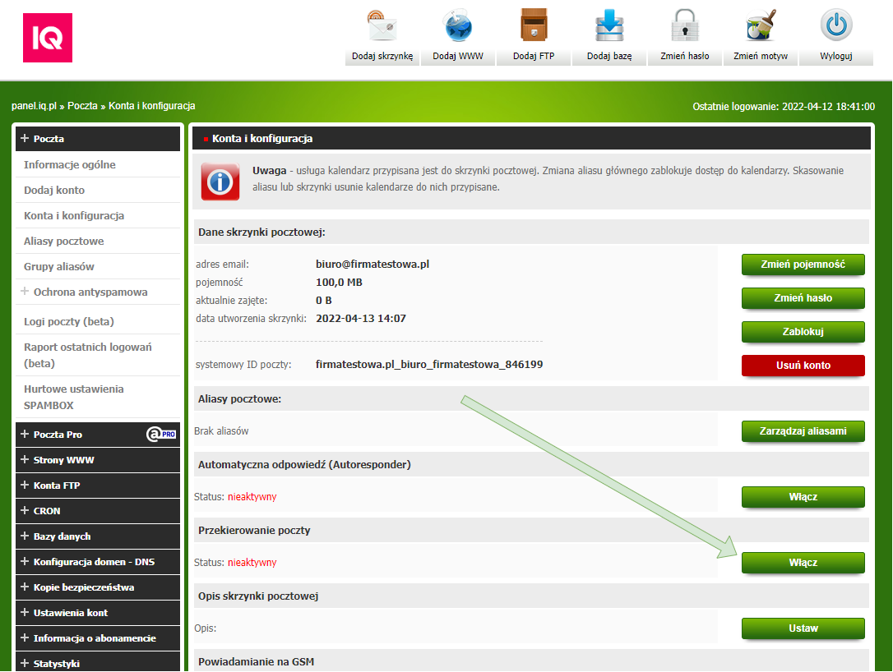
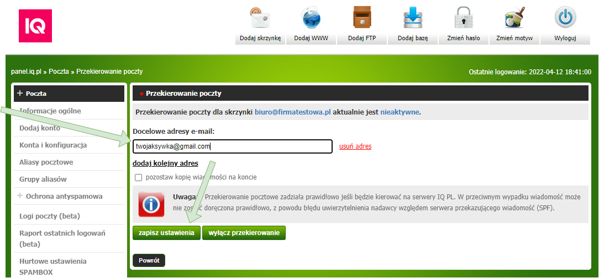
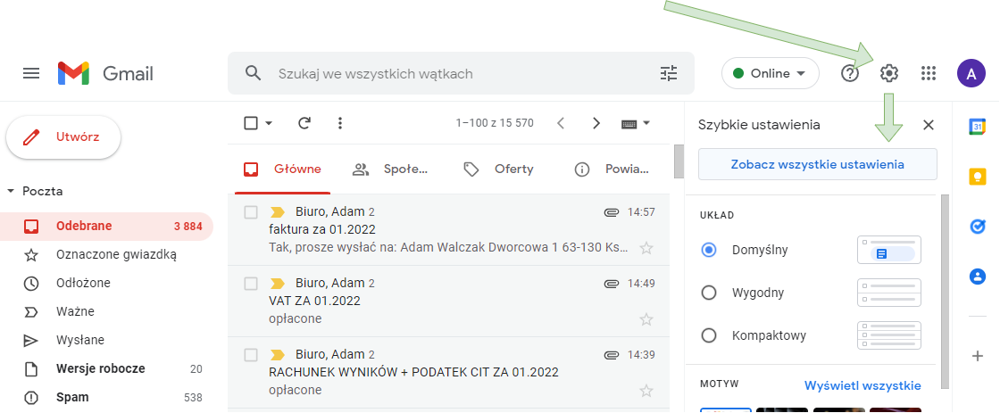
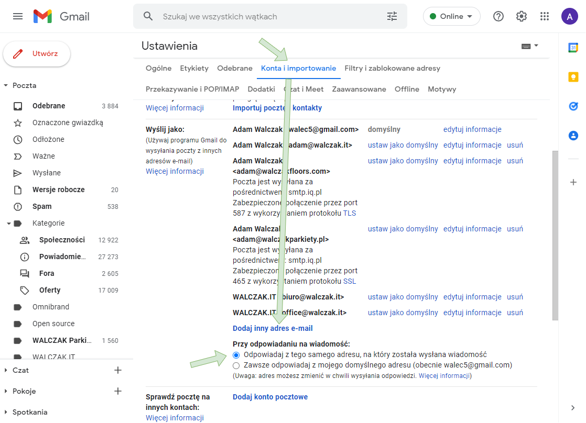
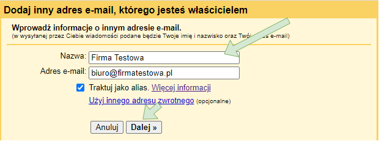
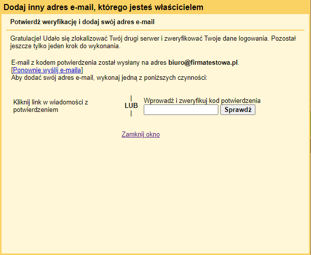
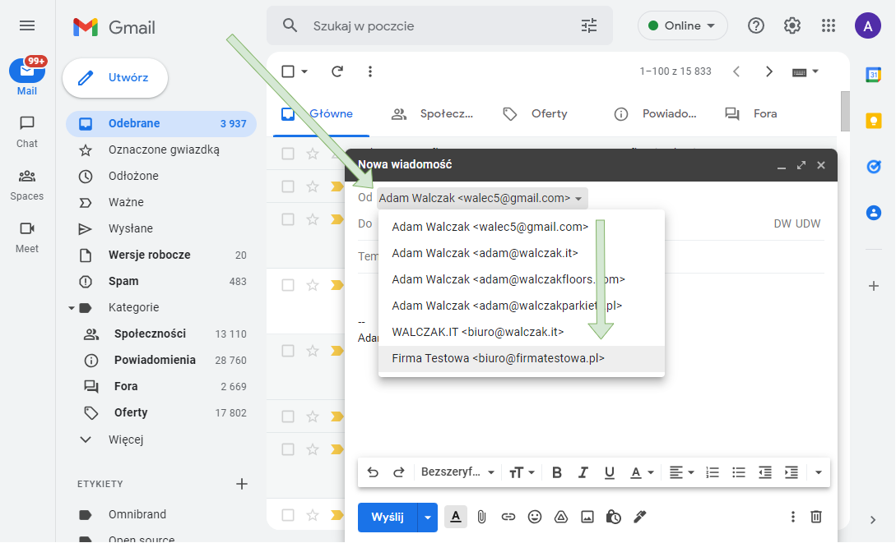

Większość firm po zakupieniu domeny internetowej tworzy od razu firmowe konta email w panelu administracyjnym hostingu i próbuje łączyć się z nimi poprzez aplikacje typu Outlook albo webmail hostingu w przeglądarce. Niestety jest to krok wstecz dla każdego, kto przywykł do bogatej funkcjonalnie skrzynki Gmail oraz powiązanych z nią aplikacji Google. Nagle dostęp do korespondencji w telefonie jest utrudniony, filtr antyspamowy bywa dziurawy jak sito, nie wspominając już o słabej wyszukiwarce maili.

Jest na to sposób i nie trzeba nawet wykupywać płatnego pakietu G Suite. W tym artykule pokażemy, jak dodać adres email z własnej domeny do bezpłatnej skrzynki Gmail.

Konfigurację musimy wykonać z dwóch stron:

1. [Przygotowanie konta email po stronie hostingu](#hosting)
2. [Konfiguracja do wykonania w Gmail](#gmail)

## Przygotowanie konta email po stronie hostingu

Zanim przystąpimy do skonfigurowania adresu email z naszą domeną po stronie Gmail, musimy przygotować konto email na hostingu, na którym zarejestrowaliśmy domenę. Jeżeli nie jesteś osobą techniczną, poproś o to webmastera lub agencję interaktywną, która opiekuje się Twoją stroną WWW. Poproś ich, aby:

1. dodali konto pocztowe o wskazanym przez Ciebie adresie, np. `biuro@firmatestowa.pl`;
2. ustawili na tym koncie przekierowanie całej poczty przychodzącej na Twój adres Gmail, np. `twojaksywka@gmail.com`;
3. przekazali Ci dane połączeniowe do serwera SMTP związanego z tym kontem — login, adres email, adres serwera oraz port.

Po uzyskaniu powyższych informacji będziesz mógł przejść do [konfiguracji po stronie Gmail](#gmail).

Jeżeli panel administracyjny Twojego hostingu nie jest Ci obcy, poniżej przedstawiamy, jak samemu skonfigurować takie konto email na przykładzie panelu administracyjnego firmy [IQ PL](https://www.iq.pl/oferta/serwery-wirtualne?p=ns8r).

### Na przykładzie hostingu w IQ PL

Zaloguj się do `panel.iq.pl` i wykonaj następujące kroki:

1. W menu wybierz opcję **Poczta > Dodaj konto**.
2. Podaj pożądaną nazwę skrzynki, np. `biuro`, oraz wybierz domenę, np. `firmatestowa.pl`.
3. Wyłącz SPAMBOX, ponieważ Gmail zapewni własny mechanizm antyspamowy.
4. Kliknij przycisk **Dodaj**.

Na następnej stronie otrzymasz informacje dotyczące loginu, hasła oraz danych połączeniowych do serwera SMTP. Zanotuj je, ponieważ będą potrzebne do konfiguracji po stronie Gmail.

Ostatnią rzeczą, którą musimy zrobić w panelu hostingu, jest przekierowanie poczty przychodzącej z nowego konta email na naszą skrzynkę Gmail. W tym celu przejdź do pozycji w menu **Poczta > Konta i konfiguracja** i kliknij przycisk **Konfiguruj** przy naszym koncie.

Następnie w sekcji **Przekierowanie poczty** kliknij przycisk **Włącz** i w polu **Docelowe adresy email** podaj adres pocztowy związany z Twoim kontem Gmail, np. `twojaksywka@gmail.com`. Zakończ, klikając przycisk **Zapisz ustawienia**.

## Konfiguracja do wykonania w Gmail

Mając login i hasło do konta email na hostingu oraz dane połączeniowe do powiązanego z nim serwera SMTP, możemy przystąpić do konfiguracji adresu email z własną domeną w Gmail. W tym celu zaloguj się do Gmaila, kliknij ikonę koła zębatego i wybierz opcję **Zobacz wszystkie ustawienia**.

Następnie przejdź do zakładki **Konta i importowanie** i wybierz opcję **Dodaj inny adres e-mail**.

W oknie dialogowym możesz dodać adres email z hostingu, np. `biuro@firmatestowa.pl`, oraz nazwę z nim związaną — najlepiej swoje imię i nazwisko albo nazwę firmy, którą reprezentujesz. Następnie kliknij przycisk **Dalej**.

W kolejnym kroku dodaj adres serwera SMTP hostingu oraz login i hasło do powiązanego z nim konta email. Kliknij przycisk **Dodaj konto**, po czym zobaczysz następujący komunikat:

Jeżeli przekierowanie zostało poprawnie skonfigurowane na hostingu, w ciągu kilku minut powinniśmy otrzymać na skrzynkę Gmail wiadomość z linkiem potwierdzającym. Po kliknięciu tego linku możemy sprawdzić, czy nowego adresu email można używać do wysyłki wiadomości.

W tym celu przejdź do tworzenia nowej wiadomości i kliknij pole **Adresaci**. Pojawią się wtedy pola **Od** oraz **Do**. W polu **Od** kliknij jeszcze raz swój standardowy adres Gmail — pojawią się wtedy inne adresy email dodane do skrzynki Gmail.

