Mimo rosnącej popularności usług typu [Dropbox](https://www.dropbox.com) lub [NextCloud](https://nextcloud.com) nadal wiele firm preferuje przynajmniej część plików udostępniać wyłącznie w ramach sieci LAN. Czynników wpływających na taką decyzje może być mnóstwo i nie koniecznie jest nim zacofanie w obszarze IT - dla przykładu biura firm produkcyjnych często znajdują się na prowincji z niestabilnym połączeniem internetowym lub limitowanym transferem po sieci GSM. W komputerach z systemem Windows łatwo jest uruchomić udostępnianie folderu wszystkim komputerom w danej grupie roboczej. Problem pojawia się gdy chcemy wprowadzić bardziej złożone uprawnienia ograniczając kto z jakiego komputera może mieć dostęp do poszczególnych folderów. Naturalnym narzędziem rozwiązującym ten problem dla platformy Microsoftu jest Active Directory, które umożliwia nam scentralizowane zarządzanie użytkownikami i ich uprawnieniami. Wymaga to jednak postawienia serwera w firmie z systemem Windows Server i często okazuje się przysłowiową "armatą na wróbla" w mniejszych sieciach. W tym artykule przedstawimy prostą technikę na kontrolę dostępu do udostępnionych folderów w sieci LAN bez żadnego scentralizowanego serwera.

## Konfiguracja współdzielonego folderu

Załóżmy, że mamy komputer o nazwie *BAZA* na którym jest katalog *D:\\Administracja* do którego chcemy aby miał dostęp komputer *Adam*.

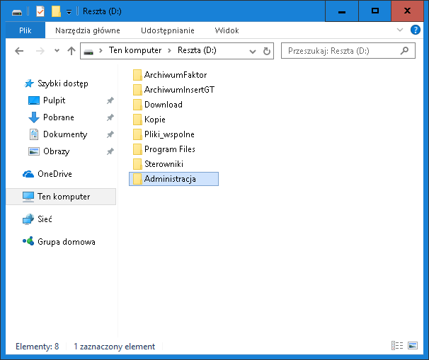

Na komputerze *BAZA* będziemy chcieli utworzyć użytkownika *Adam*, któremu udzielimy dostęp do katalogu *Administracja*. Zanim jednak przystąpimy do tworzenia samego użytkownika ustawy w systemie opcją, która zapewni że jego dane dostępowe nie wygasną prędko. W tym celu otwórzmy konsolę jako administrator.

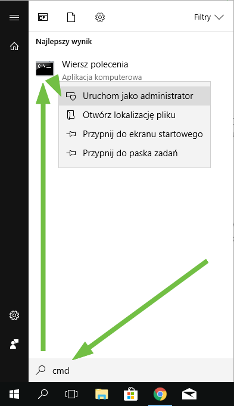

gdzie wpisujemy komendę

> net accounts /maxpwage:unlimited

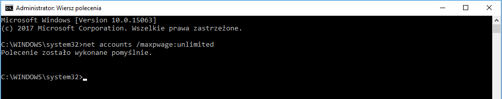

Bez wykonania powyższego dostępy do utworzonych przez nas kont wygasły by po 42 dniach.

Teraz możemy, w końcu dodać konto użytkownika *Adam* na komputerze *BAZA*. Możemy to zrobić w uprzednio otwartym wierszu poleceń poprzez komendę

> net user /add Adam \*

Albo graficznie poprzez kroki opisane poniżej

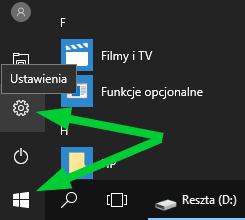

Następnie przechodzimy do sekcji *Konta \> Rodzina i inne osoby.*

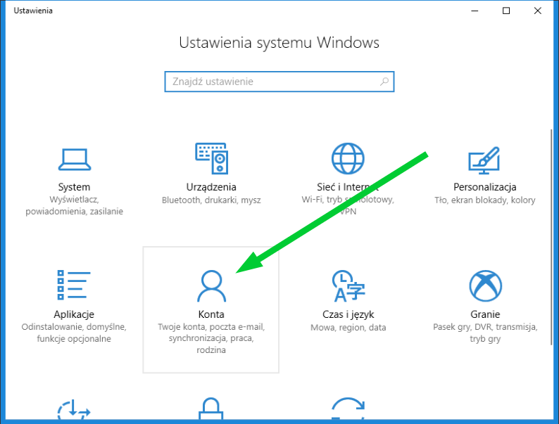

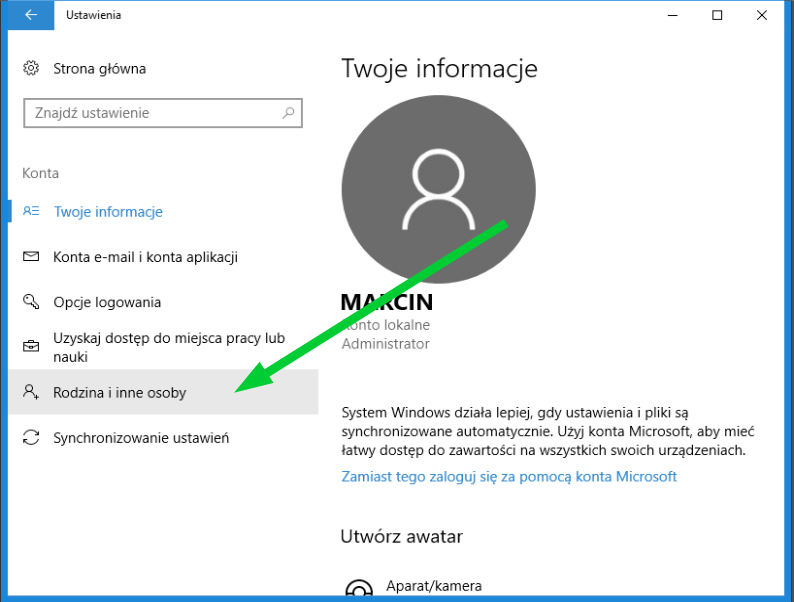

W rubryce *Inne osoby* klikamy przycisk *Dodaj kogoś innego to tego komutera*.

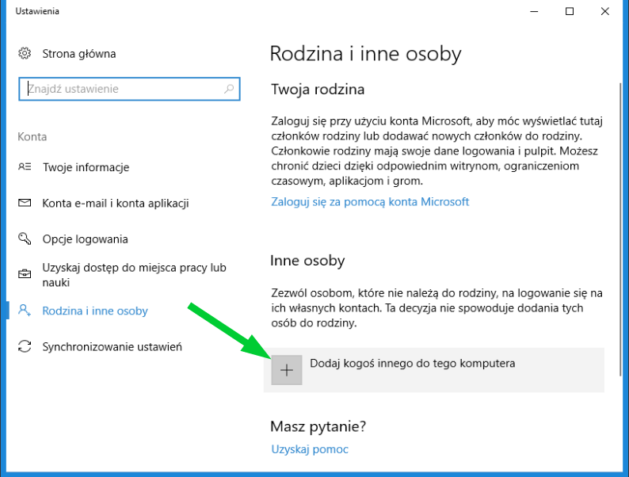

Windows bardzo uparcie będzie sugerował nam założenie konta internetowego. Omijamy to klikając na linki *Nie mam informacji logowania tej osoby* oraz *Dodaj użytkownika bez konta Microsoft*.

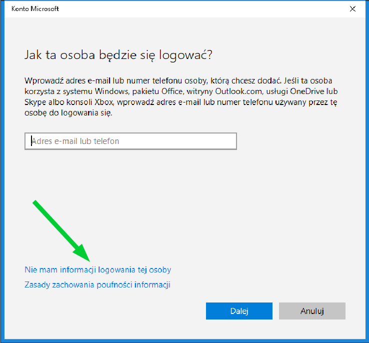

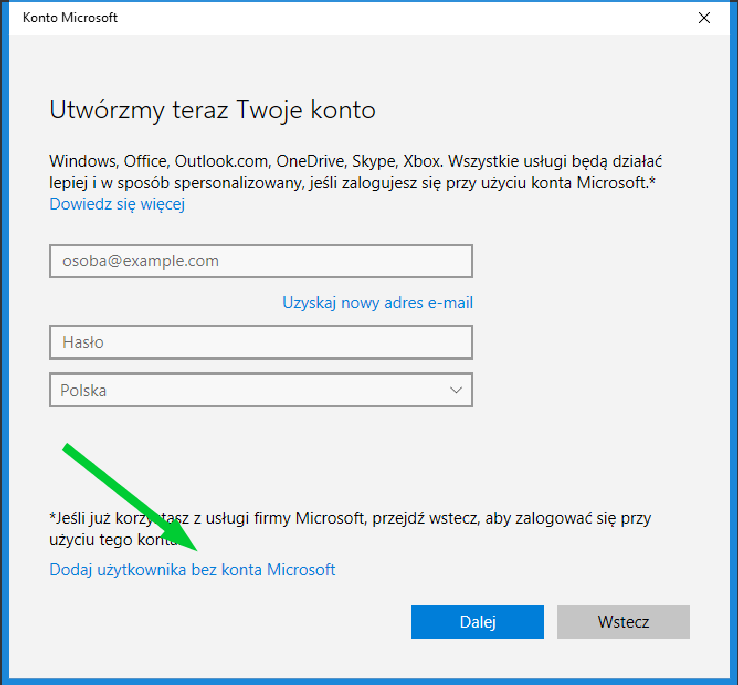

Następnie wprowadzamy login i hasło użytkownika, któremu będziemy chcieli udzielić dostępu do wybranych folderów na komputerze *BAZA* - w naszym przykładzie będzie to login *Adam*.

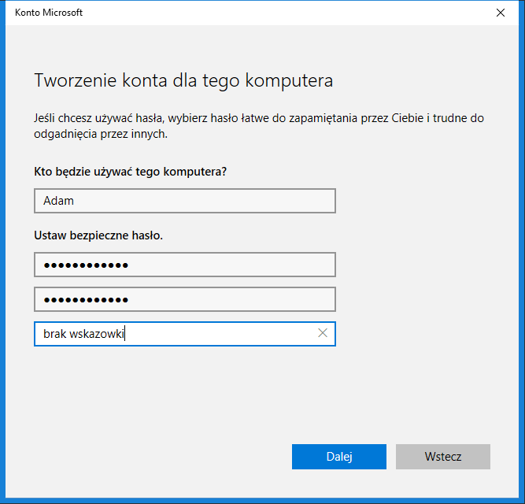

Po kliknięciu *Dalej* powinniśmy widzieć login *Adam* jako konto lokalne.

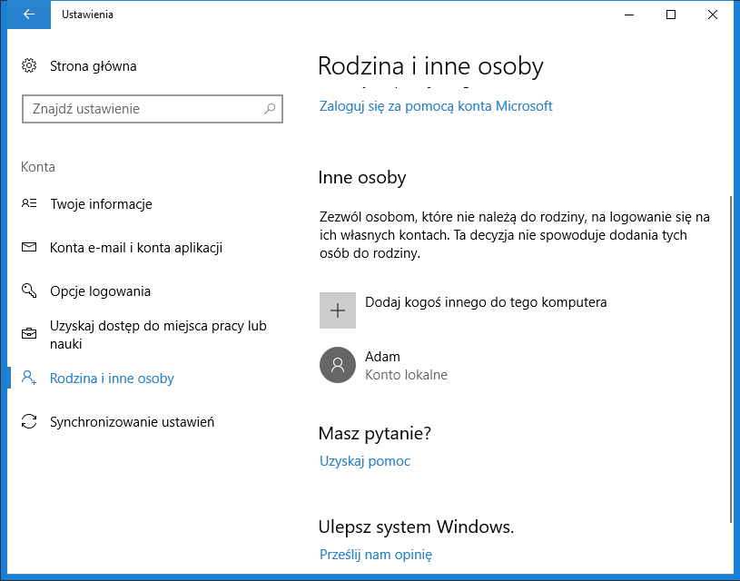Wracamy teraz do katalogu *D:\\Administracja*, klikamy na niego prawy przyciskiem myszy i wybieramy opcję *Udostępnij \> Określone osoby...*

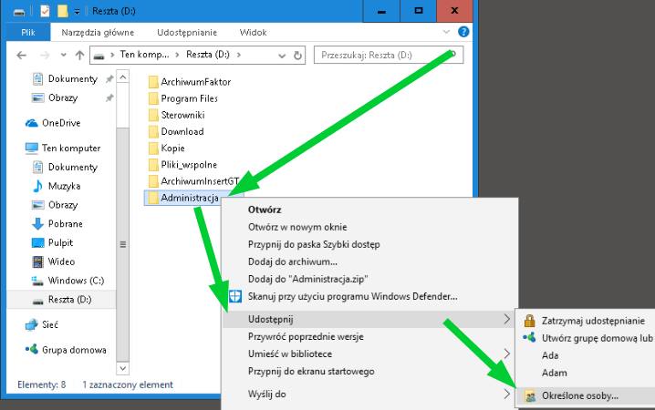

W oknie dialogowym podajemy login *Adam* i klikamy *Dodaj*.

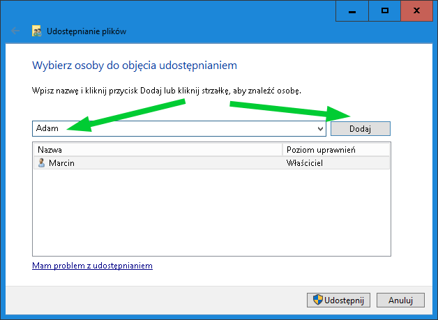

W ostatnim kroku wybieramy czy *Adam* mam mieć dostęp tylko do odczytu czy również do modyfikowania zawartości katalogu *D:\\Administracja*.

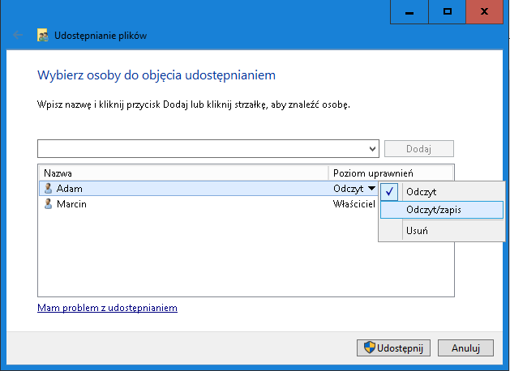

## Konfiguracja dostępu do folderu

Przechodzimy teraz to komputera Adama. Obecnie próba wejścia z jakiegokolwiek komputera do foldera *\\\\BAZA\\Administracja* zakończy się następującym komunikatem.


Aby uzyskać dostęp do tego musimy przejść do opcji *Uruchom* w menu startowym systemu Windows.

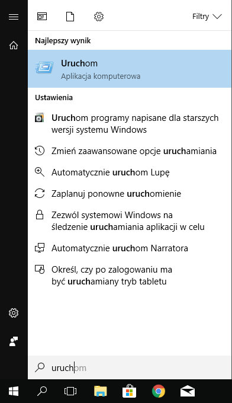

Do wywołanego okna dialogowego wprowadzamy następującą komendę.

```

control keymgr.dll
```

Pojawi nam się wtedy dialog do zarządzania poświadczeniami. W nim wybieramy *Poświadczenia systemu Windows* i następnie opcję *Dodaj poświadczenie systemu Windows*.

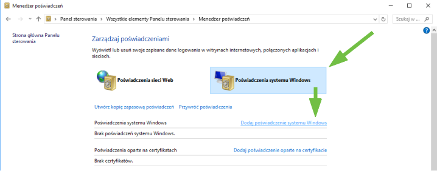

Tam wprowadzamy login i hasło które uprzednio skonfigurowaliśmy na komputerze *BAZA.*

*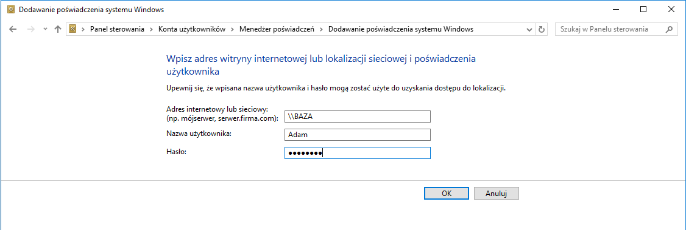*

Na tym etapie próba wejścia do *\\\\BAZA\\Administracja* nadal może skończyć się niepowodzeniem ponieważ Windows może nadal przechowywać w pamięci podręcznej połączenie do katalogu bez wprowadzonych przez nas danych do uwieżytelniania. Aby wyczyścić ową pamięc podręczną w wierszu poleceń można podać komendę

> net use \* /delete

Tym sposobem kolejna próba dostępu do folderu *\\\\BAZA\\Administracja* z komputera *Adam* na pewno sie powiedzie.

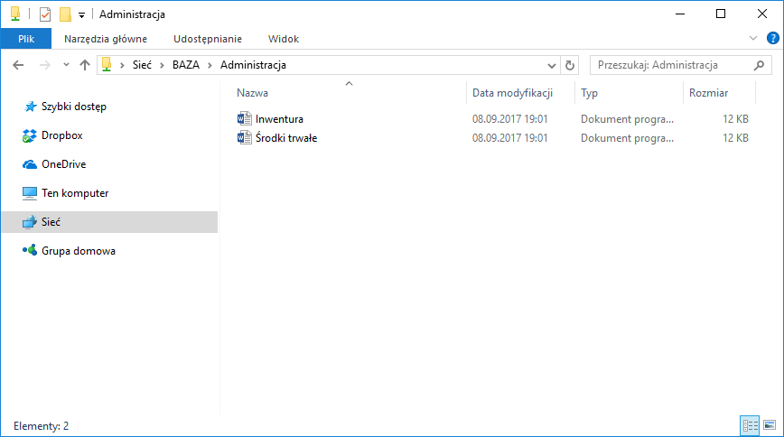

Analogicznie możemy dodać kolejne kombinacje folderów i użytkowników na komputerze *BAZA*. Również inne komputery mogą współdzielić foldery w ten sposób. Gdybyśmy, np. na komputerze *Adam* chcieli udostępnić folder tylko dla komputera *Marcin* to na komputerze *Adam* musimy utworzyć użytkownika *Marcin* i upoważnić go do odopowiedniego folderu na komputerze *Adam*.

## Podsumowanie

Czy da się zatem kontrolować dostęp do folderów w sieci LAN bez Active Directory? Tak. Czy powinno się? Jeżeli Twoja sieć LAN składa się z paru komputerów i nie przewidujesz jej rozbudowy to możesz sobie zaoszczędzić zakupu Windows Server z Active Directory. Jednak im bardziej skomplikowany będzie schemat uprawnień oraz im więcej komputerów w sieci LAN, tym bardziej zarządzanie dostępami w sugerowany przez nas sposób, stanie się karkołomne. Stosuj zatem naszą poradę tylko w sieciach które są małe i jesteś niemal pewny że takie pozostaną w przyszłości.
