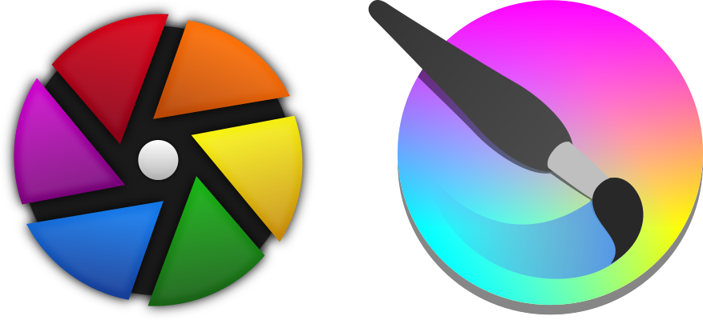
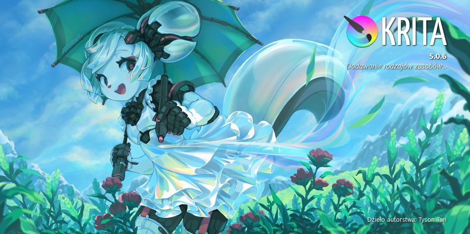

Tradycyjnie Adobe Photoshop i Lightroom są uznawane za standard branżowy, oferując bogaty zestaw funkcji i narzędzi do obróbki obrazów rastrowych. Nie są one jednak jedynymi rozwiązaniami dostępnymi na rynku. Przez wiele lat ich główną darmową alternatywą był program GIMP, który świetnie nadaje się do przygotowania obrazów do publikacji w Internecie, posiada jednak wiele braków, które ujawniają się wtedy, gdy chcemy przygotować zdjęcia do druku lub obrobić surowe pliki RAW z aparatu. W tym przypadku lukę tę wypełniają mniej znane, ale bardziej rozbudowane programy open source takie jak Krita i Darktable. W poniższym artykule przyjrzymy się ich niektórym, bardziej zaawansowanym funkcjom.

## Darktable – kombajn do obróbki zdjęć RAW z aparatu

Zdjęcia RAW przechowują wszystkie dane obrazowe zebrane przez sensor aparatu, dając fotografom więcej swobody i kontroli nad postprodukcją. Darktable to potężne narzędzie do edycji i zarządzania tymi plikami. W poniższym filmie przedstawimy przykładowe zastosowanie następuących funkcji:

1. Regulacja poziomów czerni i bieli: Za pomocą narzędzi Darktable można skorygować ekspozycję, balans bieli oraz kontrast, co pozwala na wydobycie największej ilości detali z każdego zdjęcia.

2. Korekcja barwy zdjęcia: W Darktable znajdziemy narzędzia do zarządzania barwami, które pozwolą uzyskać idealne tonacje, czy to przez korekcję odcieni skóry, czy poprzez artystyczne manipulacje barwami.

3. Korekcja zniekształcenia obiektywu: Zaawansowane narzędzia Darktable pozwalają na precyzyjną korekcję zniekształceń obiektywu, eliminując aberracje chromatyczne i inne niedoskonałości obiektywu.

[//www.youtube.com/embed/1PBeIqLTr9o?color=red&controls=1&h1=pl&iv_load_policy=1&modestbranding=1&rel=0](https://www.youtube.com/embed/1PBeIqLTr9o?color=red&controls=1&h1=pl&iv_load_policy=1&modestbranding=1&rel=0)

Bardzo przydatnym narzędziem (zwłaszcza przy zdjęciach wykonywanych pod kątem prostym) jest możliwość korekty perspektywy.

[//www.youtube.com/embed/3zfXiDwWW38?color=red&controls=1&h1=pl&iv_load_policy=1&modestbranding=1&rel=0](https://www.youtube.com/embed/3zfXiDwWW38?color=red&controls=1&h1=pl&iv_load_policy=1&modestbranding=1&rel=0)

Korektę barw można natomiast uzyskać w bardziej zautomatyzowany sposób z pominięciem ręcznej dłubaniny, którą pokazaliśmy na pierwszym filmie. Jeżeli zrobimy zdjęcie z wykorzystaniem profesjonalnego wzornika kolorów, takiego jak [X-Rite ColorChecker](https://allegro.pl/oferta/x-rite-colorchecker-passport-video-13268716339?utm_medium=afiliacja&utm_source=ctr&utm_campaign=3025baa0-29e0-47d2-9491-726206419d00) lub [Datacolor SpyderCheckr](https://allegro.pl/oferta/datacolor-spydercheckr-24-wzorzec-barw-24-pola-11189831671?utm_medium=afiliacja&utm_source=ctr&utm_campaign=75cff108-1d32-460e-91a4-23ee27a1f21e), to wtedy korekta sprowadza się do wskazania programowi Darktable gdzie na zdjęciu znajduje się wzornik.

[//www.youtube.com/embed/SHGrALNhWd8?color=red&controls=1&h1=pl&iv_load_policy=1&modestbranding=1&rel=0](https://www.youtube.com/embed/SHGrALNhWd8?color=red&controls=1&h1=pl&iv_load_policy=1&modestbranding=1&rel=0)

Mimo że Darktable jest projektem open sourceowym to wygląda na to że udało im się proces kalibracji bardziej zautomatyzować niż w jego komercyjnym odpowiedniku **Lightroom**:

[//www.youtube.com/embed/rkgVZ9LWDt8?color=red&controls=1&h1=pl&iv_load_policy=1&modestbranding=1&rel=0](https://www.youtube.com/embed/rkgVZ9LWDt8?color=red&controls=1&h1=pl&iv_load_policy=1&modestbranding=1&rel=0)

## Krita – studio graficzne i ilustratorskie w jednym pakiecie

Tuż po otwarciu programu zauważymy ekran powitalny, która zdradza pierwotne przeznaczenie tego narzędzia.

Ilustracja, którą zobaczyliście powstała w Krita, która daje artysta możliwość tworzenia tego typu dzieł od podstaw. Mnogość funkcji jaką jednak dodano do tej aplikacji sprawia, że na tym jej możliwość się nie kończą. W tym artykule pokażemy jak zdjęcie wstępnie obrobione w Darktable możemy przygotować w programie Krita do druku oraz publikacji elektronicznej.

[//www.youtube.com/embed/VbEdoZplsgA?color=red&controls=1&h1=pl&iv_load_policy=1&modestbranding=1&rel=0](https://www.youtube.com/embed/VbEdoZplsgA?color=red&controls=1&h1=pl&iv_load_policy=1&modestbranding=1&rel=0)

Kroki:

1. Zaimporotwanie profilu ICC Fogra 39.
2. Przekształczenie palety barw na CMYK z danym profilem.
3. Eksport do pliku.

[//www.youtube.com/embed/RMH2FwHJnZQ?color=red&controls=1&h1=pl&iv_load_policy=1&modestbranding=1&rel=0](https://www.youtube.com/embed/RMH2FwHJnZQ?color=red&controls=1&h1=pl&iv_load_policy=1&modestbranding=1&rel=0)

Kroki:

1. Zmniejszenie do maks. wysokości FullHD: 1080 px.
2. Eksport do kompresowanego formatu JPG.
3. Branding zdjęć poprzez dodanie logo.
4. Eksport wersji obrandowanej do JPG.

## Podsumowanie

Podczas gdy programy takie jak Photoshop i Lightroom dominują w branży, to jednak open source oferuje potężne, darmowe alternatywy dla profesjonalistów i hobbystów. Korzystając z Darktable i Krita, możemy nie tylko edytować zdjęcia na wysokim poziomie, ale również przygotować je do druku, zachowując pełną kontrolę nad procesem, od korekcji obrazu do zarządzania kolorami.

Oficjalne strony, z których można pobrać Darktable i Krita:

[www.darktable.org](https://www.darktable.org/)

[krita.org](https://krita.org/)
