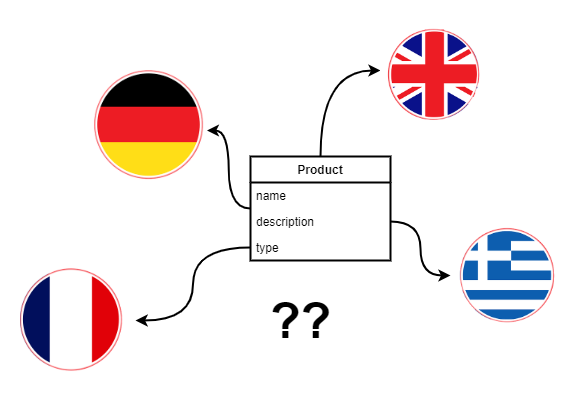

Software systems that operate in an international environment often must support multilingual data models. For example, users of a procurement system must be able to describe the products they want to buy in many languages because they want to receive offers from suppliers that reside in different countries. Designing a system that can effectively display data in a given users language and also allow him to do full text searches is a challenge - many commonly used patterns will have a high performance penalty and slow down your system. In this first of a series of articles we will describe how Postgres supports full text search in general and what are the most common anti-patterns for multilingual SQL models.

## Table of contents

This blog post is part of a series of articles about internationalizing data with support for text searches:

1. Indexes available in Postgres and anti-patterns - your currently reading this
2. Performant internationalization in PostgreSQL + Hibernate / JPA:
  1. [Companion translation table](https://walczak.it/blog/performant-internationalization-in-postgresql-hibernate-jpa-companion-translation-table)
  2. [HStore column with translations](https://walczak.it/blog/performant-internationalization-in-postgresql-hibernate-jpa-hstore-column-with-translations)

## Indexes available in Postgres

Text searches are a very costly operations in every database and they are not easy to optimize. Because of this every database engine provides some custom mechanisms that allow us to speed up these type of queries.

Two types of optimalizations that are most often used in Postgres are:

1. **GIN or GiST indexes** along with the pg\_trgm extension - we use them if we want to check if a given field contain some word or sequence of characters. Let’s illustrate this with an example where we want to find some products which contain the phrase *print* in their name and *double* in their description:

  
2. **Indexes based on to\_tsvector / to\_tsquery** with a full lexical analysis of the entire text of a given document - we use them if we want to search for a given phrase in all the objects fields at one and also take synonyms into consideration.

  

In this series of articles we will focus on the solution np. 1: **GIN / GiST indexes**. However, before we can create an index we must first model our data for internationalization in an object orientated and relational manner.

## Anti-patterns

Lets start with two potential relational models that usually pop up first in our minds when we tackle this problem.

**Anti-pattern no. 1:** one table for translatable fields of all our objects

Problems with this solution:

- this table and their indexes will grow in a very fast rate,
- indexes for text searches will have mixed values from unrelated object classes,
- many transaction which could have been executed separately, because they run though totally different business entities, will now have to be queued on the translations table which services all those entities.

**Anti-pattern no. 2:** separate table for each translatable field

Problems with this solution:

- reading an object in its translated form requires many JOINs,
- writing an objects translation requires INSERTs to multiple tables,
- many tables to manage in our database.

We will search for an optimal model somewhere between those two extreme solutions.

## Read more

Next article in this series:

[Performant internationalization in PostgreSQL + Hibernate / JPA - companion translation table](https://walczak.it/blog/performant-internationalization-in-postgresql-hibernate-jpa-companion-translation-table)

---

This article is a result of our cooperation with [**Nextbuy**](https://www.nextbuy24.com/)- a SaaS company which develops a procurement and online auction platform to connect buyers and suppliers. We provide various consulting and software development services to them and they have kindly allowed us to publish part of the resulting research / design documents. You can checkout their amazing platform at [www.nextbuy24.com](https://www.nextbuy24.com/)

---

Do you need help in your company with some topic we mentioned in our blog articles? If so, then please feel free to [contact us](https://walczak.it/contact). We can help you by providing consulting and audit services or by organizing [training workshops](https://walczak.it/consulting-training-courses) for your employees. We can also aid you in [software development](https://walczak.it/software-development) by outsourcing our developers.
