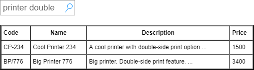
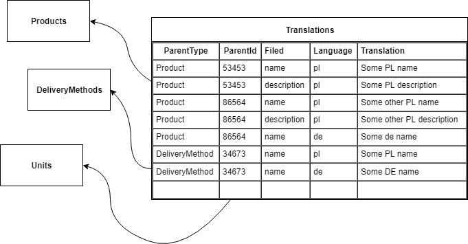
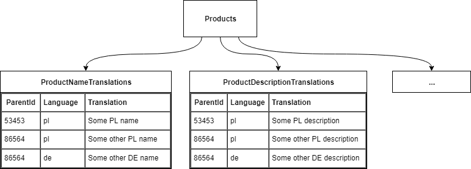

Systemy informatyczne, które operują w międzynarodowym środowisku, muszą często wspierać wielojęzyczne modele danych. Dla przykładu: użytkownicy systemu do zarządzania zakupami muszą mieć możliwość opisania pożądanych produktów w wielu językach ponieważ chcą otrzymać oferty od dostawców rezydujących w wielu państwach. Zaprojektowanie systemu, który będzie sobie dobrze radził z wyświetlaniem danych w języku danego użytkownika oraz także umożliwi mu wyszukiwane tekstowe jest nie lada wyzwaniem - wiele często stosowanych wzorców niesie za sobą dużo problemów wydajnościowych, które spowolnią cały system. W tym pierwszym z serii artykułów opiszemy jak Postgres ogólnie wspiera wyszukiwanie po tekście i zobaczymy jakie anty-wzorce pojawiają się najczęściej w wielojęzycznych modelach SQL.

## Spis treści

Ten wpis na blogu jest częścią serii artykułów o internacjonalizacji danych z wsparciem dla wyszukiwania tekstowego:

1. Indeksy dostepne w Postgres oraz antywzorce - obecnie czytasz
2. Wydajna internacjonalizacja w PostgreSQL + Hibernate / JPA:
  1. [Tabela towarzysząca z tłumaczeniami](https://walczak.it/pl/blog/wydajna-internacjonalizacja-w-postgresql-hibernate-jpa-tabela-towarzyszaca-z-tlumaczeniami)
  2. [Kolumna HStore z tłumaczeniami](https://walczak.it/pl/blog/wydajna-internacjonalizacja-w-postgresql-hibernate-jpa-kolumna-hstore-z-tlumaczeniami)

Chcesz otrzymać notyfikacje gdy pozostałe artykuły zostaną opublikowane? Polub nas na [Facebook](https://www.facebook.com/walczak.it/) lub śledź na [4programmers.net](https://4programmers.net/Profile/33337/Microblog).

## Indeksy dostępne w Postgres

Wyszukiwanie po tekście we wszystkich bazach danych jest bardzo kosztowne i nietrywialne w optymalizacji. Z tego względu każdy silnik bazodanowy udostępnia własne mechanizmy umożliwiające nam przyspieszyć tego typu zapytania.

Dwa najczęściej stosowane tego typu optymalizacje w bazie Postgres to:

1. **Indeksy typu GIN lub GiST** wraz z rozszerzeniem pg\_trgm - stosowane gdy chcemy indywidualnie odpytywać poszczególne pola w obiekcie czy zawierają podane części tekstu. Poniżej przykład gdzie szukamy produktów z frazą *print* w nazwie i *double* w opisie:

  
2. **Indeksy oparte to\_tsvector / to\_tsquery** z pełną analizą leksykalną całego tekstu w ramach dokumentu - stosowane gdy chcemy aby wyszukać daną frazę we wszystkich polach obiektu z uwzględnieniem fraz podobnych.

  

W tej serii artykułów skupimy się na rozwiązaniu nr 1: **Indeksy typu GIN / GiST**. Zanim jednak przejdziemy do tworzenia indeksu musimy zastanowić się jak zamodelować nasze dane obiektowo oraz relacyjnie pod internacjonalizacje.

## Antywzorce

Zacznijmy od dwóch potencjalnych modeli relacyjnych, które zazwyczaj przychodzą jako pierwsze do głowy.

**Antywzorzec nr 1:** jedna tabela dla wszystkich przetłumaczalnych pól wszystkich obiektów

Problemy tego rozwiązania:

- ta tabela oraz jej indeksy będzie rosnąć w bardzo szybkim tempie,
- indeksy do wyszukiwań tekstowych będą miały wymieszane wartości z nie powiązanych ze sobą klas obiektów,
- wiele transakcji, które mogłyby być całkowicie niezależne, ponieważ obracają się wokół zupełnie niezależnych bytów biznesowych, będzie kolejkować się na tabeli tłumaczeń, którą obsługuje wszystkie takowe byty.

**Antywzorzec nr 2:** oddzielna tabela na tłumaczenia każdego pola

Problemy tego rozwiązania:

- odczytanie obiektu w przetłumaczonej postaci wymaga wielu JOIN'ów,
- zapis tłumaczeniu obiektów wymaga INSERTów do wielu tabel,
- spora liczba tabel do zarządzania w bazie danych.

Optymalnego modelu będziemy szukać pośrodku tych dwóch skrajnych rozwiązań powyżej.

## Czytaj dalej

Następny artykuł z serii:

[Wydajna internacjonalizacja w PostgreSQL + Hibernate / JPA - tabela towarzysząca z tłumaczeniami](https://walczak.it/pl/blog/wydajna-internacjonalizacja-w-postgresql-hibernate-jpa-tabela-towarzyszaca-z-tlumaczeniami)

---

Ten artykuł jest wynikiem naszej współpracy z [**Nextbuy**](https://www.nextbuy24.com/)- firmą dostarczającą w modelu SaaS platformę zakupową i przetargową, która łączy kupców i dostawców. Świadczymy dla nich usługi doradcze oraz wsparcie w pracach programistycznych. Jesteśmy wdzięczni, że zgodzili się upublicznić część dokumentów projektowo-rozwojowych powstałych, w wyniku tego. Możecie sprawdzić ich świetną platformę na [www.nextbuy24.com](https://www.nextbuy24.com/)

---

