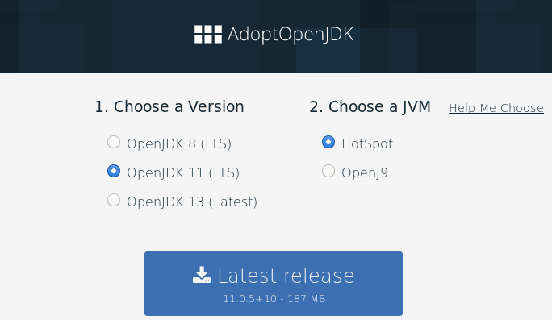
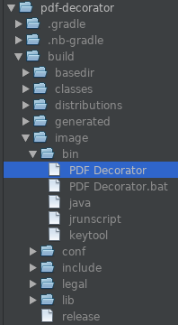
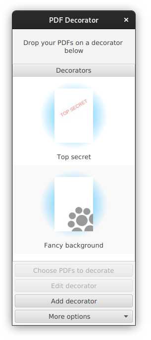
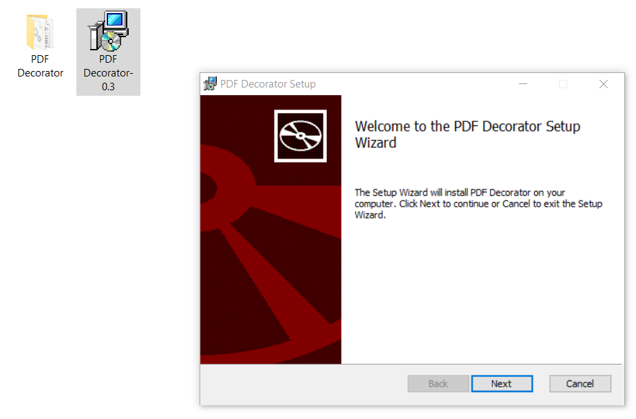
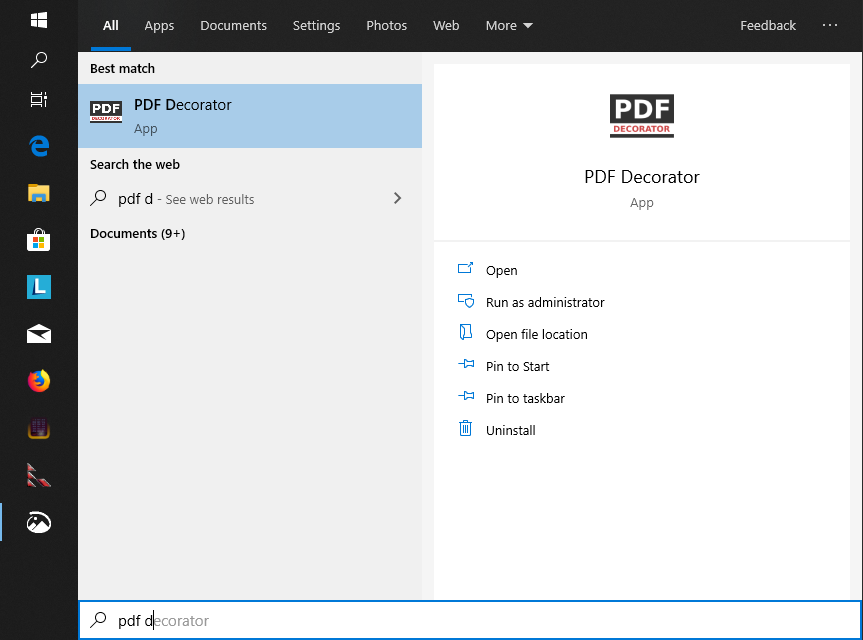
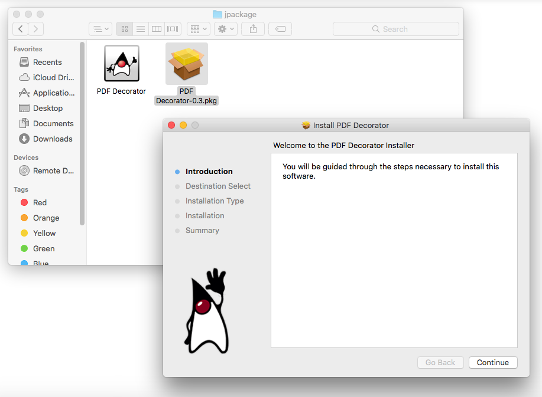
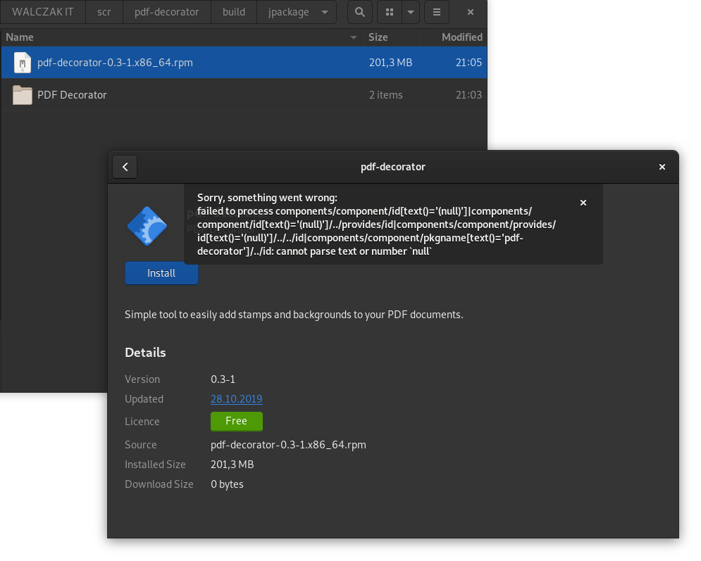
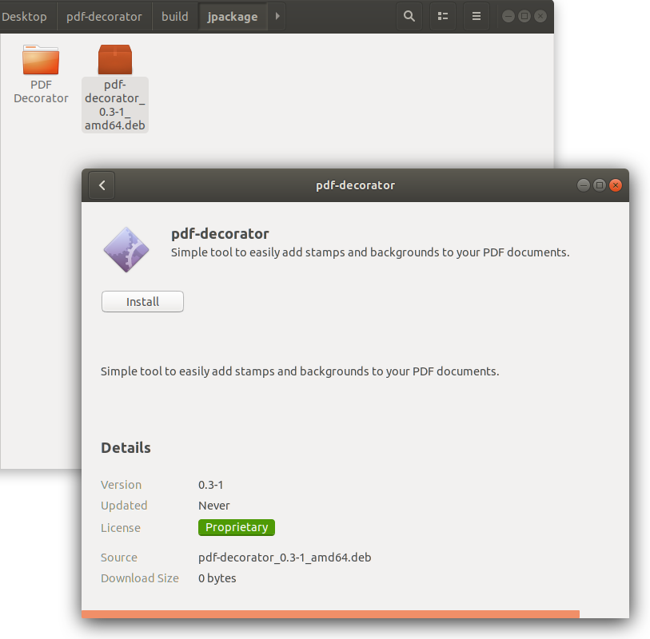

The times when Java was available on almost every desktop are long gone but you can still distribute your desktop applications written in Java in a user friendly way. Since the release of OpenJDK and OpenJFX 9 we can benefit from the JVMs modularization efforts and easily build executables with a bundled JVM trimmed to the needs of our application. In this article we will show you how we ported our small desktop app called PDF Decorator to OpenJDK 11 and used tools like jlink and jpackage to start distributing our app without requiring any third party software on our clients machines.


## Install OpenJDK 11

First of all we must set up our development environment and make sure that we have OpenJDK 11 installed. The best place to get any version of OpenJDK is the [AdoptOpenJDK](https://adoptopenjdk.net) project. Select the OpenJDK 11 with the HotSpot JVM and download the latest release.

[](https://adoptopenjdk.net)

After installing make sure you have the following system variables poperly set:

- JAVA\_HOME - should be pointing to the directory containing the extracted JDK,
- PATH - should contain the path to the extracted JDKs subdirectory called bin.

On my Fedora Linux machine I have exported the variable:

```

JAVA_HOME=/usr/lib/jvm/java-11-openjdk-11.0.5.10-0.fc30.x86_64
```

I've also used this command to make sure the right version of the JDK is prioritized in the PATH variable:

```

sudo alternatives --config java
```

If you have done the configuration correctly (be it on Windows, Mac or Linux) then you should see the desired Java version and java.home path after typing this in your command line:

```

java -XshowSettings:properties -version

Property settings:
    ...
    java.home = /usr/lib/jvm/java-11-openjdk-11.0.5.10-0.fc30.x86_64
    ...

openjdk version "11.0.5" 2019-10-15
OpenJDK Runtime Environment 18.9 (build 11.0.5+10)
OpenJDK 64-Bit Server VM 18.9 (build 11.0.5+10, mixed mode, sharing)
```

## Porting to modular Java 11 and jlink

[PDF Decorator](http://pdf-decorator.walczak.it/) is a small desktop app we developed way back in 2015 for the [WALCZAK - wooden floors](http://walczakfloors.com) company to help them adjust their PDF documents to their new visual cooperate identity. We build it using OracleJDK 8 with Gradle and distributed it as a fat jar expecting that the desktops that will run it will have Oracle JVM installed. Today this assumption seams archaic and as [PDF Decorator](http://pdf-decorator.walczak.it/) attracted a small user base after being open sourced, we decided to build it using OpenJDK 11 and jlink to change the way we package our app. To accomplish this we had to:

- upgrade our dependancies to use modularized libraries where possible
- change our build process in build.gradle
- modularize our app by adding a module-info.java and module-info.test

Our build script required some changes to work with jlink and this is how it looks like now:

```groovy
buildscript {
    ext {
        pdfBoxVersion = '2.0.17'
        bouncycastleVersion = '1.64'
        jaxbVersion = '2.3.1'
        junitVersion = '4.12'
        mockitoVersion = '3.1.0'
        assertjVersion = '3.13.2'
    }
    repositories {
        mavenCentral()
        jcenter()
    }
}

plugins {
    id 'java'
    id 'org.javamodularity.moduleplugin' version "1.5.0"
    id 'application'
    id 'org.openjfx.javafxplugin' version '0.0.8'
    id 'org.beryx.jlink' version '2.16.2'
}

repositories {
    mavenCentral()
    jcenter()
}

targetCompatibility = "11"
sourceCompatibility = "11"

project.ext.buildDate = new Date()
project.version = "0.3"

dependencies {
    compile("javax.xml.bind:jaxb-api:${jaxbVersion}")
    compile("org.glassfish.jaxb:jaxb-runtime:${jaxbVersion}")
    compile("org.apache.pdfbox:pdfbox:${pdfBoxVersion}")
    compile("org.bouncycastle:bcprov-jdk15to18:${bouncycastleVersion}")

    testCompile("junit:junit:${junitVersion}")
    testCompile("org.mockito:mockito-core:${mockitoVersion}")
    testCompile("org.assertj:assertj-core:${assertjVersion}")
}

javafx {
    version = "11"
    modules = [ 'javafx.controls', 'javafx.fxml' ]
}

mainClassName = "pdfdecorator/pdfdecorator.gui.PdfDecoratorApplication"

run {
    jvmArgs = ['-Djdk.gtk.version=2'] // required due to a bug in Java: https://github.com/javafxports/openjdk-jfx/issues/175
}

jlink {
    launcher {
        name = 'PDF Decorator'
        jvmArgs = ['-Djdk.gtk.version=2'] // required due to a bug in Java: https://github.com/javafxports/openjdk-jfx/issues/175
    }
}
```

To make the app build and run in a modular way we also had to add the following module descriptor:

```java
module pdfdecorator {
    requires java.xml.bind;
    requires com.sun.xml.bind;
    requires java.desktop;
    requires java.logging;
    requires javafx.controls;
    requires javafx.fxml;
    requires org.apache.pdfbox;
    
    opens pdfdecorator.model to java.xml.bind;
    opens pdfdecorator.gui to javafx.graphics, javafx.fxml;
}
```

To make our tests work we also had to add some command line options for java in a special type of file:

```java
--add-modules
  org.assertj.core,junit
    
--add-reads
  pdfdecorator=org.assertj.core,junit

--add-reads
  org.assertj.core=java.logging
```

For a full list of changes made to our project please see [this commit](https://bitbucket.org/walczak_it/pdf-decorator/commits/b5d81e303994e969f7db7e282813e090d77d16d9). After doing all this we build the project, executed our unit tests and runned our applications from gradle.

```

./gradlew clean build test run
```

We also did some manual clicking to make sure that our applications GUI works as expected.

Now its time to build an image of our application with a bundled custom trimmed JVM using jlink. To do so we will execute the following gradle command:

```

./gradlew jlink
```

this uses the [Badass JLink](https://github.com/beryx/badass-jlink-plugin) gradle plugin and after some minutes we can see that a new directory appeared in our project: build/image

If we run the executable file build/image/bin/PDF Decorator then our application will show up and it will not be using the JVM installed on our system. It will use its own JVM contained in the build/image directory.

 

From this point we could just:

- run the jlink task on every OS we support,
- remane the image directory do pdf-decroator,
- zip it to pdf-decroator-win.zip or pdf-decroator-linux.zip, etc.
- distribute thoose archives to our users.

Java won't be required on their machines to run it but extracting an archive and finding an executable in it to run is not the most user friendly experience. Providing an installer / package would be much easier for every one. Because of this lets take a look at an upcoming tool developed for Java 14: jpackage.

## Building an installer using jpackage

At the time we are writing this article jpackage is still in development and targets JDK 14. It would be tempting to build our entire app using the upcoming JDK 14 however Gradle will not run on it because of a [bug in Groovy](https://issues.apache.org/jira/browse/GROOVY-9211). Fortunately our [Badass JLink](https://github.com/beryx/badass-jlink-plugin) gralde plugin can be configured to use jpackage from JDK 14 even if our project is build using OpenJDK 11. To do this lets download the [early access JDK14 with jpackage](https://jdk.java.net/jpackage/), extract the archive to a desired location and add an environmental variable BADASS\_JLINK\_JPACKAGE\_HOME pointing to that location. On my Fedora Linux this variable looks like this:

```

BADASS_JLINK_JPACKAGE_HOME=/usr/lib/jvm/jdk-14
```

Now to build the installer we will enhance our build script so that our app has proper icons and additional information about it self:

```java
jlink {
    options = ['--strip-debug', '--compress', '2', '--no-header-files', '--no-man-pages']
    launcher {
        name = 'PDF Decorator'
        jvmArgs = ['-Djdk.gtk.version=2'] // required due to a bug in Java: https://github.com/javafxports/openjdk-jfx/issues/175
    }
    jpackage {
        installerOptions = [
            '--description', project.description,
            '--copyright', 'Copyrigth 2015-2019 WALCZAK.IT'
        ]
        installerType = project.findProperty('installerType') // we will pass this from the command line (example: -PinstallerType=msi)
        if (installerType == 'msi') {
            imageOptions += ['--icon', 'src/main/resources/pdfdecorator/gui/icon.ico']
            installerOptions += [
                '--win-per-user-install', '--win-dir-chooser',
                '--win-menu', '--win-shortcut'
            ]
        }
        if (installerType == 'pkg') {
            imageOptions += ['--icon', 'src/main/resources/pdfdecorator/gui/icon.icns']
        }
        if (installerType in ['deb', 'rpm']) {
            imageOptions += ['--icon', 'src/main/resources/pdfdecorator/gui/icon_256x256.png']
            installerOptions += [
                '--linux-menu-group', 'Office',
                '--linux-shortcut'
            ]
        }
        if (installerType == 'deb') {
            installerOptions += [
                '--linux-deb-maintainer', 'office@walczak.it'
            ]
        }
        if (installerType == 'rpm') {
            installerOptions += [
                '--linux-rpm-license-type', 'GPLv3'
            ]
        }
    }
}

jpackage {
    doFirst {
        project.getProperty('installerType') // throws exception if its missing
    }
}
```

To build an installer for a given operation system we have to be on that system, have the necessary tooling installed and type the following command:

```

./gradlew jpackage -PinstallerType=...
```

Of course the type of installer will depend on the operating system we are building for / on.

### on Microsoft Windows

Before we start building on Windows we must[enable .NET Frakemwork 3.5](https://docs.microsoft.com/en-us/dotnet/framework/install/dotnet-35-windows-10?redirectedfrom=MSDN#ControlPanel) and install [WIX toolset](https://wixtoolset.org/). After that we just type in our projects directory:

```

gradlew.bat jpackage -PinstallerType=msi
```

and after a successful build we should see a MSI package in our build/jpackage directory. Double clicking on it will start the installation wizard.



After completing we can find our application in the start menu.



### on Mac OS

We just type the following in our projects directory:

```

./gradlew jpackage -PinstallerType=pkg
```

This will result in a PKG package appearing in our build/jpackage directory. Double clicking on it will start the installation wizard.

### 

After completing we can find our application in the lunchpad.


### on Fedora and other RPM based Linux distros

Before we start building we must have rpm-build package installed. We can do this by typing:

```

sudo dnf install rpm-build
```

After that we just type in our projects directory:

```

./gradlew jpackage -PinstallerType=rpm
```

This will result in a RPM package appearing in our build/jpackage directory.



Unfortunately, at the time we are writing this article jpackage struggles to build a working RPM and double clicking on it will cause an error to show in the package manager on Fedora 30. Even after ignoring this error and installing we could not find any way to activate our application in Gnome Shell. I was also not able to uninstall this package due to the following error:

```

xdg-desktop-menu: file to uninstall must be a *.directory or *.desktop file
```

### On Ubuntu and other DEB based Linux distros

We just type the following in our projects directory:

```

./gradlew jpackage -PinstallerType=deb
```

This will result in a DEB package appearing in our build/jpackage directory.



Unfortunately, DEB packages are also not working correctly. After installing the package we could not find any way to activate our application in Gnome Shell. I was also not able to uninstall it due to the same error we noticed on Fedora.

## Conclusion

Java is still a good platform for building desktop apps and may sometimes suite your requirements better then browser based technologies that are trending today. Modularization and jlink allows us to ship apps without requiring users to install Java and with the upcoming jpackage tool we will also gain an easy way to build user friendly installers / packages. If you want to examine an application that uses jlink and jpackage in more detail the dive into our [PDF Decorators source code](https://bitbucket.org/walczak_it/pdf-decorator/src/master/).

There is still some work in jpackage that needs to be done to consider it production ready for enterprise apps. We reported the problems we've encountered ([JDK-8233449](https://bugs.java.com/bugdatabase/view_bug.do?bug_id=JDK-8233449)) and as you can see from the comment section below the authors of this tool are collaborating with us to fix them. We'll update this article when those issues get resolved.

---

[](https://walczak.it/contact)

Do you need help in your company with some topic we mentioned in our blog articles? If so, then please feel free to [contact us](https://walczak.it/contact). We can help you by providing consulting and audit services or by organizing [training workshops](https://walczak.it/consulting-training-courses) for your employees. We can also aid you in [software development](https://walczak.it/software-development) by outsourcing our developers.
