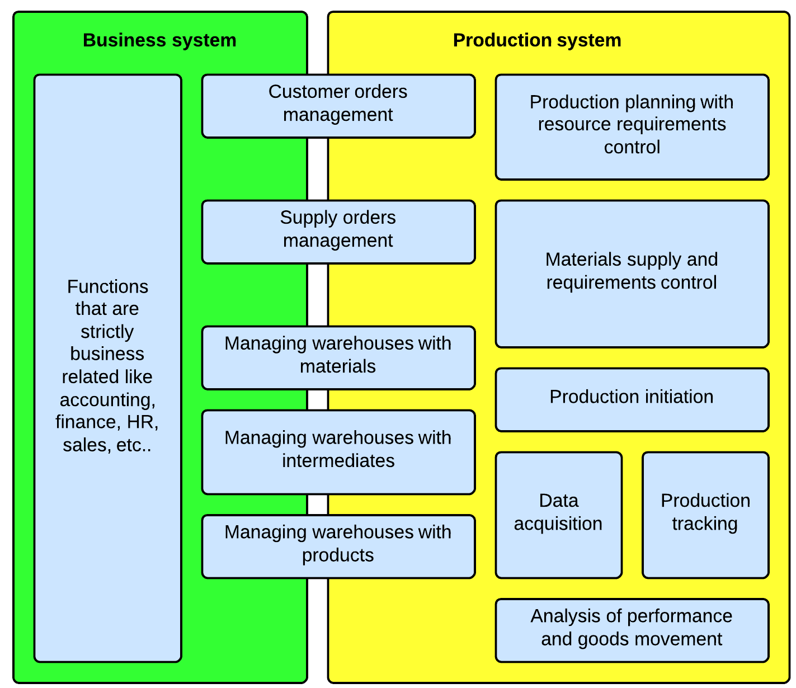

At the beginning of the year we began preparations to design our own IT system for industrial production management targeted towards small and medium-sized enterprises. As part of this stage we analyzed standards related to such solutions. Our attention has been particularly caught by **IEC/ISO-62264** (based on **ISA-95**), which attempts to construct an unified model of concepts, data structures and activities that occur at the interface between **Enterprise Resource Planning** systems and Manufacturing **Execution Systems**.

Now came the time to share with you our insights and design sketches. This is our first article from a hole series that show you our efforts aimed at transferring the standards adopted for large ERP and MES systems to the SME scale of things.

## The functional hierarchy from the standard vs SME

The functional hierarchy defined in IEC-62254 (shown in a table below) is a generally accepted division of responsibilities between ERP-MES-SCADA systems in the so-called *large IT.*

| Level | Functionality | System classes |
| --- | --- | --- |
| 4 | Business planning and procurement | ERP, MRP, SCM |
| 3 | Execution and control of production operations | MES |
| 2, 1, 0 | Low-level process control: batch, continuous and discrete | SCADA |

Although, the above division appears to be legitimate and obvious, it is difficult to apply it to software used in SME, where we do not have ERP systems in the full sense of the word. Let us now compare in the table below the activities expected by IEC-62254 on level 4 with what is being offered by systems such as *InsERT Naviero* or *Comarch OPTIMA* - two popular business software packages in Poland.

| Activities of level 4 | **Capabilities of business systems for SME** |   |   |
| --- | --- | --- | --- |
| a | Collection of data on materials and spare parts and management of their availability and demand for them. | A warehouse system will allow us to keep track of inventories and manage orders, but comparing it to the demand for materials and spare parts will be problematic. We have only so-called picking orders and reservations at our disposal, which are often mechanisms of an excessive number of rigid assumptions and poor functionality. |  |
| b | Collection of data on electricity and management of its availability and demand for it. | Functionality is not covered in these types of systems. Although it is not very often highly desirable by SME. |  |
| c | Collection and management of data on the goods currently being processed and on goods inventories. | The problem is often solved by one or more warehouses recording goods inventory taken for the production process. |  |
| d | Collection and management of data from quality control and its relationships towards customers’ requirements. | The area is usually not covered by any integrated IT system in SME. |  |
| e | Collection and management of data on the use of machinery and equipment for maintenance purposes. | The area is usually not covered in business systems for SME. Sometimes separate CMMS software is being purchased for this purpose. |  |
| f | Collection and management of data on the use of human resources. | It is supported in a very limited range. HR processes are mainly supported in terms of payroll and accounting. In contrast, information on an allocation of human resources is very superficial. |  |
| g | Development of a basic production plan. | It is exercisable only at the level of goals to be achieved, namely customers’ orders or internal orders. But even this cannot be accomplished if we have to plan our production schedule from the perspective of orders to process raw materials, rather then orders to produce the final product. |  |
| h | Modification of a production plan based on general availability of resources. | No useful presentation features to visualize the general availability of production resources. |  |
| i | Development of an optimal schedule of machinery and equipment maintenance in correlation with a production plan. | Lack of support for any activities related to the maintenance of machinery and equipment. |  |
| j | MRP functions. | Systems for SME always possess a fully functional warehouse management module which can determine inventory quantities, do document management and supply orders. However, they do not have the extensive features to compare that data with the material requirement of the production schedule. |  |
| k | Moditification of a production plan in an event of an unplanned downtime. | See section h. |  |
| l | Planning of the level of production capacities based on all of the above. | Systems for SME do not have the necessary data to determine overall production capacities. |  |

As it can be seen in the table above, the overlap between activities on level 4 is very superficial in business systems for SME. This is due to the fact that systems of this scale in order to preserve their attractive pricing, aim at a broad enterprise market. They focus on covering the common needs of companies in all sectors (services, distribution and production) like sales, warehouse management, basic supply management, accounting, HR and finance. Systems for SME have very little support functions that are targeted exclusively for manufacturing companies. Nevertheless production companies by them anyway for two reasons:

- they are affordable, as mentioned earlier,
- the production modules of ERP systems for medium-sized companies are often too inflexible to make them worth the price.

Therefore, the model of a production management system for SME must assume that it will have to integrate with relatively simple business systems with a limited set of responsibilities. On the other hand, we also need to restrict activities supported by the production system on level 3, in order to preserve its attractive pricing and reduce the amount of data that we will expect from our users. Thus, let us see which of the activities specified in IEC-62264 must be fully supported and which we can simplify or completely eliminate.

| **Activities on level 3** | **Description of simplified activities for hte SME production system** |   |
| --- | --- | --- |
| Allocation and control of resources | We assume that an industrial system for SME will not require to enter the full description of resource availability and load on a timeline. Often this would be a to significant burden for our users and their scale of production. However the system should allow to allocate resources to tasks and summarize the demand for them. |  |
| Production initiation | Delegation of tasks to be performed within a production pocess by means of paper and electronic form. |  |
| Data aquisition | Collecting data from filled out paper and electronic forms. We assume that a large part of the data will be delivered post-factum. |  |
| Quality management | In SME it is rarely required in an integrated system. Furthermore this process cannot be handled in a generic manner. Therefore, we will limit ourselves only to registering defective quantities that appeared in the process. |  |
| Process management | Since we assume that a large part of data will be registered post-factum, which is why the system will not exercise direct control over the process. In this way we will also avoid many rigid assumptions in the implementation of the system. |  |
| Production tracking | The system will present the overall progress in production and individual tasks. It will also be sending notifications in situations specified by the systems users. However, as we assume that data acquisition is performed post-factum, the state of production that is being presented will be subject to adequate time delays. |  |
| Productivity analysis | The system will analyze resources that were actually used, in regard to the production plan. However, it will not take place in real time, as data acquisition will usually take place post-factum. |  |
| Operatonar and detailed scheduling | Realization of this goal requires a very robust APS system (Advanced Production Scheduling) and a precise definition of accessibility and resource capacity. Despite the fact that SME often report the need for such software, they are not prepared enough to provide all necessary data required by it and to cover high licensing fees. |  |
| Document control | In SME it is rarely required in an integrated system. |  |
| Personnel management | It will be limited mainly to data acquisition on their participation in the production process and the analysis of their productivity. |  |
| Management of machinery and equipment | In SME it is rarely required in an integrated system and there are ready solutions specialized only in this area. We assume that basic management of this region will be covered in the standard production tasks mechanism. |  |

## Our approach to the functional hierarchy for SME

The functional hierarchy defined in the standard is very much apart from the SME scale of things. Therefore, we will base our design more on our experience in this subject. Bearing in mind the previously mentioned limitations of IT systems in this sector and the needs of SME, we have developed the following division of activities between level 4 (business) and 3 (production).

All functions that are not directly related to production remain in the business system. Especially those that generate accounting implications, or are highly dependent on the legal system of a country in which a company resides. Orders support in the production system will be limited to the minimum functionality that is required that will provide the data required by the production processes. However, support for management of storage spaces and movement of goods will be significant in both systems. The business system will manage warehouses that are located in the center of interest of accounting, sales and supply departments. The production system must have the possibility to integrate with these warehouses. It can also independently handle goods movement within warehouse spaces used strictly for production, which will not directly generate results in accounting. It should also handle warehouse movements between production storage areas and warehouses operated by the business system.

Nevertheless, we assume that the production system will be able to also work independently, or only with limited integration – just basic data for example. This is a common requirement imposed by companies that:

- have fear of automatic integration with documents from the production system that may cause various effects in the companies accounting,
- have a business system that is not very popular and they do not want to finance full integration with it.

In this case, the activities taking place on the border of non-integrated systems will be:

- supported by only one of the systems in a limited scope,
- or integrated manually.

---

Do you need help in your company with some topic we mentioned in our blog articles? If so, then please feel free to [contact us](https://walczak.it/contact). We can help you by providing consulting and audit services or by organizing [training workshops](https://walczak.it/consulting-training-courses) for your employees. We can also aid you in [software development](https://walczak.it/software-development) by outsourcing our developers.
