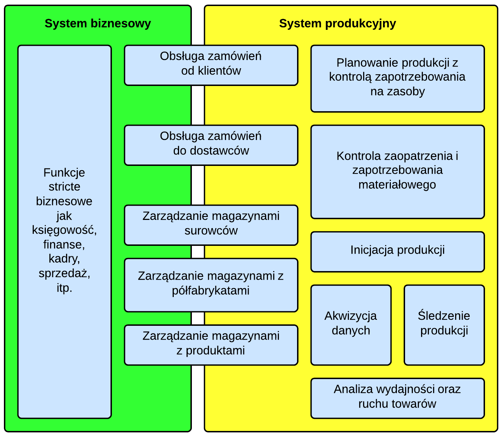

Na początku roku zaczęliśmy przygotowywać się do zaprojektowania własnego *systemu informatycznego do zarządzania produkcją przemysłową* dla małych i średnich przedsiębiorstw. Częścią tego etapu była między innymi analiza standardów związanych z tematyką tego typu rozwiązań. Naszą uwagę szczególnie zwrócił **IEC/ISO-62264** (oparty na **ISA-95**), który próbuje skonstruować jednolity model pojęć, struktur danych oraz aktywności występujących na styku systemów klasy **Enterprise Resource Planning** oraz **Manufacturing Execution System**.

Nadszedł czas, aby podzielić się naszymi spostrzeżeniami oraz szkicami projektowymi. Rozpoczynamy zatem serię artykułów, która będzie poświęcona naszym staraniom przełożenia standardów przyjętych dla dużych systemów ERP i MES do realiów MSP.

# Hierarchia funkcjonalna standardu a MSP

Hierarchia funkcjonalna standardu IEC-62254, przedstawiona w poniższej tabeli, stanowi w tzw. *dużym IT* ogólnie przyjęty model podziału kompetencji między systemami ERP-MES-SCADA.

| **Poziom** | **Funkcjonalność** | **Klasy systemów** |
| --- | --- | --- |
| 4 | Planowanie biznesowe oraz zaopatrzenia | ERP, MRP, SCM |
| 3 | Wykonanie oraz kontrola operacji wytwórczych | MES |
| 2, 1, 0 | Niskopoziomowa kontrola procesów: wsadowych, ciągłych oraz dyskretnych | SCADA |

Mimo że powyższy podział wydaje się słuszny i oczywisty, trudno go zastosować wobec oprogramowaniu dla MSP gdzie nie mamy systemów ERP w pełnym tego słowa znaczeniu. Porównajmy zatem w poniższej tabeli jak mają się aktywności oczekiwane przez standard na poziomie 4 do tego, co oferują systemy takie jak *InsERT Naviero* lub *Comarch OPTIMA.*

| Aktywności poziomu 4 | **Możliwości systemów biznesowych dla MSP** |   |   |
| --- | --- | --- | --- |
| a | Zbieranie danych o materiałach i częściach zapasowych oraz zarządzanie ich dostępnością i zapotrzebowaniem na nie. | Moduł magazynowy pozwoli nam śledzić ich stany oraz zarządzać zamówieniami, jednak problemem będzie zestawienie tego z zapotrzebowaniem. Mamy tutaj do dyspozycji jedynie tzw. zlecenia kompletacyjne oraz rezerwacje, które często są mechanizmami o nadmiernej liczbie sztywnych założeń oraz ubogiej funkcjonalności. |  |
| b | Zbieranie danych o energii elektrycznej oraz zarządzanie jej dostępnością i zapotrzebowaniem na nią. | Funkcjonalność niepokryta w tego typu systemach. Chociaż nie jest ona często wielce pożądana przez MSP. |  |
| c | Zbieranie oraz zarządzanie danymi o towarach obecnie przetwarzanych oraz ich stanach. | Problem często rozwiązywany przez jeden lub więcej magazynów rejestrujących stan towarów pobranych do produkcji. |  |
| d | Zbieranie oraz zarządzanie danymi z kontroli jakości oraz ich relacjami w stosunku do wymagań klientów. | Obszar zazwyczaj nie pokryty żadnym zintegrowanym systemem IT w MSP. |  |
| e | Zbieranie oraz zarządzanie danymi o wykorzystaniu maszyn oraz wyposażenia w celu ich konserwacji. | Obszar zazwyczaj nie pokryty w systemach biznesowych dla MSP. Czasem w tym celu zakupywane jest oddzielne oprogramowanie klasy CMMS. |  |
| f | Zbieranie oraz zarządzanie danymi o wykorzystaniu zasobów ludzkich. | Wspierane w bardzo ograniczonych zakresie. Procesy kadrowe są głównie wspierane w zakresie płacowo-księgowym. Natomiast informacje o alokacji zasobów ludzkich są bardzo powierzchowne. |  |
| g | Opracowanie podstawowego planu produkcji. | Możliwe do zrealizowania tylko na poziomie celów do zrealizowania, czyli zamówień od klientów lub wewnętrznych. Przy czym nawet tego nie można zrealizować jeżeli trzeba zaplanować produkcję z perspektywy zleceń na przerób surowca, a nie zleceń na produkt końcowy. |  |
| h | Modyfikacja planu w oparciu o ogólną dostępność zasobów. | Brak wsparcia dla użytecznej prezentacji ogólnej dostępności zasobów produkcyjnych. |  |
| i | Opracowanie optymalnego harmonogramu utrzymania maszyn oraz wyposażenia w korelacji z planem produkcji. | Brak wsparcia dla jakichkolwiek czynności związanych z utrzymaniem maszyn oraz wyposażenia. |  |
| j | Funkcje MRP. | Systemy dla MSP zawsze mają w sobie w pełni funkcjonalny moduł zarządzania magazynami w zakresie określania stanów, zarządzania dokumentami oraz zamówieniami do dostawców. Nie mają natomiast rozbudowanych funkcji umożliwiających zestawienie tych danych z potrzebami zaplanowanej produkcji. |  |
| k | Modyfikacja planu produkcji w przypadku pojawienia się nie planowanych przestojów. | Patrz pkt. h. |  |
| l | Planowanie poziomu zdolności produkcyjnych w oparciu o wszystkie powyższe. | Systemy dla MSP nie mają większości danych potrzebnych do określenia ogólnych zdolności produkcyjnych. |  |

Jak wynika z powyższego zestawienia, pokrycie aktywności poziomu 4 jest bardzo powierzchowne w systemach biznesowych dla MSP. Wynika to z faktu, iż tego typu systemy, aby zachować swoją atrakcyjność cenową celują w szeroki rynek firm. Skupiają się na pokryciu wspólnych potrzeb firm usługowych, dystrybucyjnych oraz produkcyjnych, które pojawiają się w obszarach sprzedaży, obsługi magazynu, podstawowej obsługi zaopatrzenia, księgowości, kadrach oraz finansach. Niewielkie wsparcie funkcjonalności jest tutaj stricte dla produkcji przemysłowej. Mimo wszystko tego typu systemy są często wybierane przez firmy produkcyjne z dwóch względów:

- są atrakcyjne cenowo, jak już wcześniej wspomniano,
- moduły produkcyjne systemów ERP dla średniej wielkości firm są często zbyt mało elastyczne, aby opłacało się je wdrożyć.

Dlatego też model systemu zarządzania produkcją dla MSP musi zakładać integrację ze stosunkowo ubogimi systemami biznesowymi oraz ograniczony podział kompetencji. Z drugiej strony musimy także zawęzić aktywności wspierane przez system produkcyjny na poziomie 3, aby zachować również i jego atrakcyjność cenową oraz ograniczyć ilość danych, którą będziemy oczekiwali od użytkowników. Zobaczmy zatem jakie aktywności określone w IEC-62264 musimy przyjąć w pełni, a jakie możemy uprościć lub całkowicie wyeliminować.

| **Aktywności poziomu 3** | **Opis uproszczonej aktywności w systemie przemysłowym dla MSP** |   |
| --- | --- | --- |
| Alokacja i kontrola zasobów | Zakładamy, że system przemysłowy dla MSP nie będzie wymagał wprowadzania pełnego opisu dostępności oraz obciążenia zasobów na osi czasu. Jest to często zbyt wielkie obciążenie użytkowników systemu przy tej skali produkcji. Umożliwi on natomiast alokację zasobów do zadań oraz podsumowywanie zapotrzebowania na nie. |  |
| Inicjacja produkcji | Przekazanie zadań do wykonania na produkcji w postaci formularzy papierowych lub elektronicznych. |  |
| Akwizycja danych | Zbieranie danych z wypełnionych formularzy papierowych lub elektronicznych. Zakładamy, że duża część danych może być dostarczana post-factum. |  |
| Zarządzanie jakością | W MSP rzadko jest to wymagane w zintegrowanym systemie. Nie da się też tego procesu obsłużyć generycznie. Dlatego też ograniczamy się wyłącznie do rejestracji wadliwych ilości towarów pojawiających się w procesach. |  |
| Zarządzanie procesem | Jako że zakładamy, że duża część danych będzie rejestrowana post-factum, dlatego też system nie będzie sprawował bezpośredniej kontroli nad procesem. W ten sposób unikniemy też wielu sztywnych założeń w implementacji systemu. |  |
| Śledzenie produkcji | System będzie przedstawiał ogólny poziom postępu produkcji oraz poszczególnych zadań. Będzie także wysyłał powiadomienia w sytuacjach określonych przez użytkowników systemu. Jednak jako że zakładamy, że akwizycja danych odbywa się post-factum, prezentowany stan produkcji będzie obarczony adekwatnym opóźnieniem. |  |
| Analiza wydajności | System umożliwi analizę faktycznego wykorzystania zasobów względem planu. Nie będzie się to jednak odbywało w trybie rzeczywistym, jako że akwizycja danych zazwyczaj będzie odbywała się post factum. |  |
| Harmono- gramowanie operacyjne oraz szczegółowe | Realizacja tego celu wymaga bardzo rozbudowanego modułu APS (ang. advanced production scheduling) oraz precyzyjnego określenia dostępności oraz zdolności zasobów. Mimo że MSP często zgłaszają zapotrzebowanie na takie oprogramowanie, nie są one przygotowane do zapewnienia wszystkich wymaganych przez niego danych oraz pokrycia wysokich kosztów licencyjnych. |  |
| Kontrola dokumentów | W MSP rzadko jest to wymagane w zintegrowanym systemie. |  |
| Zarządzanie personelem | Ograniczone głównie do akwizycji danych nt. ich udziału w realizacji procesu oraz analizy ich wydajności. |  |
| Zarządzanie utrzymaniem maszyn oraz wyposażenia | W MSP nieczęsto jest to wymagane w zintegrowanym systemie i są gotowe rozwiązania specjalizujące się tylko w tym obszarze. Zakładamy, że podstawowe zarządzanie tym rejonem będzie mógł pokryć standardowy mechanizm zadań. |  |

# Nasze podejście do hierarchii funkcjonalnej dla MSP

Jako że część standardu dotycząca hierarchii funkcjonalnej tak mocno odbiega od realiów MSP, uciekliśmy bardziej w nasze własne doświadczenia w tym temacie. Mając na uwadze wcześniej wymienione ograniczenia systemów informatycznych w tym sektorze oraz potrzeby MSP opracowaliśmy następujący podział aktywności między poziomem czwartym (biznesowym) a trzecim (produkcyjnym).

Wszystkie funkcje niezwiązane bezpośrednio z produkcją pozostają w systemie biznesowym. Zwłaszcza te, które generują skutki księgowe lub są wysoce zależne od systemu prawnego państwa, w którym rezyduje firma. Wsparcie obsługi zamówień w systemie produkcyjnym będzie ograniczone do minimum, które zapewni dane wymagane na produkcji. Natomiast wsparcie dla zarządzania przestrzeniami magazynowymi oraz ruchem towarów będzie istotne w obu systemach. System biznesowy będzie zarządzał magazynami, które znajdują się w centrum zainteresowań księgowości, sprzedaży oraz zaopatrzenia. System produkcyjny musi mieć możliwość współpracy z tymi magazynami. Sam też może niezależnie obsługiwać ruch towarów w ramach przestrzeni magazynowych stricte produkcyjnych, które nie będą bezpośrednio generowały skutków w księgowości. Powinien też móc obsłużyć ruchy magazynowe z magazynów produkcyjnych do magazynów obsługiwanych przez system biznesowy.

Mimo wszystko zakładamy, że system produkcyjny będzie mógł działać także samodzielnie lub tylko z integracją okrojoną np. do danych podstawowych. Jest to częste wymaganie stawiane przez firmy, które:

- obawiają się automatycznej ingerencji systemu produkcyjnego z dokumentami, które mogą mieć skutki księgowe,
- posiadają mało popularny system biznesowy i nie chcą ponosić pełnych kosztów jego integracji.

W takiej sytuacji aktywności dziejące się na pograniczu niezintegrowanych systemów będą:

- wspierane tylko przez jeden z systemów w okrojonej postaci
- lub integrowane manualnie.
