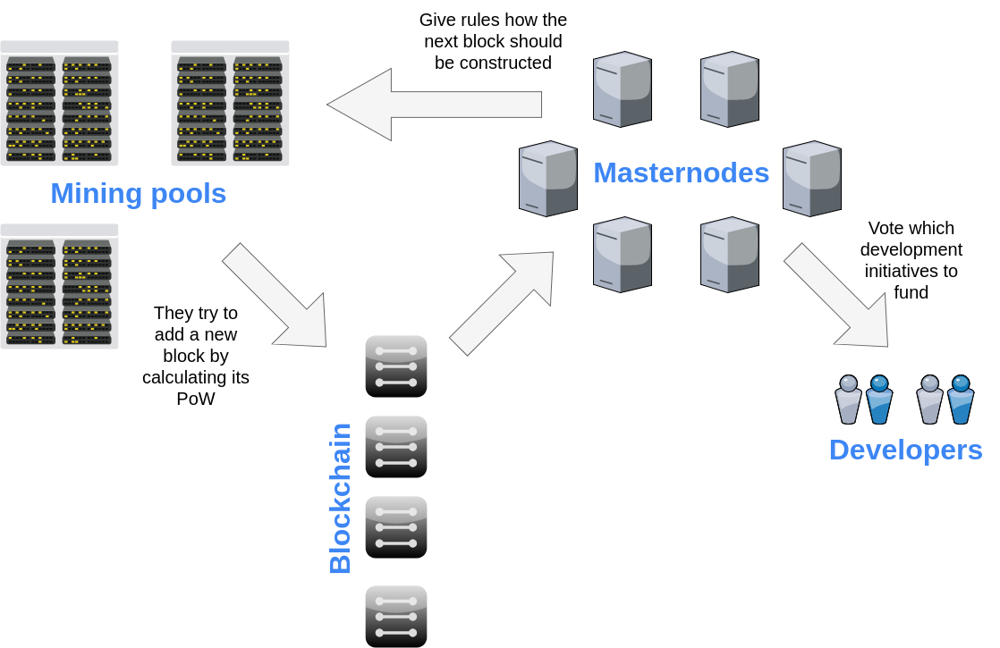
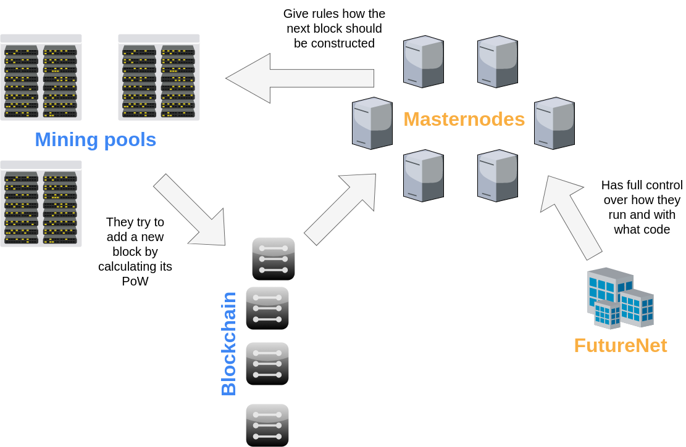

In the past months we could hear many controversies surrounding an upcoming coin developed by FutureNet called [FuturoCoin](https://futurocoin.com/). FutureNet is a social network and Multi Level Marketing (MLM) platform. Most of the cryto-community didn't take them seriously and ware expecting another [DasCoin](https://bitcointalk.org/index.php?topic=1636850.0) - a coin which had little do to with the term 'cryptocurrency' but was heavily marketed as such using MLM. Both FutureNet and the creators of DasCoin (Netleaders) are under [investigation by the Polish government](https://uokik.gov.pl/aktualnosci.php?news_id=13844) under the suspicion of being a ponzi-scheme. The fact that FutureNet promoted their FuturoCoin without even publishing a whitepaper also didn't help. Now that they finally have one and also published their source code we can see what this coin really is.

## They just copied Dash...

As it is confirmed in [their whitepaper](https://futurocoin.com/download/FuturoCoin-white-paper-en-31.01.18.pdf) ​​they just forked the source code from Dash, did some changes and initialized a new blockchain with it. Bare in mind that only a source code fork happened here - they didn't do a blockchain fork like Bitcoin Cash did with Bitcoin. Before we examin what changes they made lets see how Dash it self works.

Dash is a cryptocurrency that is build from a two layer protocol:

- on the first layer its like Bitcoin - just a blockchain with blocks mined my miners using Proof of Work,
- the second layer is build by a network of masternodes - thousands of servers which:
  - provide the Instant Send functionality by locking your coins in one second and instructing the miners on how to build the next block to eliminate the possibility of double spending before your transaction receives its first confirmation,
  - provide the Private Send functionality which mixes coins to make them less traceable,
  - vote on which developer initiatives to fund from their treasury system - this makes Dash a decentralized organization.

## How Dash works

No part of Dash is owned by a single company. Masternodes have tremendous power over the system as they guide the miners on how the blockchain should be constructed. This is actually how Instant Send gets done - those guidelines prohibit any transactions that could double spend coins locked for another Instant Send transaction. There are no limitations on who can run a masternode - the only barrier of entry is acquiring 1000 units of Dash needed to run one. This is no small investment but it didn't stop companies and idividuals to add over 4000 masternodes to the network.

## ... and centralized it

The changes made in FuturoCoin seem subtle at first. Besides initializing a new blockchain you can read that they removed the Private Send feature for legal reasons. Everything in [their whitepaper](https://futurocoin.com/download/FuturoCoin-white-paper-en-31.01.18.pdf) seems ok until you get to the jaw dropping statement at page 14:

> Masternodes are owned by FutureNet company which is responsible for code development, organizing events, hiring employees, preparing and introducing marketing strategies and reward systems.

So much for decentralization there - a crucial part of the protocol is locked up in a single company. Furthermore all transactions have to be guided by those centralized masternodes because as we can read on page 12 - all of them are Instant Send transactions in FuturoCoin:

> In DASH masternodes receive an additional fee for processing instant transactions. In FuturoCoin no additional fee is required for this kind of operation as all transactions are instant.

In consequence the fact that everyone can mine the coin is irrelevant - masternodes (a.k.a FutureNet) have too much control over how new blocks get created.

## How FuturoCoin works

## Conclusion

In our opinion you cannot call any system decentralized if one of its crucial components is fully controlled by one company. And if FuturoCoin isn't fully decetralized - you can argue it does not fully meet [the definition of a cryptocurrency](http://si-journal.org/index.php/JSI/article/viewFile/335/325).

We asked FutureNet if the above statements from their whitepaper are just mistakes and could we run our own masternode. They replied that they are not, we can't, and afterwards argued that FutureCoin is still decentralized because anyone can mine it and that the masternodes do not interfere with the mining process - they just add the Instant Send feature. We replayed that the Instant Send feature IS implemented by interfering in the mining process so this answer makes no sense. After some time we received a [formal response form FutureNet](https://walczak.it/download_file/view/160/248). They do not agree with our article but their argumentation doesn't seem to bring anything new to the topic - they still claim that masternodes don't interfere in the mining process but fail to explain how Instant Send gets technically done without any ingratiation. You can find our replay to them in the comment section below.

## Update

As FutureNets "MLM" pyramid collapses Polish UOKiK pressed charges against its founders and promoters. Read more about it in [their article (in Polish)](https://www.uokik.gov.pl/aktualnosci.php?news_id=17309). If you were affected by any of their actions you should UOKiK branch in Gdańsk via their email: [gdansk@uokik.gov.pl](mailto:gdansk@uokik.gov.pl)

---

