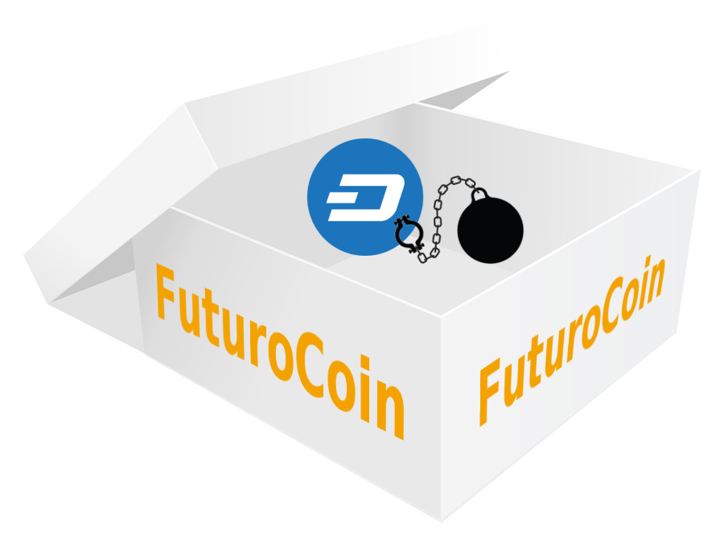
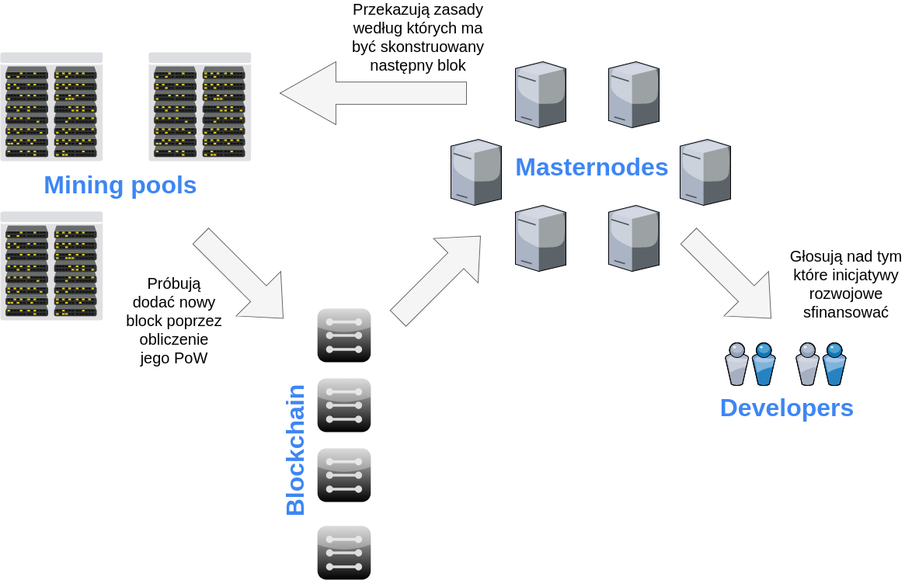
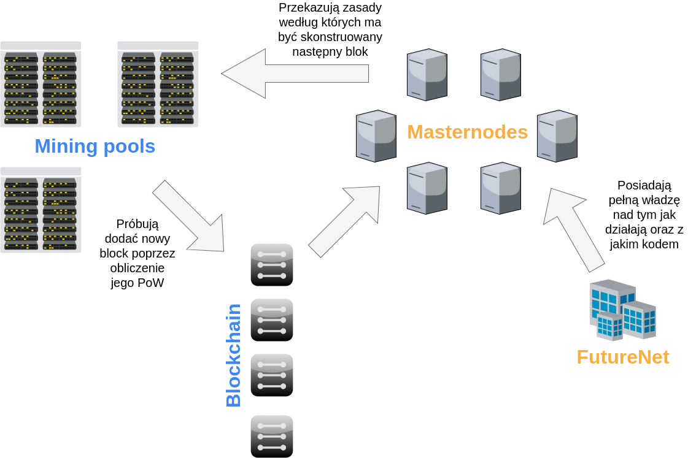

W ostatnich miesiącach mogliśmy usłyszeć wiele kontrowersji wokół coina tworzonego przez FutureNet o nazwie [FuturoCoin](https://futurocoin.com/). FutureNet to sieć społecznościowa oraz platforma do marketingu wielopoziomowego (MLM). Większa część społeczności krypto nie traktowała tego projektu poważnie i oczekiwała kolejnego [DasCoin](https://bitcointalk.org/index.php?topic=1636850.0) - czyli coina, którym [miał mało wspólnego z definicją 'kryptowaluty'](https://businessinsider.com.pl/finanse/kryptowaluty/co-to-jest-dascoin-ostrzezenie-od-stowarzyszenia-bitcoina/vg7lw7l), ale był intensywnie na takową promowany przy użyciu MLM. Zarówno wobec FutureNet jak i twórców DasCoin (Netleaders) prowadzone jest [postępowanie na wniosek UOKiK](https://uokik.gov.pl/aktualnosci.php?news_id=13844) ze wględu na podejrzenie, że są piramidą finansową. Wiarygodności nie dodaje też fakt, że FutureNet promował FuturoCoin w czasie, gdy nie mieli jeszcze nawet whitepaper. Teraz gdy już w końcu posiadają ten dokument i opublikowali kody źródłowe, możemy zobaczyć czym na prawdę ten coin jest.

## Po prostu skopiowali Dash ...

Jak sami potwierdzają to w [swoim whitepaper](https://futurocoin.com/download/FuturoCoin-white-paper-en-31.01.18.pdf) zrobili forka kodów źródłowych kryptowaluty Dash, wykonali w nich kilka zmian i zainicjowali nowy blockchain. Miejcie na uwadze, że nastąpił tu tylko fork kodów źródłowych - nie wykonali forka blockchainu w takim sensie jak to zrobił Bitcoin Cash z Bitcoinem. Zanim przejdziemy do analizy poczynionych przez nich zmian, zobaczmy jak działa sam Dash.

Dash jest kryptowalutą zbudowaną z dwuwarstwowego protokołu:

- na poziomie pierwszej warstwy jest jak Bitcoin - czyli po prostu blockchainem, w którym bloki są kopane przez koparki z wykorzystaniem Proof of Work,
- druga warstwa zbudowana jest z sieci masternodów - tysięcy serwerów, które:
  - dostarczają funkcjonalność Instant Send poprzez natychmiastowe zablokowanie twoich coinów oraz instruowanie koparek tak aby wyeliminować możliwość podwójnego wydawania zanim Twoja transakcja otrzyma pierwsze potwierdzenie,
  - dostarczają funkcjonalność Private Send, która poprzez mieszanie coinów utrudnia ich śledzenie,
  - głosują które inicjatywy rozwojowe sfinansować z ich systemu budżetowego - to czyni z Dasha zdecentralizowaną organizację.

## Jak działa Dash

Żadna część Dasha nie jest w posiadaniu jednej firmy. Masternody mają ogromną władzę nad systemem jako że kierują koparkami jak powinny one budować blockchain. Dzięki temu właśnie działa opcja Instant Send - wskazówki masternodów uniemożliwiają dodanie transakcji wydającej środkw, które już zostały zablokowane pod inną transakcję typu Instant Send. Nie ma żadnych ograniczeń w kwestii kto może prowadzić masternoda - jedyną barierą wejścia jest pozyskanie 1000 jednostek Dasha potrzebnych do jego prowadzenia. Nie jest to mała inwestycja jednak nie powstrzymało to firma oraz indywidualnych osób przed dołączeniem ponad 4000 masternodów do sieci.

## ... i scentralizowali go

Zmiany wykonane w FuturoCoin, na początku, wydają się subtelne. Poza zainicjowaniem nowego blockchaina, dowiadujemy się, że usunęli też funkcję Private Send z przyczyn prawnych. Wszystko w [ich whitepaper](https://futurocoin.com/download/FuturoCoin-white-paper-en-31.01.18.pdf) wygląda ok do momentu aż natrafimy na zdanie ze strony 14 po którym opadnie nam szczęka:

> **Cytat:** Masternodes are owned by FutureNet company which is responsible for code development, organizing events, hiring employees, preparing and introducing marketing strategies and reward systems.

> **Tłumaczenie:** Właścicielem masternodów jest firma FutureNet, która jest również odpowiedzialna za rozwój kodu, organizację wydarzeń, zatrudnianie pracowników, przygotowywanie i wprowadzanie strategii marketingowych oraz systemów wynagrodzeń.

Tyle jeżeli chodzi o decentralizację - kluczowa część protokołu jest zamknięta w jednej firmie. Ponadto wszystkie transakcje kierowane przez te scentralizowane masternody, ponieważ jak czytamy na stronie 12 - wszystkie z nich w FuturoCoin są transakcjam typu Instant Send:

> **Cytat:** In DASH masternodes receive an additional fee for processing instant transactions. In FuturoCoin no additional fee is required for this kind of operation as all transactions are instant.

> **Tłumaczenie:** W DASH masternody otrzymują dodatkową opłatę za przetwarzanie natychmiastowych transakcji. W FuturoCoin żadne dodatkowe opłaty nie są wymagane dla tego typu operacji, jako że wszystkie transakcje są natychmiastowe.

W konsekwencji fakt, że każdy może kopać tego coina jest nieistotny - masternody (czyli FutureNet) mają zbyt dużą kontrolę nad tym jakie transakcje mogą wejść do nowego bloku.

## Jak działa FuturoCoin

## Konkluzja

W naszej opinii nie można nazwać żadnego systemu zdecentralizowanym jeżeli jeden z jego kluczowych komponentów jest w pełni kontrolowany przez jedną firmę. A jeżeli system nie jest w pełni zdecentralizowany to można wysunąć tezę że nie spełnia w pełni [definicji kryptowaluty](http://si-journal.org/index.php/JSI/article/viewFile/335/325).

Spytaliśmy FutureNet czy powyższe zdania z whitepaper są tylko błędem i czy możemy uruchomić własnego masternoda. Odpowiedzieli nam, że nie są i nie możemy tego zrobić. Następnie argumentowali, że system jest zdecentralizowany ponieważ nadal każdy może brać udział w procesie kopania, w który masternody nie ingerują - tylko zapewniają opcję Instant Send. Odpowiedzieliśmy im, że opcja Instant Send JEST właśnie realizowana poprzez ingerowanie masternodów w proces kopania i z tego względu ich argumentacja jest bez sensu. Po jakiś czasie otrzymaliśmy [formalną odpowiedź od FutureNet](https://walczak.it/download_file/view/160/250). Nie zgadzają się z naszym artykułem jednak ich argumentacja nie wydaje się wnosić nic nowego do tematu - nadal twierdzą że masternody nie ingerują w proces kopania ale nie potrafią wytłumaczyć jak techniczne realizują funkcje Instant Send bez tego. Naszą odpowiedź na ich pismo możecie znaleźć w sekcji komentarzy poniżej.

PS. Każdego co chciałby się nauczyć analizować projekty tak jak to zrobiliśmy powyżej zapraszamy na organizowane przez nas cyklicznie [warsztaty wprowadzające do inwestowania w kryptowaluty](https://walczak.it/pl/doradztwo-szkolenia). Na nich pokażemy między innymi jak kryptowaluty działają od środka oraz na jakie rzeczy należy zwrócić uwagę przed zakupen danego coina lub wejściem w ICO.

## Aktualizacja

UOKiK postawił zarzuty założycielom oraz promotorom upadłej piramidy "MLM" FutureNet. Można przeczytać więcej w ich artykule pt. [Kolejni naganiacze z zarzutami za promowanie systemów typu piramida](https://www.uokik.gov.pl/aktualnosci.php?news_id=17309). Wszystkie osoby dotknięte tym procederem proszone są o kontakt z Gdańską delegaturą UOKiK poprzez email: [gdansk@uokik.gov.pl](mailto:gdansk@uokik.gov.pl)
