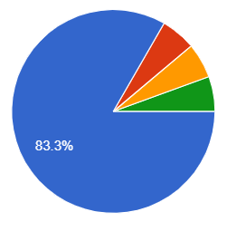
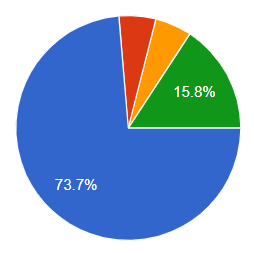
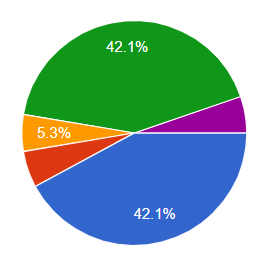
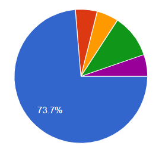
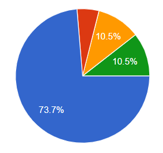

Zdolność do precyzyjnego lokalizowania użytkowników przeglądarek stanowi kluczową funkcjonalnością wielu aplikacji i serwisów internetowych. Wybór odpowiedniej metody geolokalizacji nie jest zawsze oczywisty. W tym artykule sprawdzimy mocne i słabe strony przeglądarkowego Geolocation API kontra geolokalizacja serwerowa na podstawie IP, a także porównamy skuteczność różnych usług wspomagających drugą opcję.

## Badania ankietowe

W poniższym artykule będziemy podawać skuteczność poszczególnych mechanizmów geolokalizacji na podstawie przeprowadzonych badań ankietowych. Ankieta była przeprowadzana na 19 użytkownikach w Polsce, z czego 37% z nich było w stolicy w tym czasie. 32 % osób ankietowanych korzystało z smartfonów z internetem po sieci komórkowej - prosiliśmy ich o wyłączenie WiFi. Natomiast pozostałe 68 % korzystało z komputerów połączonych do sieci poprzez stałe łącze WiFi lub kablowe.

## Geolocation API w przeglądarce

Geolocation API to API dostępne dla JavaScript w przeglądarce, które korzysta z danych GPS, informacji o sieci Wi-Fi oraz sygnałów komórkowych, aby zaoferować precyzyjne dane lokalizacyjne. Jednak, aby skorzystać z tego API, trzeba użytkownika przeglądarki poprosić o dodatkowe uprawnienia. Skuteczność w przypadku użytkowników, którzy zgodzili się przydzielić owe dodatkowe uprawnienia wygląda następująco:

Trafił w miasto, w którym jestem

Nie to miasto ale blisko, do 50 km

Dalsze miasto ale z tego samego województwa

Inne województwo ale chociaż kraj się zgadza

Nawet kraj się nie zgadza

Jak wykazują różne źródła, tylko nieliczni użytkownicy zgadzają się na udostępnienie swoich danych lokalizacyjnych poprzez Geolocation API. Prywatność w sieci jest dla odwiedzających daną stronę www znacznie ważniejsza niż drobne usprawnienie, jakim mogłoby być ustalenie ich miasta poprzez udostępnienie precyzyjnej lokalizacji. W tym samym czasie, co mogliby kliknąć dialog zezwalający na nadanie uprawnienia, mogą równie dobrze wybrać swoje miasto w UI.

## Geolokalizacja serwerowa na podstawie IP

Alternatywą dla Geolocation API jest technologia oparta na adresie IP użytkownika. Metoda ta jest bardziej uniwersalna, ponieważ nie wymaga dodatkowych uprawnień. Geolokalizacja na podstawie IP wykorzystuje bazę danych adresów IP i ich lokalizacji, aby określić przybliżoną pozycję użytkownika. Lokalizacja oparta na IP jest jednak mniej precyzyjna, a jej efektywność może być zniwelowana przez użycie mobilnych połączeń internetowych oraz technologii takich jak VPN czy proxy. Poniżej przedstawiamy statystykę skuteczności geolokalizacji poprzez różne usługi utrzymujące bazy danych zakresów IP i powiązanych z nimi krajów oraz miast.

### Geoapify

Płatna usługa dostępna pod adresem: [www.geoapify.com](https://www.geoapify.com/)

z darmowym pakietem dla stron z mniejszym ruchem i ograniczoną komercjalizacją.

Trafił w miasto, w którym jestem

Nie to miasto ale blisko, do 50 km

Dalsze miasto ale z tego samego województwa

Inne województwo ale chociaż kraj się zgadza

Nawet kraj się nie zgadza

### IPGeolocation

Płatna usługa dostępna pod adresem: [ipgeolocation.io](https://ipgeolocation.io/)

z darmowym pakietem dla niekomercyjnych stron nawet z większym ruchem.

Trafił w miasto, w którym jestem

Nie to miasto ale blisko, do 50 km

Dalsze miasto ale z tego samego województwa

Inne województwo ale chociaż kraj się zgadza

Nawet kraj się nie zgadza

### IP-API

Usługa dostępna pod adresem: [ip-api.com](https://ip-api.com/)

Spory darmowy pakiet dla stron nawet z dużym ruchem. Mozliwość dokupienia jeszcze większej przepustowości.

Trafił w miasto, w którym jestem

Nie to miasto ale blisko, do 50 km

Dalsze miasto ale z tego samego województwa

Inne województwo ale chociaż kraj się zgadza

Nawet kraj się nie zgadza

### Metadane requestu w GCP AppEngine

Każdy programista uruchamiający swoją usługę w AppEngine na Google Cloud Platform na udostępniane różnego typu metadane klienta wykonującego request HTTP. Wśród nich jest także geolokalizacja na podstawie IP wykonana przez infrastrukturę Google. Jeżeli nie pracujesz z GCP możesz tam tylko wrzucić następującą usługę [appengine-ip-to-location](https://github.com/renaudcerrato/appengine-ip-to-location) aby udostępnić sobie tą funkcję jako mikrousługowe API.

Trafił w miasto, w którym jestem

Nie to miasto ale blisko, do 50 km

Dalsze miasto ale z tego samego województwa

Inne województwo ale chociaż kraj się zgadza

Nawet kraj się nie zgadza

## Podsumowanie

Ustalanie lokacji po IP (z pominięciem jednej wadliwej usługi tego typu) nie wykazało drastycznie mniejszej skuteczności od Geolocation API przeglądarki. Z tego względu na pewno jest opcją wartą rozważenia, jako że nie wymaga dodatkowych interakcji od użytkowników. W obu jednak podejściach można znaleźć przypadki, gdzie mylą się o dziesiątki kilometrów. Dlatego niezależnie od mechanizmu, w projekcie UI aplikacji zawsze trzeba przewidzieć jasną prezentację wyników geolokalizacji.
