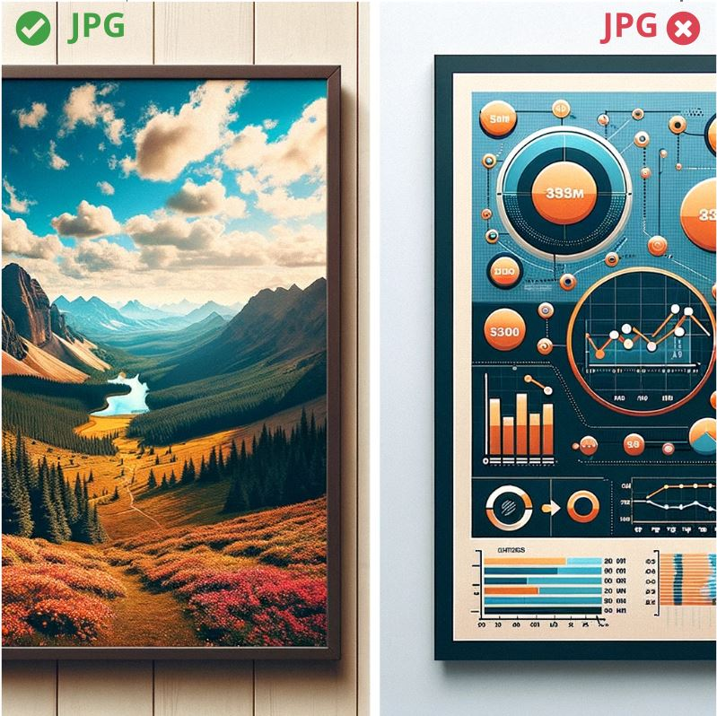

Often, employees of marketing agencies or beginner graphic designers lack technical knowledge about the operation of individual graphic file formats and their appropriate application. This becomes apparent when they submit vector graphics for online publication in JPG format or when they deliver a PDF file for printing with an RGB color palette and attached custom fonts. The purpose of this article is to provide a quick cheat sheet for such individuals, so that the works they submit do not lose quality as a result of conversion to inappropriate formats and to prevent situations where the prints turn out differently than the document preview on the monitor.

## Collaboration with Photographers

### RAW - The Negative of a Photo

The RAW file format, often referred to as the "digital negative," contains a complete set of information captured by the camera's sensor at the moment the photo is taken, without undergoing automatic processing or compression. It's an excellent choice for photographers who plan to precisely process the image using specialized software like Darktable or Adobe Lightroom before using it in graphic works. However, RAW is not the recommended format for transferring to agencies or graphic designers. After fine-tuning the photo's parameters, the photographer should export it to a format that still allows for high-quality digital processing but is not as specialized and closely tied to photography as RAW. TIFF, described below, is the ideal choice for transferring photos.

### TIFF - Photos Prepared for Further Processing

Tagged Image File Format (TIFF) is the ideal choice for storing photos in a large, lossless format that can later be digitally enhanced or converted to various other formats. Its advantage lies in the fact that it allows for lossless compression — aiming to reduce the file size (from tens to hundreds of MB) without decreasing quality. This contrasts sharply with the JPG format, where each subsequent save leads to an inevitable loss of sharpness and granularity due to lossy compression. Repeated editing and saving of a JPG file deteriorate the quality with each step, and the loss of details becomes particularly noticeable when enlarging the photo or in its prints.

Graphic designers can directly import TIFF files into projects prepared for printing. However, it may be necessary to convert from an RGB color palette, used by monitors, to a CMYK palette, used by printers. For electronic publication, such as a website or files, conversion to JPG format will be necessary. In this case, lossy compression is only acceptable as the final step, reducing the photo's size from dozens of MB to a few MB.

## Collaboration with Graphic Designers

### Editable Formats

Each graphic designer, when creating a new project intended for print or an infographic for online publication, will save their work in a format corresponding to the graphic program used. For Adobe InDesign, this will be an INDD file, while for Adobe Illustrator – AI. These files have the following characteristics:

- They are worth keeping as they allow for easy editing and further development of the project.
- They are not suitable for direct online publication, as few have the software to open them.
- They are often not suitable for printers – the printer may not have the required program, and the file may contain links to external files, such as photos or custom fonts, which may not print correctly after the file is transferred.

For these reasons, graphic designers usually convert projects to more universal formats before publication or sending them to printers.

### PDF - Ideal for Printers and Online Documents Publishing

Portable Document Format is a versatile format useful for both printing and digital documents publication. It is no suitable to embed images into websites and email - it's usually opened as a separate file. It is also not suitable for extensive editing - beyond minor corrections, graphic designers will encounter significant difficulties in further developing a project based solely on a PDF file. This format is typically used at the final stage of the process, primarily for publishing purposes. Another important aspect to keep in mind is that the method of preparing a PDF file for print differs from that used for preparing it for an online publication.

In the context of materials intended for print, it's crucial that PDF files are based on a CMYK color palette and that all custom fonts have been converted to outlines. Also, photos should be adjusted to the CMYK palette and embedded at high resolution. This ensures that the print will faithfully reflect the design.

For digital publications, an RGB color palette suited for screens and digital devices is recommended. It's also advisable to use a higher degree of image compression so the PDF size doesn't exceed a few megabytes. In comparison, a PDF file for print can be hundreds of megabytes.

### SVG - Vector Graphics on the Web

Scalable Vector Graphics (SVG) is a graphic file format used for storing vector graphics. Unlike raster formats such as JPG or PNG, SVG allows for unlimited scaling of graphics without any loss of quality. This makes it an excellent choice for projects that require sharp edges and clarity, regardless of the displayed image size.

SVG is particularly popular for web publishing. It is commonly used for:

- **Logos** – thanks to its small file size and the ability to scale without losing quality.
- **Infographics and charts** – providing sharp edges and readability at any level of zoom.
- **Animations** – SVG supports simple animations that can be created using CSS and JavaScript.
- **Icons and user interface (UI) elements** – due to its compatibility with browsers and ease of editing.

However, SVG is not commonly used in print-oriented projects. Support for CMYK and ICC profiles was added to the standard quite late and is therefore poorly supported.

### JPG - Publishing Photos

The Joint Photographic Experts Group format is an ideal choice for publishing photos online, as it's widely supported by web browsers and file viewing applications. With its lossy compression, JPG can significantly reduce the size of a photo, which is particularly useful with limited internet bandwidth. This compression was specifically designed for photos. However, for publishing various types of infographics, logos, and other graphics where sharp edges and transparency are important, the PNG format might be more suitable.

### PNG - Publishing Vector Images

Portable Network Graphics is an excellent choice for publishing infographics, logos, charts, and other graphics based on so-called vector projects. For these types of projects, PNG offers compression that reduces file size while maintaining sharp edges - this is important as JPG compression often disturbs them in such graphics. The differences between raster and vector graphics are demonstrated in the image below:

Above, we used the JPG format for both graphics - that's why you can see some noise around the edges of the charts and shapes on the right. If you split this image in two and used PNG for the right side, then the edges of the graphics would be sharp. PNG, however, is not infinitely scalable while maintaining sharp edges like SVG. It is, however, a simpler format than SVG and therefore causes fewer compatibility issues on older devices.

### Update: AVIF - The Successor to JPG and PNG

The AVIF (AV1 Image File Format) is a modern image standard based on the open-source AV1 video codec. It provides significantly higher compression efficiency than older formats like JPG, PNG, and even WebP, offering better image quality at a noticeably smaller file size. AVIF is highly versatile—it supports both lossy and lossless compression, transparency (alpha channel), animations, as well as wide color gamuts and HDR.

When saving to the **AVIF** format, you must choose between lossy and lossless compression, applying the same logic as when deciding between **JPG** (lossy) and **PNG** (lossless).

As of today (2026), browser support for the AVIF format is universal and well-established. It is natively and fully supported by all major web browsers, including Google Chrome, Mozilla Firefox, Apple Safari, and Microsoft Edge (across both desktop and mobile platforms). Because of this, AVIF has become the new default standard for optimizing graphics and photos in modern web design.
