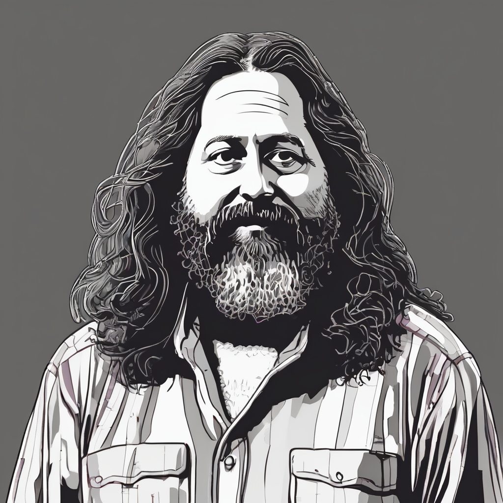
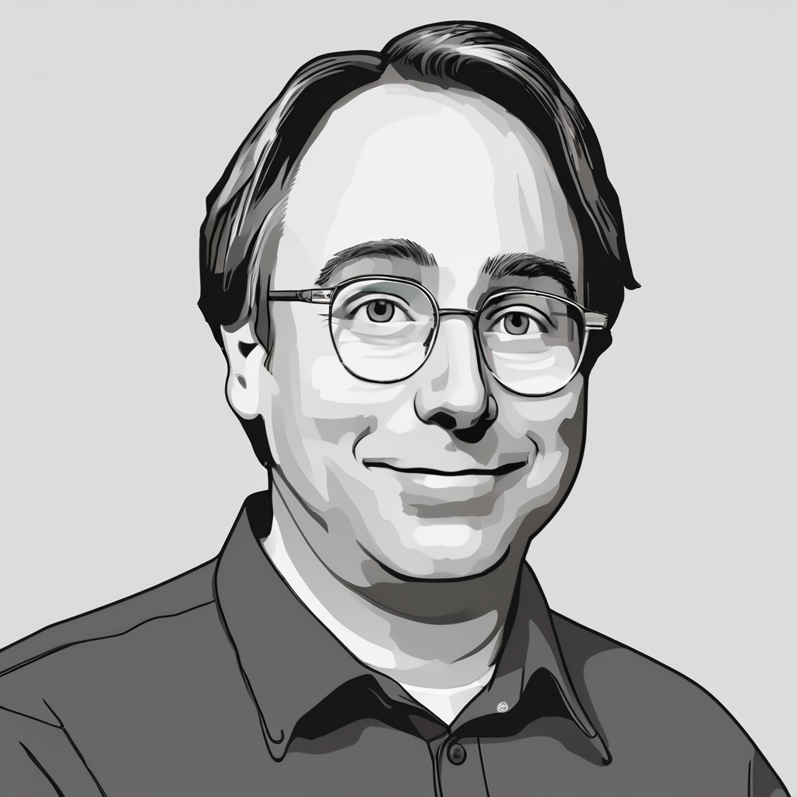

Open projects are a phenomenon that entered the arena of computer history at the turn of the 1980s and 1990s, in the form of the free software movement. At that time, business players in the IT industry saw them as a whim of a few members of the academic community, which had no place in commercial conditions. The vision of open projects, within which software could be used and copied for free, and users would be treated as collaborators, seemed to have no chance of developing and improving valuable computer products.

## Common practices of the '60s and '70s.

Sharing software is a phenomenon as old as the software itself. As improbable as it might seem in today's world, dominated by EULA licenses and numerous protections against unauthorized copying, sharing source codes was a common practice in the 1960s and 1970s. In those times, software was mainly produced and used by scientists and highly qualified technicians. Among both groups, there was a relatively open culture of sharing intellectual property and critiquing it. The resulting exchange of intellectual values was not framed in any legal form, nor limited by licensing provisions. Moreover, computer hardware suppliers had an equally relaxed attitude towards software, as they did not see it as a significant business asset. Clearly, the IT industry of those distant decades differed significantly from today's. One of the other significant differences was the large number of non-standardized hardware architectures in common use at the time and the lack of programming languages that were portable between these architectures. Therefore, computer hardware suppliers not only did not restrict the sharing of software sources in any way but even encouraged such behavior. This attitude stemmed from the fact that it helped them in adapting software to new architectures, which in turn ensured faster market adaptation. At the same time, the clients of these suppliers expressed a willingness to engage in such cooperation, because, one way or another, necessity forced them to write their own software, closely tailored to the requirements of their research. Moreover, computational power itself was much more important than feature-rich software. However, as the industry matured in the 1980s, certain changes occurred, ending what was known as the first era of software co-creation\[TES\].

## Escalation of proprietary software in the '80s.

The second era, which began in the '80s, is termed the *escalation of proprietary software*. This was a time when computer hardware suppliers began to see software as a sellable commodity, a good in itself subject to commercial exchange, or at least as an essential attribute in hardware sales\[POS\]. The two most important factors that led to this change were the emergence of high-level programming languages and the fact that the market began to focus on only a few hardware architectures. With such a state of affairs, the mass production of feature-rich computer systems became a viable venture. Hardware manufacturers also noticed that the value of their products, from the customer's perspective, shifted from the offered computational power to the availability of software. This, in turn, led some companies to start enforcing intellectual property rights for software products to which many scientists and technicians had previously contributed their own improvements. One of the most recognizable examples of this type was the actions of AT&T against the UNIX operating system\[TES\].

These practices broke the prevailing cycle of exchanging software improvements and lowered the IT community's motivation for informally offering further enhancements. While this trend spread, taking over a significantly larger part of the computer industry, several smaller communities (mainly connected with the academic environment) effectively resisted it by not closing their source code. One such group was the Computer Systems Research Group at the University of California, Berkeley, which made its Berkeley Software Distribution package available under the very liberal BSD license. This allowed their source codes to be used in both open and closed projects. Initially, Berkeley Software Distribution was a collection of new programs and replacements for the commercial Sixth Edition Unix. However, BSD gradually began to transform into an independent operating system. Meanwhile, Richard Stallman emerged on the IT industry scene as one of the most influential and active personalities resisting the trend of proprietary software. He quit his job at the AI labs at the Massachusetts Institute of Technology as soon as they switched to proprietary software and started building a community around the GNU project and the Free Software Foundation\[AGP\].

Stallman led both organizations, building the legal and ideological foundations of a new community working for free software - a community that could share their work without the risk that the source code they offered would again be transformed into proprietary software. A manifestation of this was the creation of the GNU GPL license, which allowed for unlimited distribution of the unmodified version of the software but also imposed certain restrictions on works created using its sources. These restrictions stipulated that any software using the sources or linking to the free software must also be available under the GPL license terms. An important end result of this was that any improvement made on free software automatically became available to its original authors. Richard Stallman's GNU project was the first testing ground for GPL licensing principles. It was built by a community with similar goals to the people involved with the BSD project, but much more permeated with ideology in their pursuits. For the BSD team members, the openness of the project was a practical matter, while for the free software movement, it was a moral issue. This difference gave rise to two types of open-source licenses: permissive licenses like BSD and restrictive licenses similar to GPL (otherwise known as copyleft licenses).

At the same time, during those same years, the first attempts to profit from free software were made. One such attempt was the selling of copies of free software carried out by Richard Stallman and the FSF. This business model had great potential before the internet boom and later evolved into the sale of software distributions specifically tailored for particular commissions.

Another manifestation of the development of open software at that time was a project called the X Window System. It was an open graphical environment created by MIT along with computer hardware suppliers who were interested in providing their clients with a windowing system as well. However, this project was far from the idea of opposing proprietary software, as its X license explicitly allowed for the creation of proprietary extensions to the environment. Each consortium member wanted the ability to add their own modules to the default version of the environment to gain an advantage over other members. The X Window System was created as free software, and the project itself was a simple form of cooperation among several companies that had previously competed with each other over a common tool\[POS\]. This allowed them to drastically reduce the costs of producing a product that in itself was not a tradeable good for them. Such a strategy allowed everyone to save their own resources and spread the risk associated with the project.

Aside from the examples mentioned above, at the same time, there were many other, less noticeable, open projects using even more varied licenses. The diversity of open licenses reflected the variety of existing motivations. Many developers who chose the GPL license for their projects were not as ideologically driven as, for instance, those involved in GNU projects. Some felt a moral impulse to free the world from what Stallman called software hoarding (his term for non-free software), but others were more motivated by technical fascination and saw the methodologies used in open projects as an effective way to organize collaboration. Programmers also had other reasons to stick together on such terms: many open projects produced very high-quality code. This tendency was not universal, but it was increasingly common. The business community could not help but notice this. Senior managers are not always fully aware of what their IT departments use and are often surprised to learn, albeit belatedly, that they are already using free software in their daily operations. Consequently, corporations began to take an active role in free projects by offering their own labor or computer equipment, and sometimes even by funding developers. According to optimistic scenarios, such investments could pay off many times over in the future. In plain terms: a sponsor employs only a small number of full-time experts in the project but benefits from the work contributed by all parties involved, including volunteers working without financial compensation, as well as other programmers paid by different companies.

## Development of the internet, mass collaboration, and open source since the '90s.

If you look at free software as a methodology, it's noticeable that it's an easy way to create a simple environment for the collaboration of all parties interested in the project with almost zero bureaucracy. Open projects usually readily accept anyone who wishes to participate and don't require members to work continuously, i.e., from day to day. This allows for a large potential group of people and businesses to join such projects. However, the biggest initial barrier was geographical limitations, which disappeared with the emergence and development of the internet in the 1990s. The network provoked communities engaged in free software to create tools such as file repositories, mailing lists, IRC chats, task trackers, version control systems, etc., and at the same time made them accessible from anywhere in the world. This enabled them to fully utilize their potential and began the third era, which continues to this day\[TES\].

The tools mentioned above accelerated the development of a collaborative network among many open projects and inspired new free software creators. One of them was Linus Torvalds, who, using tools from the GNU project, began working on the Linux kernel project.

With the help of various programmers who found the project online, Linus's kernel matured at a rapid pace. Two years after the first release of Linux in 1991, the GNU project team decided to use it to build their operating system. A stable system kernel was the only component they lacked. Thus, in 1993, the Debian distribution, also called GNU/Linux, which was a combination of the Linux kernel and GNU system software, saw the light of day. This combination proved to be exceptionally successful and gained recognition in the IT industry. As free software gained wider acceptance worldwide, a new market emerged for commercial support of this type of software and new GNU/Linux distributions to meet growing demands. Two of these distributions - Red Hat and SUSE - gained wide adoption in the market of web servers and application servers. The companies that produced them grew into multimillion-dollar corporations, demonstrating to the IT industry that open source software can generate substantial revenue.

The new trend treated free software merely as an efficient method of development and distribution. The shift in image from ideological to more practical brought new players like Larry Augustin, Jon Hall, Sam Ockman, Michael Tiemann, and Eric S. Raymond to the scene, who began promoting the term *open source*. This was intended to distance from the ideology negating proprietary software and promote commercial activities within their community. Bruce Perens and Eric S. Raymond created an initiative called the Open Source Initiative to provide substantive and legal support for the new movement. This effort proved effective as the term open source began to gain popularity, and new companies emerged on the market reaping huge profits from such projects. One of the most spectacular successes was the company MySQL AB with their low-end database and Trolltech with the Qt development toolkit. Both companies introduced a new business model called dual licensing, in which they provided their products for free for open source projects, but at the same time required licensing fees from those who wanted to integrate them with proprietary software. Also, the biggest giants in the IT industry recognized the advantages of having a rich portfolio of open products. Since the late '90s, there has been a wave of opening multi-million-dollar products and creating entire foundations supporting the open source movement. Examples include Sun Microsystems, which opened almost its entire Java technology stack and many related tools. To this day, many of these projects are actively developed under the leadership of Oracle despite the controversial acquisition of Sun Microsystems in 2010. Another example is IBM, the founder of the Eclipse Foundation, which aims to develop open developer tools. Microsoft also changed its approach, whose creator Bill Gates aggressively attacked the free software movement in the 1970s1. The first breakthrough for the Redmond corporation occurred in 2006 when it created the CodePlex foundation, focusing on the development of free software centered around its technology stack. Some time later in 2015 Microsoft released the open and expansive developer environment Visual Studio Code, which has become the most popular tool of its type among developers in recent years2.

## Summary

Today, open source software no longer carries the same aura of mystery it did at the beginning of its existence, and certain basic features that contributed to its success are now widely recognized. However, open source projects still pose a fairly significant challenge when a much more detailed analysis is needed, or when planning to create one's own initiative of this type. Soon, more articles on the organization methods and funding sources for such projects will appear on the blog.

## Sources

1. [Computer Hobbyists - Bill Gates, *Radio-Electronics* (New York NY: Gernsback Publications), 1976](https://www.digibarn.com/collections/newsletters/homebrew/V2_01/index.html)
2. [Stack Overflow Developer Survey 2022 - Integrated Development Environment](https://survey.stackoverflow.co/2022/#section-most-popular-technologies-integrated-development-environment)

\[TES\] [The economics of sharing: Open source and Beyond - Josh Lerner, Jean Tirole, NBER Working Paper No. 10956, 2004](http://www.nber.org/papers/w10956)

\[POS\] [Producing Open Source Software - Karl Fogel, book, 2009](http://producingoss.com/)

\[AGP\] [About the GNU Project - Richard Stallman, article](http://www.gnu.org/gnu/the-gnu-project.html)
