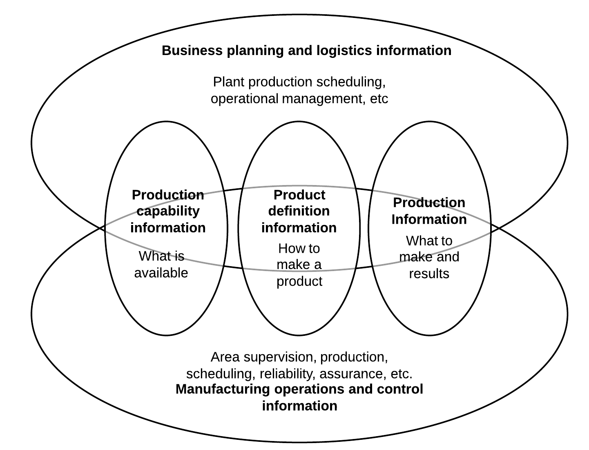
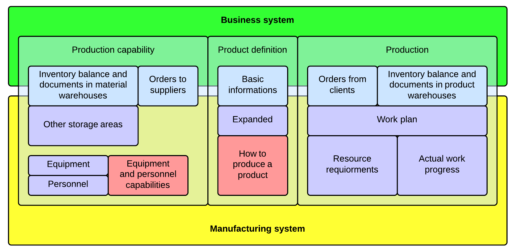

In the [last article](https://walczak.it/blog/division-erp-mes-responsibilities-sme-scale-things) we described why the division of responsibilities between **ERP-MES** systems from the **IEC/ISO-62264** standard cannot be directly applied to small and medium enterprises. Now we’ll show you how we devised our own integration scheme for systems used in **SME** based on the conclusions from the previous analysis.

The IEC-62264 standard shows the areas of information exchange between the business (4) and manufacturing (3) level as presented below. Its design is tightly correlated with the standards functional hierarchy.

Because we constructed a different functional hierarchy for our manufacturing system we must also take a different approach to the information interchange scheme. Our model will be significantly limited due to the fact that we also narrowed the scope of responsibilities for both business and the manufacturing systems in SME. Furthermore, our manufacturing system took some responsibilities from the business level (4). The diagram below illustrates our integration scheme.

This division of information is much less overlapping then what we can see in the standard. It allows us to keep the integration costs relatively cheep by limiting us to only three data exchange points:

- basic informations about goods, units, people and companies – the manufacturing system will base on the data received from the business system and will extensively expand them with its resource model and unit conversion rules,
- the companies main warehouses – management functions around them will remain in the business system, inventory balances will be received by the manufacturing system, aspects of the overall work progress that are important to the business system will mostly be represented in the form of goods transfers out and into those main warehouses,
- orders – the business system is the main place to service them from the accounting and financial perspective, the manufacturing system will only receive the data required by the manufacturing process.

As for the data model to describe equipment/personnel capabilities and how to produce a product – this will remain a moot point. We’re making a conscious decision to not implement these type of mechanisms in the first release of the system. We assume production plant managers and engineers will always have a much richer model inside their heads. The system must allow then to construct the work plan without the constrains the poorer model implemented in the software. It will be safer to implement this model in the subsequent releases of our system as a means to automatism some planning operations. But the formal production rules in the system should not be treated as unbreakable. Exceptional situations happen – especially in production plans – and one must have the ability to service them in the system without the need to modify its rule set.

For example lets take the following scenario. We are producing a lot of closets. Unfortunately because one of our workers did a mistake while configuring the machinery – a dozen of the closets side walls ware cut too short. However, there is no sense to mark them as waste – after doing one more cut they could be used as shelf walls. This type of nuances in manufacturing are not taken into consideration by many software designers. Most systems will not allow this type of problem solving to proceed because this would validate the rules of closet manufacturing that ware previously entered to the system. In this case we will have to devise a way to cheat the system so that we can move on and pray that we wont get absurd data in the future reports. Only some systems will allow us to modify the rules of a process that is already being executed. Still however there is no sense to add this type of exception to the formal description of the closets production process. The optimal solution is to just register the actual event – as it really happened – despite the fact that it’s invalid from the perspective of the systems configuration.

---

