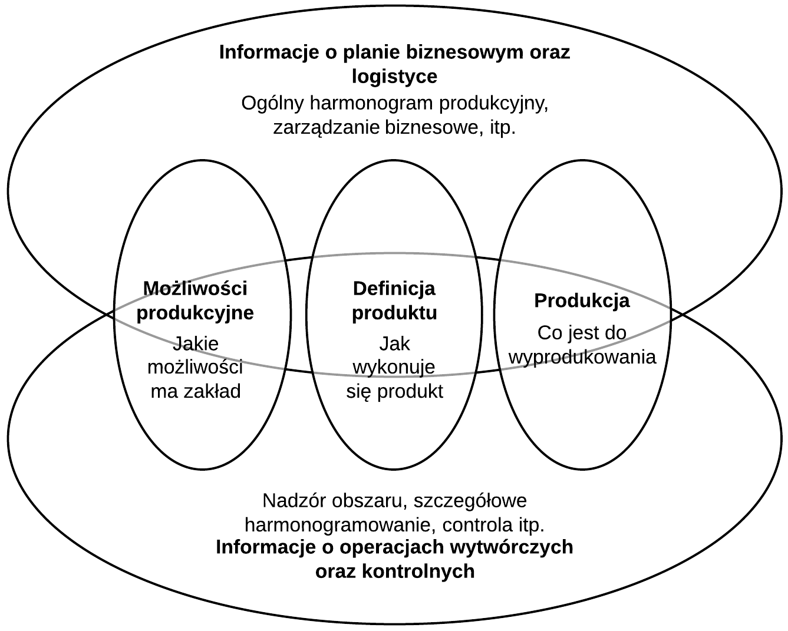
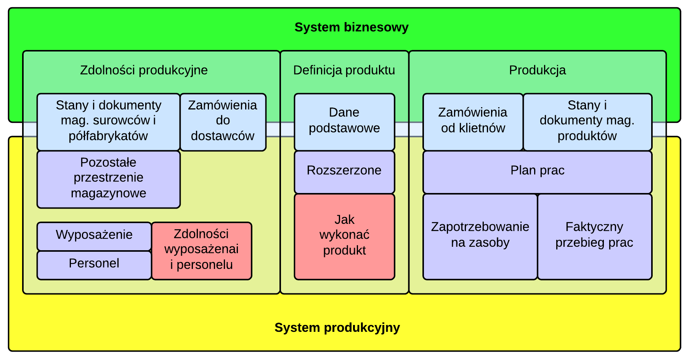

W [poprzednim artykule](https://walczak.it/pl/blog/podzial-kompetencji-miedzy-erp-mes-kontra-realia-msp) przedstawiliśmy dlaczego nie da się zastosować w pełni podziału kompetencji systemów **ERP-MES** według standardu **IEC/ISO-62264** w realiach małych i średnich przedsiębiorstw. Teraz natomiast opiszemy jaki, na bazie tych przemyśleń, opracowaliśmy schemat integracji analogicznych systemów stosowanych przez **MSP**.

Standard IEC-62264 przedstawia obszary wymiany informacji między poziomem biznesowym (4) a przemysłowym (3) według poniższego schematu. Jego zamysł jest ściśle skorelowany z ich hierarchią funkcjonalną.

W konsekwencji tego, że przyjęliśmy zupełnie inną hierarchię funkcjonalną, także musimy zastosować inne podejście do lokalizacji obszarów informacji. Nasz model będzie znacznie ograniczony, jako że ograniczyliśmy zakres kompetencji zarówno systemów biznesowych jak i przemysłowych w MSP. Ponadto nasz system przemysłowy przejął niektóre kompetencje z poziomu biznesowego (4). Poniższy rysunek przedstawia naszą koncepcję wymiany informacji między systemami.

Podział ten jest o wiele płytszy od tego proponowanego w standardzie. Umożliwia zachowanie względnie tanich kosztów integracji systemów dzięki ograniczeniu się do trzech kluczowych punktów integracyjnych:

- dane podstawowe takie jak: towary, jednostki, ludzie, firmy – system produkcyjny będzie bazował na danych systemu biznesowego, ale będzie też je znacznie rozszerzał poprzez swój model zasobów oraz przeliczniki jednostek,
- główne magazyny firmy – zarządzanie nimi pozostanie w systemie biznesowym, ich stany będą znane w systemie produkcyjnym, realizacja produkcji istotna dla systemu biznesowego będzie odzwierciedlona w dużej mierze w postaci ruchów na głównych magazynach,
- zamówienia – głównym miejscem ich obsługi w zakresie księgowym oraz finansowym będzie system biznesowy, do systemu produkcyjnego trafiają tylko w zakresie niezbędnym do obsługi procesów produkcyjnych,

Kwestią dyskusyjną pozostają modele służące do definicji zdolności wyposażenia i personelu oraz tego jak wykonać dany produkt. Świadomie pomijamy implementację tego typu mechanizmów w pierwszej wersji systemu. Zakładamy że planista lub technolog będzie miał zawsze bogatszy model w postaci swojej wiedzy. System powinien umożliwić mu układanie planu nieograniczonego regułami opartymi o uboższy model zaimplementowany w oprogramowaniu. Dlatego też bezpieczniej będzie zaimplementować je dopiero w kolejnej wersji jako aspekt ułatwiający pracę. Niemniej jednak owe reguły, które dadzą systemowi częśc wiedzy nt. przebiegu procesu produkcyjnego, nie powinny być traktowane w sposób sztywny. Wyjątki od reguł się zdarzają – zwłaszcza na produkcji – i trzeba mieć możliwość obsłużenia ich w systemie bez konieczności modyfikowania samych reguł.

Dla przykładu weźmy następującą sytuację. Produkujemy partię szaf. Niestety z powodu złego ustawienia maszyny przez pracownika kilkanaście ścian bocznych zosało źle wyciętych. Nie ma jednak sensu wyrzucać ich jako odpad – po kolejnych skróceniu nadawałyby się na ściany górne. Jakże wielu projektantów oprogramowania nie uwzględnia tego typu smaczków występujących na produkcji. Większość systemów na to nie pozwoli – jako że takie postępowanie jest niezgodne z skonfigurowanym w nich opisem procesu produkcyjnego szaf. Zaczynają się kombinacje jak oszukać system żeby to przepchnąć, jednocześnie mając na uwadze że w raportach potem mogą wyskoczyć bzdury. Niektóre systemy pozwolą zmodyfikować reguły procesu nawet jeżeli jest on już w toku. Jednak nadal nie ma sensu wprowadzać takiego wyjątku do formalnego opisu procesu produkcji szaf. Optymalnym rozwiązaniem jest po prostu zarejestrować przebieg zdarzenia – mimo że jest niezgodny z konfiguracją systemu.
