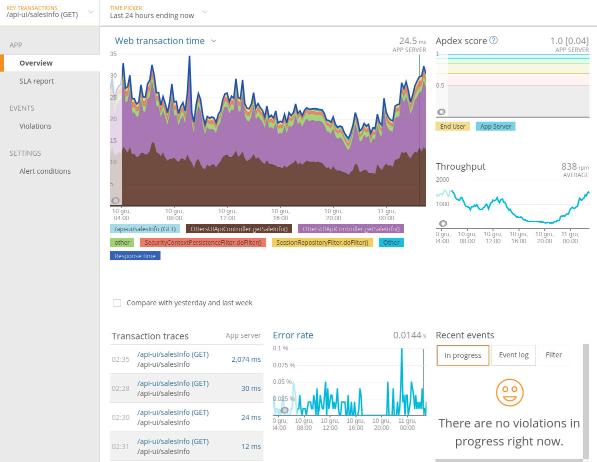
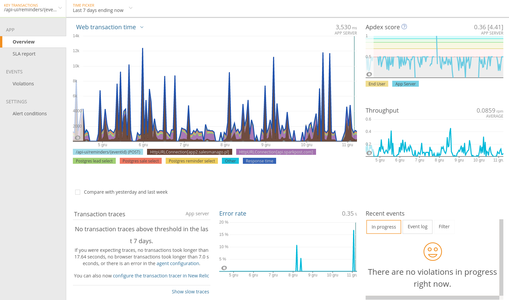
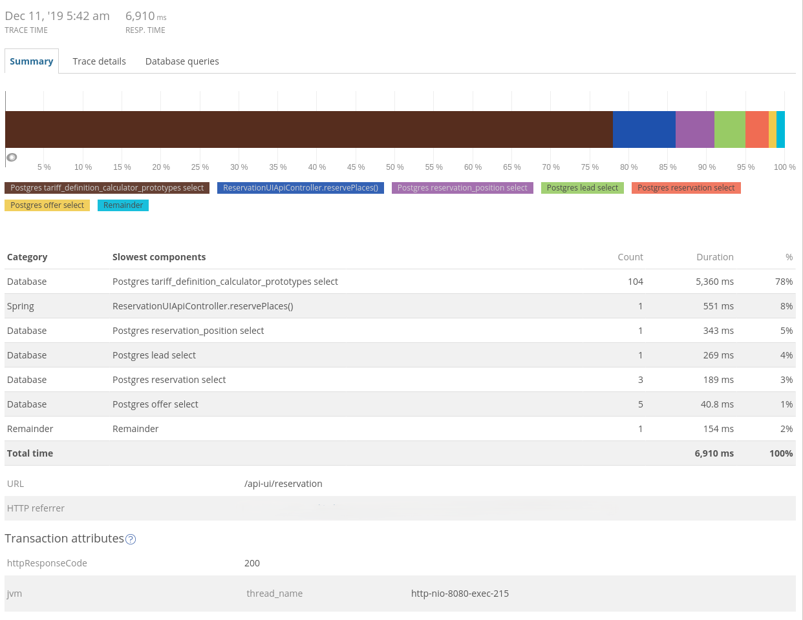
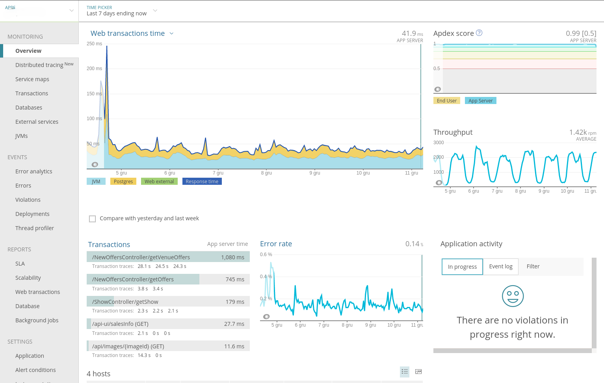
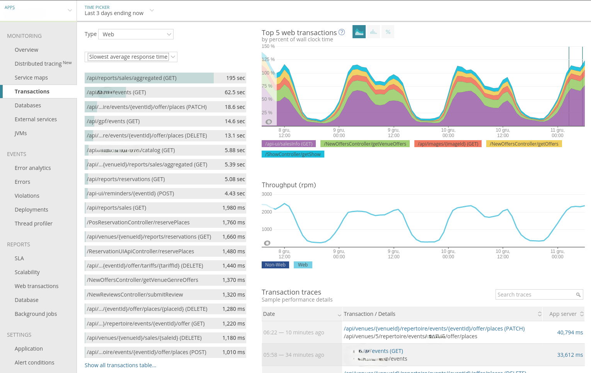
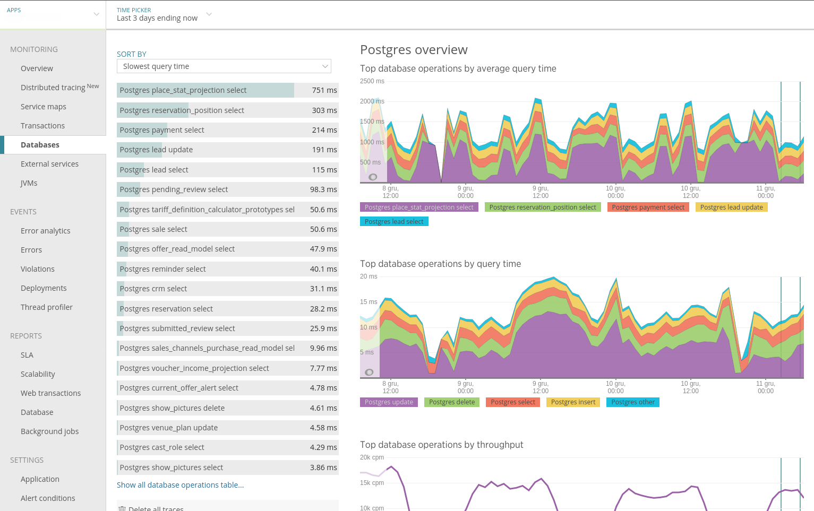
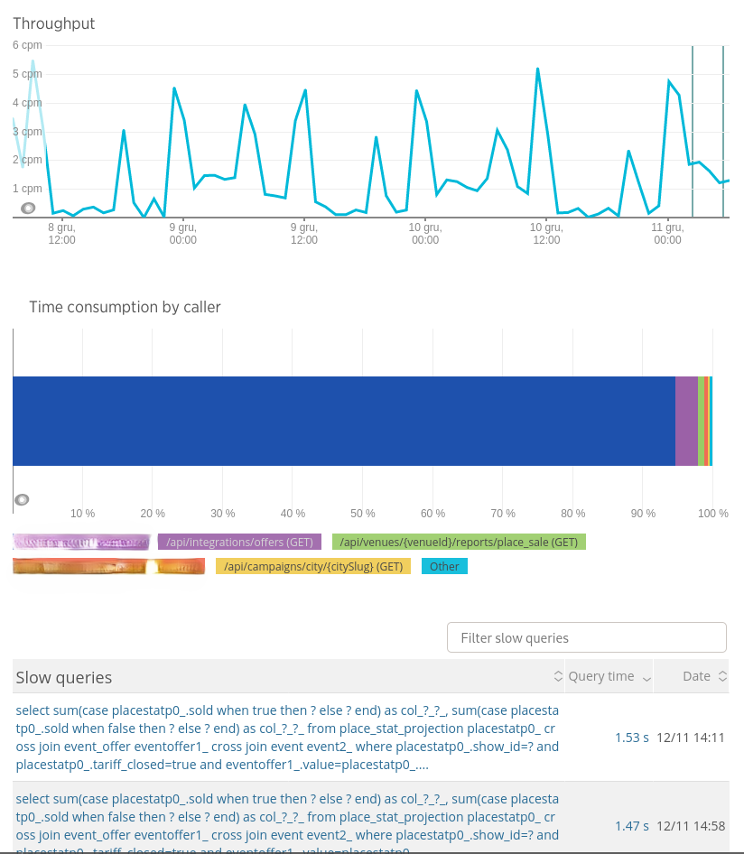

## Introduction

Application and infrastructure monitoring is one of the basic tools that helps us spot problems quickly and understand their causes. New Relic and Datadog are commercial SaaS services, Prometheus with Grafana is an open-source solution focused on metrics, and Elastic Stack is primarily used to aggregate and search logs as well as work with metrics. I compare their features — metrics, logs, alerts, and APM — and check how much it costs to set up and maintain each approach. The goal is not to identify one universally best solution, but to show the scenarios in which each of them works best.

## Comparison scope and assumptions

The comparison covers the functionality and maintenance and development costs of the following solutions in a small startup:

- **New Relic** — metrics, logs, and alerts. A commercial service designed to automatically detect a large number of application metrics and present them in a partially configurable interface.
- **Datadog** — metrics, logs, and alerts. Like New Relic, it is a SaaS service that automatically collects and presents data.
- **Prometheus + Grafana** — metrics and alerts. This is an open-source solution in which most dashboards and charts have to be prepared manually, although you can use a [repository of ready-made dashboards](https://grafana.com/grafana/dashboards).
- **Elastic Stack** — metrics, logs, and alerts (in the paid version). The analysis covers both Kibana + Elasticsearch + Beats / Logstash and Elastic APM.
  - Kibana + Elasticsearch + Beats / Logstash is a quasi-open-source solution: some important features are available only in proprietary code. The stack is primarily suited to **logs**, but it can also store metrics. Unlike SaaS services, it does not automatically configure many views, and dashboard examples are scattered across GitHub.
  - Elastic APM was, at the time, a free product with code available under a proprietary license. Its interface is embedded in Kibana and, similarly to New Relic APM, automatically detects application metrics.

The quoted prices are approximate.

Assumptions about the cost of developer work:

- PLN 15,000 gross per month for a developer = PLN 210,840 annual employer cost,
- 253 working days in 2020 - 26 days of vacation - 8 days of sick leave / on-demand leave / etc. = 219 working days,
- cost of one working day (8 hours) = PLN 963,
- cost of one hour = PLN 120.

Other assumptions:

- 1 host for production services = 6 vCPUs and 16 GB RAM, plus 10 MB of logs per day,
- 1 USD = 4 PLN.

## Basic maintenance cost

This section includes installation, hosting, backups, upgrades, and ongoing maintenance.

### New Relic

| Module / Pricing | 1 host | 2 hosts | 3 hosts | Comment |
| --- | --- | --- | --- | --- |
| APM (host based pricing) | PLN 596 / mo | PLN 1192 / mo | PLN 1788 / mo | Many very useful metrics for every endpoint and business method; in other tools they have to be configured separately on dashboards |
| Logs (8-day retention) | PLN 1100 / mo | PLN 1100 / mo | PLN 1100 / mo | The minimum data package is far too large for us |
| Logs (30-day retention) | PLN 1744 / mo | PLN 1744 / mo | PLN 1744 / mo | |
| Infrastructure | PLN 79 / mo | PLN 158 / mo | PLN 237 / mo | Fairly standard metrics, which we also have on DigitalOcean |

| Module / Pricing | Price | Comment |
| --- | --- | --- |
| Insights | free for 90 days of retention, PLN 1000 / mo for 75 million events | We would have to add the extra cost if we wanted to store a long-term history of business metrics there |
| Browser | PLN 596 / 0.5 million page views / mo | Once we exceed 0.5 million page views, sampling can be used because a larger data sample is usually unnecessary |

The prices are net prices.

Example combinations:

- initially: 1 host with APM + Logs (9 days) = PLN 1696 / mo,
- after implementing zero-downtime deployment: 2 hosts with APM + Logs (30 days) = PLN 2936 / mo,
- in the future: 3 hosts with APM + Logs (30 days) + Browser = PLN 3532 / mo.

### Datadog

| Module | 1 host | 2 hosts | 3 hosts | Comment |
| --- | --- | --- | --- | --- |
| APM | PLN 124 / mo | PLN 248 / mo | PLN 372 / mo | |
| Logs (50k events / host / day, 8-day retention) | PLN 8 / mo | PLN 16 / mo | PLN 24 / mo | |
| Logs (500k events / host / day, 30-day retention) | PLN 160 / mo | PLN 240 / mo | PLN 400 / mo | |
| Infrastructure | PLN 60 / mo | PLN 120 / mo | PLN 180 / mo | APM has to be purchased together with Infrastructure |

| Module / Pricing | Price | Comment |
| --- | --- | --- |
| Real User Monitoring | PLN 60 / 10k sessions / mo | Sampling can be used to avoid exceeding the minimum limit |

Example combinations:

- initially: 1 host with APM + Infrastructure + Logs (50k events / host / day, 30-day retention) = PLN 192 / mo,
- after implementing zero-downtime deployment: 2 hosts with APM + Infrastructure + Logs (500k events / host / day, 30-day retention) = PLN 608 / mo,
- in the future: 3 hosts with APM + Infrastructure + Logs (500k events / host / day, 30-day retention) + Real User Monitoring = PLN 1012 / mo.

### Prometheus + Grafana

Functionality: metrics.

Basic installation and integration: 2–4 workdays (PLN 1,926–3,852).

Additional High Availability configuration (monitoring and redundancy): 2–4 workdays (PLN 1,926–3,852).

I am not claiming that we need HA, but it is worth remembering that, in practice, we get it included with New Relic.

Ongoing maintenance (updates, minor configuration changes, occasional checks that everything is working, etc.): 0.5–1 workday / mo (PLN 481–963 / mo).

| Operation | 1 host | 2 hosts | 3 hosts | Comment |
| --- | --- | --- | --- | --- |
| Resources | 0.25 CPU 0.6 GB RAM | 0.5 CPU 1.2 GB RAM | 1 CPU 2.4 GB RAM | |
| Price | PLN 13 / mo | PLN 26 / mo | PLN 52 / mo | |
| Resources for HA (2 instances) | | 1 CPU 2.4 GB RAM | 2 CPU 4.8 GB RAM | HA is based here on two instances receiving data in parallel. Scalability is limited for very large systems. |
| Price for HA (2 instances) | | PLN 52 / mo | PLN 104 / mo | |

The price was calculated as a proportional share of a server with 16 GB RAM and 6 vCPUs, costing PLN 320 / mo on DigitalOcean.

### Elastic Stack self-hosted

Functionality: metrics, plus log aggregation and indexing.

Basic installation and integration: 3–5 workdays (PLN 2,889–4,815).

Additional High Availability configuration (monitoring and redundancy): 2–4 workdays (PLN 1,926–3,852).

Ongoing maintenance (updates, minor configuration changes, occasional checks that everything is working, etc.): 1–2 workdays / mo (PLN 963–1,926 / mo).

| Operation | 1 host | 2 hosts | 3 hosts | Comment |
| --- | --- | --- | --- | --- |
| Resources | 0.5 CPU 1.2 GB RAM | 1 CPU 2.4 GB RAM | 2 CPU 4.8 GB RAM | |
| Price | PLN 26 / mo | PLN 52 / mo | PLN 104 / mo | |
| Resources for HA (3 instances) | | | 3 CPU 6.0 GB RAM | Sharding with each shard replicated to 2 instances |
| Price for HA (3 instances) | | | PLN 156 / mo | |

### Elastic Stack Cloud

Minimal configuration in a hot-warm architecture (for logs and monitoring), effectively recommended only for testing:

- 1 zone
- aws.data.highio.i3 (data) - 1 GB RAM x 1, 30 GB storage x 1
- aws.data.highstorage.d2 (data) - 2 GB RAM x 1, 320 GB storage x 1
- aws.kibana.r4 (Kibana) - 1 GB RAM x 1
- aws.apm.r4 (APM) - 512 MB RAM x 1

Price: PLN 367 / mo.

Minimum recommended production configuration:

- 1 zone
- gcp.data.highio.1 (data) - 4 GB RAM x 1, 120 GB storage x 1
- gcp.data.highstorage.1 (data) - 4 GB RAM x 1, 640 GB storage x 1
- gcp.kibana.1 (Kibana) - 1 GB RAM x 1
- gcp.apm.1 (APM) - 512 MB RAM x 1

Price: PLN 876 / mo.

The prices do not include data transfer or snapshot storage costs — the provider charges for these separately.

### Costs at large scale

In my experience, New Relic becomes very expensive for services operating at a really large scale (hundreds of thousands of users and dozens of servers).

With 50 hosts, APM alone will already cost PLN 29,800 per month.

At that price, it starts to make sense to hire two DevOps engineers to maintain a larger Elastic Stack installation together with Prometheus and Grafana, as well as to automate the creation of metrics and dashboards for the organization.

## Metrics

### Metric model

- Prometheus
  - ✅ by design, it supports a hierarchical metric model with tags, allowing data to be analyzed multidimensionally,
  - ✅ as a dedicated metrics database, it provides very good compression of stored data.
- Elasticsearch
  - ✅ metrics can also be multidimensional because individual events are stored here together with contextual data,
  - ⚠ because events are stored, additional work is needed to compress them when the amount of data becomes a problem. Despite many optimizations, Elasticsearch will never be as efficient in this regard as Prometheus ([source](https://www.reddit.com/r/devops/comments/ami7m9/is_elk_trustable_also_for_metrics_and_alerting/)).
- New Relic Insights:
  - ✅ a hierarchical metric model which has relatively [recently gained so-called facets](https://blog.newrelic.com/product-news/facets-nrql-queries-insights/) provides multidimensionality support; apparently, it has already been integrated with Spring Metrics,
  - ⚠ in a SaaS solution, we do not have to worry about how data is stored, but it is difficult to assess whether PLN 1000 / mo for retaining 75 million events is a lot or a little.
- Datadog:
  - ✅ has supported a hierarchical metric model with [tags](https://www.datadoghq.com/blog/the-power-of-tagged-metrics/) for a long time,
  - ❓ I was unable to determine how much longer retention costs.

### Custom application metrics

All systems support [Spring Metrics](https://docs.spring.io/spring-boot/docs/current/reference/html/production-ready-features.html#production-ready-metrics). You only need to prepare the appropriate metric in the application and, after configuring the import, create a chart for it in Kibana, Grafana, or New Relic Insights.

### Middleware metrics

Prometheus is the clear leader here. It is natively supported by many systems or has exporters available in separate open-source projects ([list](https://prometheus.io/docs/instrumenting/exporters/)).

That is why the Prometheus exporter format is becoming a de facto standard and can be read by both:

- [Elastic Stack](https://www.elastic.co/guide/en/beats/metricbeat/current/metricbeat-module-prometheus.html),
- [New Relic](https://docs.newrelic.com/docs/integrations/prometheus-integrations/get-started/new-relic-prometheus-openmetrics-integration-docker).

### Application metrics available out of the box in New Relic

#### Key transaction metrics

The cost of preparing similar views in competing tools:

- a script with a dashboard template containing basic metrics:
  - Web transaction time (average only),
  - Throughput,
  - Error rate,
  - Apdex,
  - cost in Grafana or Kibana:
    - 4 workdays (PLN 3,852) to develop the script,
    - then 1 hour (PLN 120) to create and test a dashboard for each transaction,
  - in Elastic Stack APM, this probably still needs to be done,
- Web transaction time (section stack):
  - Prometheus: 1 workday (PLN 963) per transaction plus 1 hour when the sections change,
  - Elastic Stack without APM:
    - 4 workdays to develop a script and convert section marking to Spring Metrics (there is a [component](https://github.com/elastic/kibana/issues/36441) for this),
    - then 1 hour (PLN 120) to create and test a dashboard for each transaction,
  - Elastic APM / Datadog APM — see the comparison at the end of the article,
- the slowest individual transactions:
  - Prometheus — hard to say; this is difficult to achieve in this system,
  - Elastic APM / Datadog APM — see the comparison at the end of the article.

#### Metrics for a single slow transaction

New Relic records details of transactions that took an exceptionally long time.

The cost of preparing a similar view in competing tools:

- Prometheus — not feasible,
- Elastic APM / Datadog APM — see the comparison at the end of the article.

#### Overview of the state of all transactions in the application

The entire cluster.

- Prometheus — 3 workdays (PLN 2,889) to develop conventions and a dashboard,
- Elastic APM / Datadog APM — see the comparison at the end of the article.

#### Overview of the most important transactions

Those putting the most load on the server, the slowest ones, the most frequently executed ones, and those with the worst Apdex score.

The cost of preparing a similar view in competing tools:

- Prometheus — this does not appear to be feasible,
- Elastic without APM — 3 workdays (PLN 2,889) for a dashboard containing tables only,
- Elastic APM / Datadog APM — see the comparison at the end of the article.

#### Overview of the slowest database queries

The cost of preparing a similar view in competing tools:

- Prometheus — this does not appear to be feasible,
- Elastic without APM — 3 workdays (PLN 2,889) for a dashboard containing tables only,
- Elastic APM / Datadog APM — see the comparison at the end of the article.

#### Metrics for executing a specific database query

The cost of preparing a similar view in competing tools:

- Prometheus — this does not appear to be feasible,
- Elastic without APM — 2 workdays (PLN 1,926) for a dashboard containing tables only,
- Elastic APM / Datadog APM — see the comparison at the end of the article.

#### JVM metrics

New Relic APM, Elastic APM, and Datadog APM offer a ready-made view. A ready-made template is available for Grafana.

#### Metrics for integration with an external service

New Relic has a rather simplified view here because it does not break the data down by endpoints of the external service.

## Log aggregation and search

Elastic Stack:

- is by far the most comprehensive solution,
- supports MDC and structured logs,
- handles large amounts of data well. In my experience with a three-machine cluster:
  - 12 GB of logs per day,
  - 60 days of retention,
  - full-text searches covering the last 7 days returned results immediately, while searches over 60 days sometimes took 2–3 seconds.

New Relic Logs:

- is difficult for me to assess — it appears to be a simple solution for systems that do not generate gigabytes of logs.

## Alerts

All of the systems analyzed here allow you to:

- set a threshold for each metric, with exceeding the threshold triggering an incident,
- configure notifications by email, in Slack, or in an incident management system such as PagerDuty.

In Elastic Stack, alerting was available only in the paid Gold license, which cost:

- in the hosted version, EUR 5,500 per year per node; 3 nodes are useful to preserve data integrity ([source](https://www.reddit.com/r/elasticsearch/comments/aq4r3b/cost_of_licensing_elastic_pack_xpack/)),
- in the SaaS version — supposedly from USD 16 per month for the smallest Standard installation, where alerting is already available, although this price required more thorough verification.

There was also a side open-source project adding this functionality, but it was difficult to assess its maturity: [ElastAlert](https://github.com/Yelp/elastalert).

## Other features

- **Error browsing** — New Relic offers functionality similar to Sentry, although it is somewhat less extensive.
- **Browser monitoring** — New Relic has a good solution that detects JavaScript exceptions and collects page rendering time statistics.
- **Anomaly detection** — Elastic Stack is the leader here, as its components have long been optimized for machine learning. New Relic offers simple [outlier detection](https://docs.newrelic.com/docs/alerts/new-relic-alerts/defining-conditions/outlier-detection-nrql-alert), although it also mentions New Relic AI. In Grafana, this feature was only being planned at the time ([discussion](https://github.com/grafana/grafana/issues/8346)).

## APM comparison

| Feature | New Relic APM | Elastic APM | Datadog APM | Comment |
| --- | --- | --- | --- | --- |
| **Key transaction metrics:** | | | | |
| average execution time | ✅ | ✅ | ✅ | |
| throughput | ✅ | ✅ | ✅ | |
| error rate | ✅ | ⛔ ⚠ | ✅ | Elastic has response-code statistics for HTTP requests, but nothing for background jobs |
| apdex (error rate + slow executions) | ✅ | ⛔ | ✅ | |
| timings inside transactions (Java, SQL, HTTP client, etc.) | ✅ | ✅ ✅ | ✅ ✅ | Elastic and Datadog have better visualization and a more detailed, nested breakdown of transactions |
| trace of the slowest transactions | ✅ | ✅ | ✅ | |
| **Overview of the state of all transactions:** | | | | |
| average execution time | ✅ | ✅ | ✅ | |
| throughput | ✅ | ✅ | ✅ | |
| error rate | ✅ | ⛔ ⚠ | ✅ | Elastic has response-code statistics for HTTP requests, but nothing for background jobs |
| apdex (error rate + slow executions) | ✅ | ⛔ | ✅ | |
| timings inside transactions (Java, SQL, HTTP client, etc.) | ✅ | ✅ | ✅ | |
| **Overview of the most important transactions:** | | | | |
| putting the most load on the server | ✅ | ✅ | ✅ | |
| slowest | ✅ | ✅ | ✅ | |
| most frequently used | ✅ | ✅ | ✅ | |
| worst Apdex | ✅ | ⛔ | ⛔ | |
| **Overview of the most important database queries:** | | | | |
| putting the most load on the server | ✅ | ⛔ | ✅ | |
| slowest | ✅ | ⛔ | ✅ | |
| most frequently called | ✅ | ⛔ | ✅ | |
| highest error rate | ⛔ | ⛔ | ✅ | |
| Metrics for executing a specific query | ✅ | ⛔ | ✅ | |
| JVM metrics (stack, GC, etc.) | ✅ | ✅ | ✅ | |
| Alerts on the metrics above | ✅ | ⚠ | ✅ | In Elastic, alerts are set directly on the data in the database. This is inconvenient and requires knowledge of how APM builds views from that data. |
| Logs in the context of metrics | ⚠ | ✅ | ✅ | In New Relic, logs are expensive to start with and require additional middleware to be installed. |
| Support | ✅ | ⚠ | ✅ | All companies respond within a few hours, but only Elastic representatives were unable to provide a specific answer to technical questions. |

## Summary

New Relic and Datadog allow you to quickly obtain ready-made views for APM, metrics, and alerts, but the convenience of SaaS services comes with a monthly cost that grows with scale. Prometheus with Grafana is the cheapest to maintain and very flexible in the area of metrics, but it requires more work to prepare dashboards and provide ongoing support.

Elastic Stack works best where logs and searching through them are critical, but running your own installation means additional operational work, and some features require a paid license. In practice, the choice should primarily depend on whether you value fast deployment and ready-made views, a low cost of maintaining metrics, or the ability to scale and analyze large amounts of logs independently.
