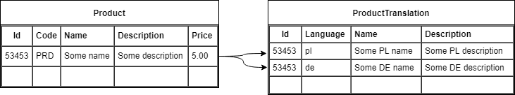

In this article we continue our research on how to implement field level text search by creating a companion translations table for each class. We'll use GIN / GiST indexes which ware described in the opening article of this series and we'll try to implement the described concept using Spring Data JPA, Hibernate and Postgres.


## Table of contents

This blog post is part of a series of articles about internationalizing data with support for text searches:

1. [Indexes available in Postgres and anti-patterns](https://walczak.it/blog/data-internationalization-with-full-text-search-indexes-in-postgres-and-anti-patterns)
2. Performant internationalization in PostgreSQL + Hibernate / JPA:
  1. Companion translation table - your currently reading this
  2. [HStore column with translations](https://walczak.it/blog/performant-internationalization-in-postgresql-hibernate-jpa-hstore-column-with-translations)

## Relational model

From the SQL perspective for each table that represents some entity in the system that has translatable fields we will create a companion table with translations. One row of the companion table will contain translations for all fields of a given row from the source table and a given language. Let's visualize this with an example of a registry of products sold in a shop.



A product in the registry, besides an identifier which is its primary key, will have fields:

- which do not require internationalization: Code, Price,
- which are translatable: Name, Description.

The companion table with translations for products fields will have a composite primary key of:

- a reference to the products identifier,
- the language code which indicates the language of the translated field values.

All other columns in it will hold translations for corresponding columns in the source table. We assume that in the Product table we are using the language that is native for the personnel that operates the system. In the ProductTranslation table we store translations for all other languages.

## Object model with JPA

Let's now try to develop an object model in Java and JPA that should generate a relational model similar to the one we introduced in the previous chapter.

```java
@Entity
public class Product {
 
    @Id
    private UUID id = UUID.randomUUID();
     
    @Embedded
    private ProductDetails details;
     
    @ElementCollection(fetch = FetchType.LAZY)
    private Map<String, TranslatableProductDetails> translatedDetailsByLanguage = new HashMap<>();
 
    protected Product() { }
     
    public Product(ProductDetails details) {
        this.details = details;
    }
    
    // getters and setters
}
```

```java
@Embeddable
public class ProductDetails extends TranslatableProductDetails {
     
    private String code;
    private BigDecimal price;
 
    // getters and setters
}
```

```java
@Embeddable
@MappedSuperclass
public class TranslatableProductDetails {
     
    private String name;
    private String description;
 
    // getters and setters
}
```

## Spring service for text search

Now we will test our model in practice by implementing a Spring service with a REST API that will allow us to:

- add and retrieve translations of a given product;
- search for products by their name in a given language.

We will use Spring Data JPA to handle our SQL queries.

```java
@RestController
@RequestMapping("products")
@Transactional
public class ProductService {
     
    private final ProductRepostiory repostiory;
 
    public ProductService(ProductRepostiory repostiory) {
        this.repostiory = repostiory;
    }
     
    @PostMapping
    public @ResponseBody Product add(@RequestBody ProductDetails details) {
        return repostiory.save(new Product(details));
    }
     
    @PutMapping("{id}/translations/{language}")
    public @ResponseBody void setTranslation(
        @PathVariable("id") UUID id,
        @PathVariable("language") String language,
        @RequestBody TranslatableProductDetails details) {
        Product product = repostiory.getOne(id);
        product.getTranslatedDetailsByLocale().put(language, details);
    }
     
    @GetMapping("{id}")
    public @ResponseBody Product get(@PathVariable("id") UUID id) {
        return repostiory.findById(id)
            .orElseThrow(IdNotFoundException::new);
    }
     
    @GetMapping
    public @ResponseBody List<Product> find(
        @RequestParam("name") String name) {
        return repostiory.findByNameLocalized(
            name, LocaleContextHolder.getLocale().getLanguage(),
            PageRequest.of(0, 100)
        );
    }
}
```

```java
public interface ProductRepostiory extends JpaRepository<Product, UUID> {
     
    @Query(
        "select p from Product p left join p.translatedDetailsByLanguage td "
            + "where index(td) = ?2 and ("
            + "lower(p.details.name) like concat('%', lower(?1), '%') "
            + "or lower(td.name) like concat('%', lower(?1), '%')"
            + ")"
    )
    public List<Product> findByNameLocalized(String name, String language, Pageable pageable);
}
```

## Indexes in Postgres and performence testing

Hibernate will generate our SQL tables based on our object model with JPA annotations however it will not provide any optimizations. Those GIN indexes, that we mentioned in the first article of this series, will have to be added to Postgres manually.

```sql
CREATE EXTENSION IF NOT EXISTS pg_trgm;
 
CREATE INDEX product_details_name_idx ON product
USING GIN (lower(details_name) gin_trgm_ops);
 
CREATE INDEX product_translated_name_idx ON product_translateddetailsbylanguage
USING GIN (lower(translateddetailsbylanguage_value_name) gin_trgm_ops);
```

We'll write a Scala script for [Gatling](https://gatling.io) to populate our database using our REST API.

```scala
class ConceptAPopulateSimulation extends In18jpaSimulation {
 
  val scn = scenario("Concept A - Populate")
    .repeat(100000)(
        feed(createFeeder())
        .exec(
          http("add-product")
            .post("/products")
            .body(StringBody(
              """
              | {
              |   "code": "${code}",
              |   "name": "${name}",
              |   "description": "${description}",
              |   "price": ${price}
              | }
              """.stripMargin))
            .check(status.is(200))
            .check(jsonPath("$.id").saveAs("id"))
        )
        .exec(
          http("add-translation")
            .put("/products/${id}/translations/pl")
            .body(StringBody(
              """
                 | {
                 |    "name": "${nameTranslation}",
                 |    "description": "${descriptionTranslation}"
                 | }
              """.stripMargin))
            .check(status.is(200))
        )
    )
 
  setUp(
      scn.inject(
          atOnceUsers(1)
        )
      .protocols(createHttpProtocol())
  )
}
```

Let's make a request to our service to check how our search endpoint operates.

```json
GET /products?name=abcd
Accept: application/json
Accept-Language: pl-PL

HTTP/1.1 200
Content-Type: application/json
[
    {
        "id": "21d84002-da10-450c-90f8-448fe92d4583",
        "details": {
            "name": "CqaBCdrrdmD",
            "description": "us2a6LvnDXs4bDimkCNd77bKxUOBADaLQa6lIC9LGzKBrTFqOGVa",
            "code": "Z",
            "price": 0.19
        },
        "translatedDetails": {
            "name": "ZXMzRdraH2",
            "description": "O0x9VV6X53iss8ttiOunsHfKOvsbASihGTfVRWMMXn50K45WwFCk3619G3p"
        }
    },
    {
        "id": "65e1b7c6-0c5e-4e36-8bbc-6cf160b0514b",
        "details": {
            "name": "XWgIWaBcDkrbs",
            "description": "",
            "code": "PWSMXoei3",
            "price": 0.87
        },
        "translatedDetails": {
            "name": "vZX6uQcr1NW4k4p",
            "description": "W6rZILJv9gqTXGCeZGwQU50ElZwtaGbrtWA65f8Hrkuen85V3KU1AVFknyw2DYISVvjZZY"
        }
    }
]
```

The results are correct however searching through 100'000 products took quite a lot of time: **~350 ms**. Let's check if those indexes we added ware actually used by the database. Using Spring Boots property `spring.jpa.show-sql=true` we can see what SQL queries did Hibernate send to Postgres and then pass them to the EXPLAIN statement.

```sql
explain select
    product0_.id as id1_0_, product0_.details_code as details_2_0_,
    product0_.details_price as details_3_0_,
    product0_.details_description as details_4_0_,
    product0_.details_name as details_5_0_
from Product product0_ left outer join Product_translatedDetailsByLanguage translated1_ on product0_.id=translated1_.Product_id
where translated1_.translatedDetailsByLanguage_KEY='pl'
and (
    lower(product0_.details_name) ilike ('%'||lower('aaa')||'%')
    or lower(translated1_.translatedDetailsByLanguage_value_name) like ('%'||lower('aaa')||'%')
)
```

```sql
Hash Join  (cost=6108.18..17175.56 rows=10447 width=85)
  Hash Cond: (product0_.id = translated1_.product_id)
  Join Filter: ((lower((product0_.details_name)::text) ~~* '%aaa%'::text) OR (lower((translated1_.translateddetailsbylanguage_value_name)::text) ~~ '%aaa%'::text))
  ->  Seq Scan on product product0_  (cost=0.00..3341.14 rows=100000 width=85)
  ->  Hash  (cost=3531.59..3531.59 rows=100000 width=26)
        ->  Seq Scan on product_translateddetailsbylanguage translated1_  (cost=0.00..3531.59 rows=100000 width=26)
              Filter: ((translateddetailsbylanguage_key)::text = 'pl'::text)
```

As we can see both tables had their entire contents fully scanned (Seq Scan) which indicates that indexes ware not used. On [StackOverflow](https://stackoverflow.com/questions/49117971/postgresql-gin-indexes-on-fields-from-many-tables-and-or-conditions) and [Postgres Mailing List](https://www.postgresql.org/message-id/530F4FC5.9040100%40free.fr) we can read the Postgreses query optimizer cannot handle two conditions with an OR statement on two joined tables using GIN indexes. Using an union was suggested as separating those two conditions into two queries results in a query execution plan that uses our indexes.

```sql
explain select
    product0_.id as id1_0_, product0_.details_code as details_2_0_,
    product0_.details_price as details_3_0_,
    product0_.details_description as details_4_0_,
    product0_.details_name as details_5_0_
from Product product0_
where lower(product0_.details_name) like ('%'||lower('aaa')||'%')
```

```sql
Bitmap Heap Scan on product product0_  (cost=61.36..2148.41 rows=5337 width=85)
  Recheck Cond: (lower((details_name)::text) ~~ '%aaa%'::text)
  ->  Bitmap Index Scan on product_details_name_idx  (cost=0.00..60.02 rows=5337 width=0)
        Index Cond: (lower((details_name)::text) ~~ '%aaa%'::text)
```

```sql
explain select *
from Product_translatedDetailsByLanguage translated1_
where translated1_.translatedDetailsByLanguage_KEY='pl'
and lower(translated1_.translatedDetailsByLanguage_value_name) like ('%'||lower('aaa')||'%')
```

```sql
Bitmap Heap Scan on product_translateddetailsbylanguage translated1_  (cost=61.31..2020.58 rows=5330 width=79)
  Recheck Cond: (lower((translateddetailsbylanguage_value_name)::text) ~~ '%aaa%'::text)
  Filter: ((translateddetailsbylanguage_key)::text = 'pl'::text)
  ->  Bitmap Index Scan on product_translated_name_idx  (cost=0.00..59.97 rows=5330 width=0)
        Index Cond: (lower((translateddetailsbylanguage_value_name)::text) ~~ '%aaa%'::text)
```

From Prostgreses point of view doing an union of those two partial queries would solve the problem. However, doing that using JPA / Hibernate won't be easy as those technologies do not support unions in queries. Unfortunately, to finish our implementation we would have to:

- either build queries in pure SQL - a solution that will become unwieldy when more complex dynamically build queries will be needed in the project as we will not be able to use [JPA Criteria API](https://www.baeldung.com/rest-search-language-spring-jpa-criteria) or [Spring Data Specifications](https://www.baeldung.com/rest-api-search-language-spring-data-specifications),
- or do one query for each criterium and combine the results in Java.

Both solutions are rather dissatisfying and therefore we will finish here our experiments with the companion translation table concept.

## Conclusions

The companion translation table pattern in an efficient solution to the problem discussed in this series of articles however can be problematic to implement because of the limitations imposed by both our database engine and ORM library. As our experiment shows, deficiencies in Posrgreses query planner combined with missing features in Hibernate / JPA would force us to develop a suboptimal workaround. Because of this we should move on to our next concept which despite the usage of a Postgres specific data type can prove easier to integrate with  
 Hibernate / JPA.

## Read more

Source code used in this article can be found in our [bitbucket repository](https://bitbucket.org/walczak_it/in18-jpa-data/src/master/).

Next article in the series: [HStore column with translations](https://walczak.it/blog/performant-internationalization-in-postgresql-hibernate-jpa-hstore-column-with-translations)

---

[](https://www.nextbuy24.com/)

This article is a result of our cooperation with [**Nextbuy**](https://www.nextbuy24.com/)- a SaaS company which develops a procurement and online auction platform to connect buyers and suppliers. We provide various consulting and software development services to them and they have kindly allowed us to publish part of the resulting research / design documents. You can checkout their amazing platform at [www.nextbuy24.com](https://www.nextbuy24.com/)

---

[](https://walczak.it/contact)
