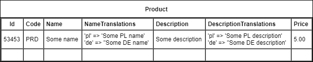
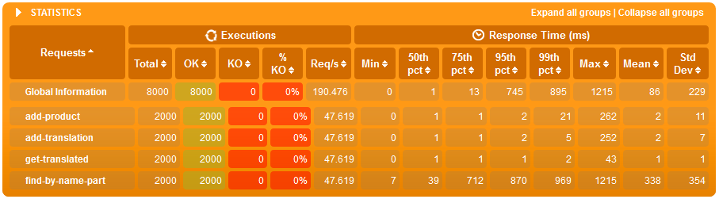
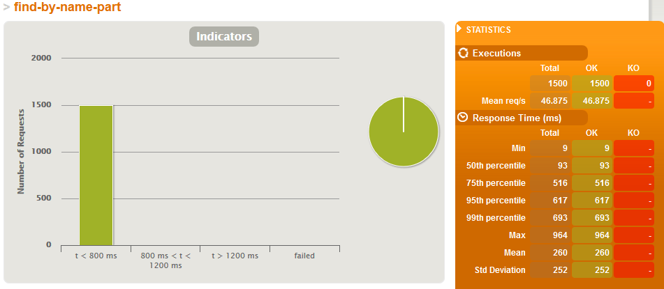
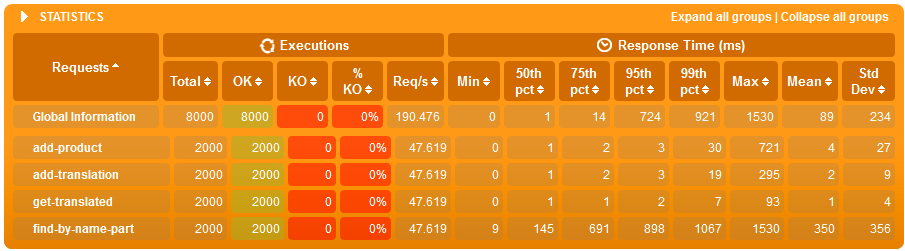
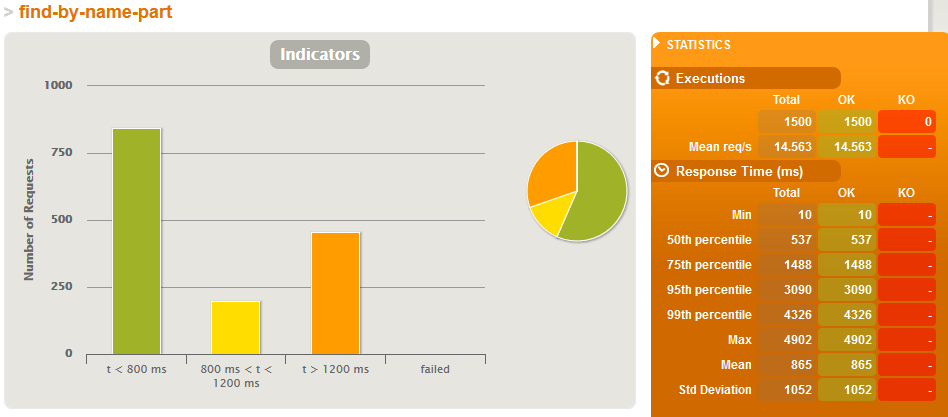
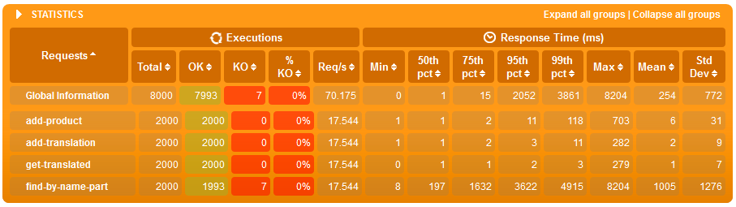
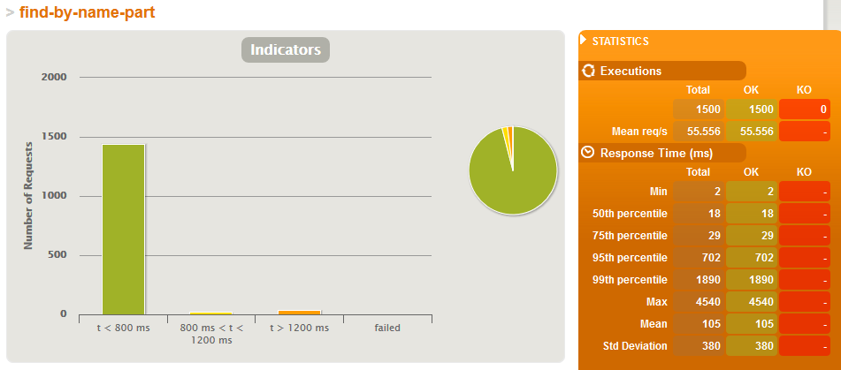
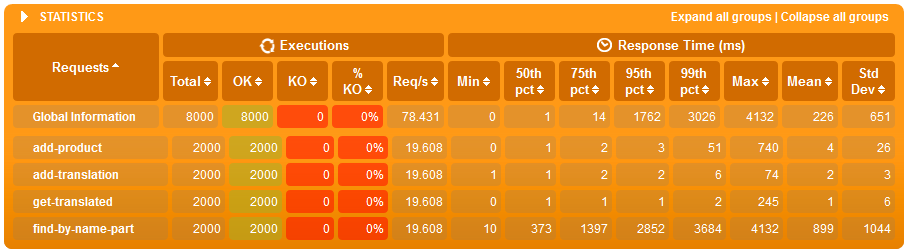

In this article we continue our research on how to implement field level text search by using a datatype specific to Postgres - a HStore column. Next we'll use GIN / GiST indexes which ware described in the opening article of this series and we'll try to implement the described concept using Spring Data JPA, Hibernate and Postgres.


## Table of contents

This blog post is part of a series of articles about internationalizing data with support for text searches:

1. [Indexes available in Postgres and anti-patterns](https://walczak.it/blog/data-internationalization-with-full-text-search-indexes-in-postgres-and-anti-patterns)
2. Performant internationalization in PostgreSQL + Hibernate / JPA:
  1. [Companion translation table](https://walczak.it/blog/performant-internationalization-in-postgresql-hibernate-jpa-companion-translation-table)
  2. HStore column with translations - your currently reading this

## Language keys in HStore

HStore is a special datatype in Postgres which allows to store *key - value* map in a single row. Thanks to this for each field (like for example a products "Name" field) we can create a companion column with a map that holds the following pairs: language key - text in that given language. Example table using this concept:



In the example above we assume that the *Name* column holds the products name in the organization default language and the *NameTranslations* column holds the products name translations in all other languages.

To be able to use HStore in postgres we must first enable this extension:

```

CREATE EXTENSION hstore;
```

## HStore integration with JPA / Hibernate

Java Persistence API tries to be database neutral so we will not find support for HStore there out of the box - as well as for any other Postgres specific datatypes. We can, however easily, extend Hibernates functionality to work with this datatype on multiple levels: JPQL, Criteria API and event DDL generation. The first thing we have to do is to add a UserType for HStore.

```java
/**
 * Custom Hibernate {@link UserType} used to convert between a {@link Map}
 * and PostgreSQL {@code hstore} data type.
 */
public class HStoreType implements UserType {
 
    /**
     * PostgreSQL {@code hstore} field separator token.
     */
    private static final String HSTORE_SEPARATOR_TOKEN = "=>";
 
    /**
     * {@link Pattern} used to find and split {@code hstore} entries.
     */
    private static final Pattern HSTORE_ENTRY_PATTERN = Pattern.compile(
        String.format("\"(.*)\"%s\"(.*)\"", HSTORE_SEPARATOR_TOKEN)
    );
     
    public static final int SQL_TYPE = Types.OTHER;
 
    @Override
    public int[] sqlTypes() {
        return new int[] { SQL_TYPE };
    }
 
    @SuppressWarnings("rawtypes")
    @Override
    public Class returnedClass() {
        return Map.class;
    }
 
    @Override
    public boolean equals(final Object x, final Object y) throws HibernateException {
        return x.equals(y);
    }
 
    @Override
    public int hashCode(final Object x) throws HibernateException {
        return x.hashCode();
    }
 
    @Override
    public Object nullSafeGet(final ResultSet rs, final String[] names,
            final SharedSessionContractImplementor session, final Object owner)
            throws HibernateException, SQLException {
        return convertToEntityAttribute(rs.getString(names[0]));
    }
 
    @SuppressWarnings("unchecked")
    @Override
    public void nullSafeSet(final PreparedStatement st, final Object value, final int index,
            final SharedSessionContractImplementor session) throws HibernateException, SQLException {
        st.setObject(index, convertToDatabaseColumn((Map<String,Object>)value), SQL_TYPE);
 
    }
 
    @SuppressWarnings("unchecked")
    @Override
    public Object deepCopy(final Object value) throws HibernateException {
        return new HashMap<String,Object>(((Map<String,Object>)value));
    }
 
    @Override
    public boolean isMutable() {
        return true;
    }
 
    @Override
    public Serializable disassemble(final Object value) throws HibernateException {
        return (Serializable) value;
    }
 
    @Override
    public Object assemble(final Serializable cached, final Object owner)
            throws HibernateException {
        return cached;
    }
 
    @Override
    public Object replace(final Object original, final Object target, final Object owner)
            throws HibernateException {
        return original;
    }
 
 
    private String convertToDatabaseColumn(final Map<String, Object> attribute) {
        final StringBuilder builder = new StringBuilder();
        for (final Map.Entry<String, Object> entry : attribute.entrySet()) {
            if(builder.length() > 1) {
                builder.append(", ");
            }
            builder.append("\"");
            builder.append(entry.getKey());
            builder.append("\"");
            builder.append(HSTORE_SEPARATOR_TOKEN);
            builder.append("\"");
            builder.append(entry.getValue().toString());
            builder.append("\"");
        }
        return builder.toString();
    }
 
    private Map<String, Object> convertToEntityAttribute(final String dbData) {
        final Map<String, Object> data = new HashMap<String, Object>();
        final StringTokenizer tokenizer = new StringTokenizer(dbData, ",");
 
        while(tokenizer.hasMoreTokens()) {
            final Matcher matcher = HSTORE_ENTRY_PATTERN.matcher(tokenizer.nextToken().trim());
            if(matcher.find()) {
                data.put(matcher.group(1), matcher.group(2));
            }
        }
 
        return data;
    }
}
```

Next we must add a function to Hibernate which will allow us to get a value by a given key from a HStore column. We do this by implementing a SQLFunction:

```java
public class HStoreValueFunction implements SQLFunction {
 
    @Override
    public boolean hasArguments() {
        return true;
    }
 
    @Override
    public boolean hasParenthesesIfNoArguments() {
        return false;
    }
 
    @Override
    public Type getReturnType(Type type, Mapping mpng) throws QueryException {
        return new StringType();
    }
 
    @Override
    public String render(Type type, List args, SessionFactoryImplementor sfi) throws QueryException {
        if (args.size() < 2) {
            throw new IllegalArgumentException("2 arguments required");
        }
        String field = (String) args.get(0);
        String key = (String) args.get(1);
        return field + " -> " + key;
    }
}
```

We combine everything together by adding a Postgres dialect.

```java
public class ExpandedPostgresDialect extends PostgreSQL95Dialect {
 
    public ExpandedPostgresDialect() {
        super();
        registerFunction("hstoreValue", new HStoreValueFunction());
    }
}
```

and we set that dialect in our Spring Boot configuration:

```

spring.jpa.properties.hibernate.dialect=it.walczak.examples.in18jpa.ExpandedPostgresDialect
```

## JPA object model

With our Hibernate expanded with HStore support we can now start using it in our persisted object model.

```java
@Entity
public class Product {
 
    @Id
    private UUID id = UUID.randomUUID();
     
    @Embedded
    private ProductDetails details;
 
    public Product() { }
     
    public Product(ProductDetails details) {
        this.details = details;
    }
 
    public UUID getId() {
        return id;
    }
 
    public void setId(UUID id) {
        this.id = id;
    }
 
    public ProductDetails getDetails() {
        return details;
    }
 
    public void setDetails(ProductDetails details) {
        this.details = details;
    }
}
```

```java
@Embeddable
public class ProductDetails {
     
    private String code;
     
    @Embedded
    private TranslatableField name;
     
    @Embedded
    private TranslatableField description;
     
    private BigDecimal price;
 
    public String getCode() {
        return code;
    }
 
    public void setCode(String code) {
        this.code = code;
    }
 
    public TranslatableField getName() {
        return name;
    }
 
    public void setName(TranslatableField name) {
        this.name = name;
    }
 
    public TranslatableField getDescription() {
        return description;
    }
 
    public void setDescription(TranslatableField description) {
        this.description = description;
    }
 
    public BigDecimal getPrice() {
        return price;
    }
 
    public void setPrice(BigDecimal price) {
        this.price = price;
    }
}
```

```java
@Embeddable
public class TranslatableField {
     
    private String value;
     
    @Type(type = "it.walczak.examples.in18jpa.concepts.b.hibernate.HStoreType")
    @Column(columnDefinition = "hstore")
    private Map<String, String> translationByLanguage = new HashMap<>();
 
    public String getValue() {
        return value;
    }
 
    public void setValue(String value) {
        this.value = value;
    }
     
    public String getTranslation() {
        String language = LocaleContextHolder.getLocale().getLanguage();
        return getTranslationByLanguage().get(language);
    }
 
    public Map<String, String> getTranslationByLanguage() {
        return translationByLanguage;
    }
 
    public void setTranslationByLanguage(Map<String, String> translationByLanguage) {
        this.translationByLanguage = translationByLanguage;
    }
}
```

We created a generic embeddable which will be used in many fields in a single entity and therefore in our Spring Boot configuration we should set a database column naming strategy which will handle object nesting.

```

spring:
  jpa:
    hibernate:
      naming:
        implicit-strategy: org.hibernate.boot.model.naming.ImplicitNamingStrategyComponentPathImpl
        physical-strategy: org.hibernate.boot.model.naming.PhysicalNamingStrategyStandardImpl
```

Without this, the default configuration would try to create many columns with the name "value" in a single table. But because we changed that strategy we will get names like:

```

details_name_value text;
details_name_translation_by_language hstore;

details_description_value text;
details_description_translation_by_language hstore;
```

## Spring service with text search

Let's test our model in practice and implement a Spring service with a REST API which will allow us to:

- add and fetch translations for a given product,
- find products by name in a given language.

We'll use Spring Data JPA to handle our database queries.

```java
@RestController
@RequestMapping("products")
@Transactional
public class ProductService {
     
    private final ProductRepostiory repostiory;
 
    public ProductService(ProductRepostiory repostiory) {
        this.repostiory = repostiory;
    }
     
    @PostMapping
    public @ResponseBody Product add(@RequestBody ProductDetails details) {
        return repostiory.save(new Product(details));
    }
     
    @PutMapping("{id}")
    public @ResponseBody Product edit(
        @PathVariable("id") UUID id, @RequestBody ProductDetails details
    ) {
        Product product = repostiory.findById(id)
            .orElseThrow(IdNotFoundException::new);
        product.setDetails(details);
        return repostiory.save(product);
    }
     
    @GetMapping("{id}")
    public @ResponseBody Product get(@PathVariable("id") UUID id) {
        return repostiory.findById(id)
            .orElseThrow(IdNotFoundException::new);
    }
     
    @GetMapping
    public @ResponseBody List<Product> find(
        @RequestParam("name") String name
    ) {
        return repostiory.findByNameLocalized(
            name, LocaleContextHolder.getLocale().getLanguage(),
            PageRequest.of(0, 100)
        );
    }
}
```

```java
public interface ProductRepostiory extends JpaRepository<Product, UUID> {
     
    @Query(
        value = "select p from Product p "
            + "where lower(p.details.name.value) like concat('%', lower(?1), '%') "
            + "or lower(hstoreValue(p.details.name.translationsByLanguage, ?2)) "
            + "like concat('%', lower(?1), '%')"
    )
    public List<Product> findByNameLocalized(String name, String language, Pageable pageable);
}
```

## Indexes in Postgres and performance tests

Hibernate can generate SQL tables for us based on our object model but it will not provide required optimizations. We our self’s must provide the GIN indexes which we mentioned at the beginning of this article series.

```sql
CREATE EXTENSION IF NOT EXISTS pg_trgm;
 
 
CREATE INDEX product_details_name_idx ON Product
USING GIN (lower(details_name_value) gin_trgm_ops);
 
 
CREATE INDEX product_translated_name_idx ON Product
USING GIN (lower(details_name_translationbylanguage -> 'pl') gin_trgm_ops);
 
 
-- indexes for other languages if needed ...
```

As we can see from the above example we must create a separate index per language. This approach has upsides and downsides. On one hand we must create many indexes with part of the data in each one. On the other hand, we have greater control which languages get indexed and we can focus only on the most popular ones. Furthermore, text searches will always work in the scope of one language and in consequence will be using only one index which is specialized for the given scope.

As we did in our previous concept, we will populate our database using a Gatling script.

```scala
class ConceptBPopulateSimulation extends In18jpaSimulation {
 
  val scn = scenario("Concept B - Populate")
    .repeat(100000)(
        feed(createFeeder())
        .exec(
          http("add-product")
            .post("/products")
            .body(StringBody(
              """
              |  {
              |    "code": "${code}",
              |    "name": {
              |      "value" : "${name}",
              |      "translationByLanguage" : {
              |        "pl" : "${nameTranslation}"
              |      }
              |    },
              |    "description": {
              |      "value": "${description}",
              |      "translationByLanguage" : {
              |        "pl" : "${descriptionTranslation}"
              |      }
              |    },
              |    "price": ${price}
              |  }
              """.stripMargin))
            .check(status.is(200))
            .check(jsonPath("$.id").saveAs("id"))
        )
    )
 
  setUp(
      scn.inject(
          atOnceUsers(1)
        )
      .protocols(createHttpProtocol())
  )
}
```

Let's make sure that our indexes are being used:

```

explain select
    product0_.id as id1_0_,
    product0_.details_code as details_2_0_,
    product0_.details_description_translationByLanguage as details_3_0_,
    product0_.details_description_value as details_4_0_,
    product0_.details_name_translationByLanguage as details_5_0_,
    product0_.details_name_value as details_6_0_,
    product0_.details_price as details_7_0_
from Product product0_
where lower(product0_.details_name_value) like ('%'||lower('aaa')||'%')
or lower(product0_.details_name_translationByLanguage -> 'pl') like ('%'||lower('aaa')||'%')
```

will return:

```

Bitmap Heap Scan on product product0_  (cost=175.84..5669.84 rows=15680 width=173)
  Recheck Cond: ((lower((details_name_value)::text) ~~ '%aaa%'::text) OR (lower((details_name_translationbylanguage -> 'pl'::text)) ~~ '%aaa%'::text))
  ->  BitmapOr  (cost=175.84..175.84 rows=16000 width=0)
        ->  Bitmap Index Scan on product_details_name_idx  (cost=0.00..84.00 rows=8000 width=0)
              Index Cond: (lower((details_name_value)::text) ~~ '%aaa%'::text)
        ->  Bitmap Index Scan on product_translated_name_idx  (cost=0.00..84.00 rows=8000 width=0)
              Index Cond: (lower((details_name_translationbylanguage -> 'pl'::text)) ~~ '%aaa%'::text)
```

The index was used as anticipated. Now lets make a HTTP call to our API.

```json
GET /products?name=abcd
Accept: application/json
Accept-Language: pl-PL
```

```json
HTTP/1.1 200
Content-Type: application/json
[
    {
        "id": "b38c0f99-705a-4f2f-bc99-3807a2d0ba9e",
        "details": {
            "code": "wsZ",
            "name": {
                "value": "mIc9MYht",
                "translationByLanguage": {
                    "pl": "NaBCDaq"
                },
                "translation": "NaBCDaq"
            },
            "description": {
                "value": "LGl0O0S7EuYF4yX1EArDvZQiH79X0j4nj4Y2aVFUlH8zlzg",
                "translationByLanguage": {
                    "pl": "ptXKAbiuSzV1EzhdFxmltFq"
                },
                "translation": "ptXKAbiuSzV1EzhdFxmltFq"
            },
            "price": 0.95
        }
    },
    {
        "id": "5fbec3a2-f41b-466c-8bcc-c8f4991859d4",
        "details": {
            "code": "",
            "name": {
                "value": "pfr46Abcdxa7cs",
                "translationByLanguage": {
                    "pl": "boFVzZF99yJSHVcufK7"
                },
                "translation": "boFVzZF99yJSHVcufK7"
            },
            "description": {
                "value": "Sp1L0hy3EoBFmZtM",
                "translationByLanguage": {
                    "pl": "A5CXGbMcpOsID1u7zjoDxP5RSuGpIN2GA"
                },
                "translation": "A5CXGbMcpOsID1u7zjoDxP5RSuGpIN2GA"
            },
            "price": 0.38
        }
    }
]
```

This requests execution time ranges from 5 to 30 ms - so far so good. If we remove the index, the execution time will increase to about ~150 ms. Let's now do a full blown performance test. We'll write two bigger Gatling scripts:

- Just search - a simulation where only searches are done in parallel
- Full simulation - concurrent writes and searches (1:1 proportions)

```scala
class ConceptBJustSearchSimulation extends In18jpaSimulation {
 
  val scn = scenario("Concept B - just search simulation")
    .repeat(100)(
        feed(createFeeder())
        .exec(
          http("find-by-name-part")
            .get("/products?name=${namePart}")
            .check(status.is(200))
        )
    )
 
  setUp(
      scn.inject(
          rampUsers(15) during (5 seconds)
        )
      .protocols(createHttpProtocol())
  )
}
```

```scala
class ConceptBFullSimulation extends In18jpaSimulation {
 
  val scn = scenario("Concept B - Full simulation")
    .repeat(10)(
        feed(createFeeder())
        .exec(
          http("add-product")
            .post("/products")
            .body(StringBody(
              """
              |  {
              |    "code": "${code}",
              |    "name": {
              |      "value" : "${name}"
              |    },
              |    "description": {
              |      "value": "${description}"
              |    },
              |    "price": ${price}
              |  }
              """.stripMargin))
            .check(status.is(200))
            .check(jsonPath("$.id").saveAs("id"))
        )
        .exec(
          http("add-translation")
            .put("/products/${id}")
            .body(StringBody(
              """
              |  {
              |    "code": "${code}",
              |    "name": {
              |      "value" : "${name}",
              |      "translationByLanguage" : {
              |        "pl" : "${nameTranslation}"
              |      }
              |    },
              |    "description": {
              |      "value": "${description}",
              |      "translationByLanguage" : {
              |        "pl" : "${descriptionTranslation}"
              |      }
              |    },
              |    "price": ${price}
              |  }
              """.stripMargin))
        )
        .exec(
          http("get-translated")
            .get("/products/${id}")
            .check(status.is(200))
        )
        .exec(
          http("find-by-name-part")
            .get("/products?name=${namePart}")
            .check(status.is(200))
        )
    )
 
  setUp(
      scn.inject(
          rampUsers(20) during (5 seconds)
        )
      .protocols(createHttpProtocol())
  )
}
```

We run the scripts above once on a database with indexes and once on a database without them. Once on a database with 100'000 products and once with 500'000 products. Below, we can compare the reported results:

### Results for 100'000 products

#### Just search simulation - WITHOUT indexes




#### Just search simulation - WITH indexes





### Results for 500'000 products

#### Just search simulation - WITHOUT indexes





#### Just search simulation - WITH indexes





## Conclusions

- this concept based on HStore turned our easier to integrate with JPA and Spring Data then the [companion translation table](https://walczak.it/blog/performant-internationalization-in-postgresql-hibernate-jpa-companion-translation-table) concept
- when we only have 100'000 products in the database then the performance impact of indexes is marginal both for searches and writes in a loaded system
- but then the products count grows to 500'000 then:
  - average text search time in a loaded system is 8x shorter when we have indexes
  - even when we have many writes (one write for each search) both search and writes on average are about 20% faster on a loaded system with indexes - this is interesting as the write has more work to do when an index needs updated but the resources saved on indexed searched give it plenty of time to do it.

Source code used in this article can be found in our [bitbucket repository](https://bitbucket.org/walczak_it/in18-jpa-data/src/master/).

This article finishes our series. If you would like to read our analysis from the beginning then please go to the [Data internationalization with text search - indexes in Postgres and anti-patterns](https://walczak.it/blog/data-internationalization-with-full-text-search-indexes-in-postgres-and-anti-patterns) article.

---

[](https://www.nextbuy24.com/)

This article is a result of our cooperation with [**Nextbuy**](https://www.nextbuy24.com/)- a SaaS company which develops a procurement and online auction platform to connect buyers and suppliers. We provide various consulting and software development services to them and they have kindly allowed us to publish part of the resulting research / design documents. You can checkout their amazing platform at [www.nextbuy24.com](https://www.nextbuy24.com/)

---

[](https://walczak.it/contact)

Do you need help in your company with some topic we mentioned in our blog articles? If so, then please feel free to [contact us](https://walczak.it/contact). We can help you by providing consulting and audit services or by organizing [training workshops](https://walczak.it/consulting-training-courses) for your employees. We can also aid you in [software development](https://walczak.it/software-development) by outsourcing our developers.
