Ogromna liczba zakażeń COVID-19 sprawiła, że niemal każda firma poczuła jak wygląda ryzyko wyłączenia z pracy kluczowych pracowników lub całej załogi w biurze - oby tylko z powodu kwarantanny. Najprostszym sposobem, aby się przed tym ustrzec jest umożliwienie pracy zdalnej dla jak największej liczby pracowników. Na rynku jest wiele płatnych rozwiązań oraz firm wdrożeniowych, które umożliwiają podłączenie zdalnych komputerów w taki sposób że będą funkcjonowały tak jakby znajdowały się w tej samej sieci LAN i miały dostęp do wszystkich zasobów firmowych (drukarki, lokalne serwery, itp.). W tym artykule opiszemy jak połączyć zdalne komputery w wirtualny LAN przy pomocy darmowych i otwartych narzędzi VPN, a także jak umożliwić przejmowanie ekranów tych komputerów poprzez VNC w celu zapewnienia wsparcia technicznego.

## Spis treści

1. [VPN - serwer umożliwiający połączenie zdalnych komputerów do sieci biura](#vpn-serwer)
2. [VPN - klient łączący zdalny komputer z siecią naszego biura](#)
3. [VNC - przejmij zdalną kontrolę nad komputerem](#vnc)
4. [Podsumowanie](https://walczak.it/pl/blog/podsumowanie)

## VPN - serwer umożliwiający połączenie zdalnych komputerów do sieci biura

Do utworzenia wirtualnej sieci LAN posłużymy się narzędziem [SoftEther VPN](https://www.softether.org). W pierwszej kolejności musimy wyznaczyć jeden komputer w biurze, który posłuży nam jako serwer - musi on być:

- zawsze włączony w czasie gdy mogą do sieci firmowej łączyć się zdalne komputery;
- podłączony do sieci LAN poprzez kabel Ethernet.

Na stronie *Download* projektu SoftEther wybieramy serwer jako komponent, kóry chcemy ściągnąć oraz system operacyjny jaki mamy na wyznaczonym serwerze - w naszym przypadku Windows.

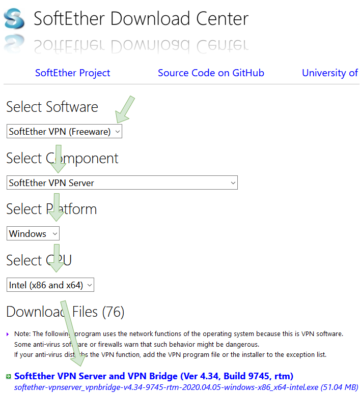

Uruchamiamy ściągnięty instalator i klikamy *Dalej*. Gdy pojawi się lista komponentów do instalacji wybieramy *SoftEther VPN Server*.

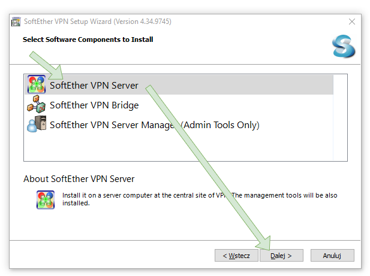

Następnie akceptujemy licencje i klikamy *Dalej* aż rozpocznie się instalacja. Po jej zakończeniu uruchomi się program *SoftEther VPN Server Manager* gdzie możemy skonfigurować naszą nową wirtualną sieć. Klikamy dwukrotnie na pierwszą pozycję w tabeli - zostaniemy poproszeni o nadanie hasła dla administratora sieci VPN.

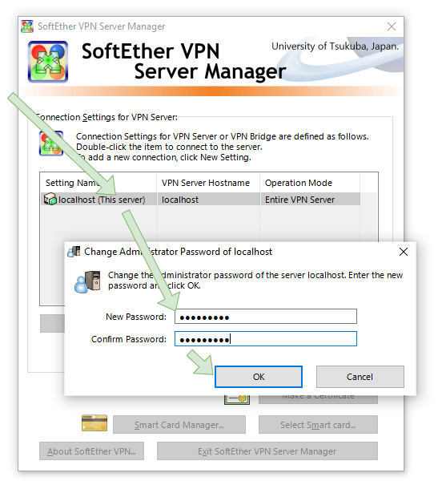

W kolejnym oknie konfiguracyjnym wybieramy tryb *Remote Access VPN Server*.

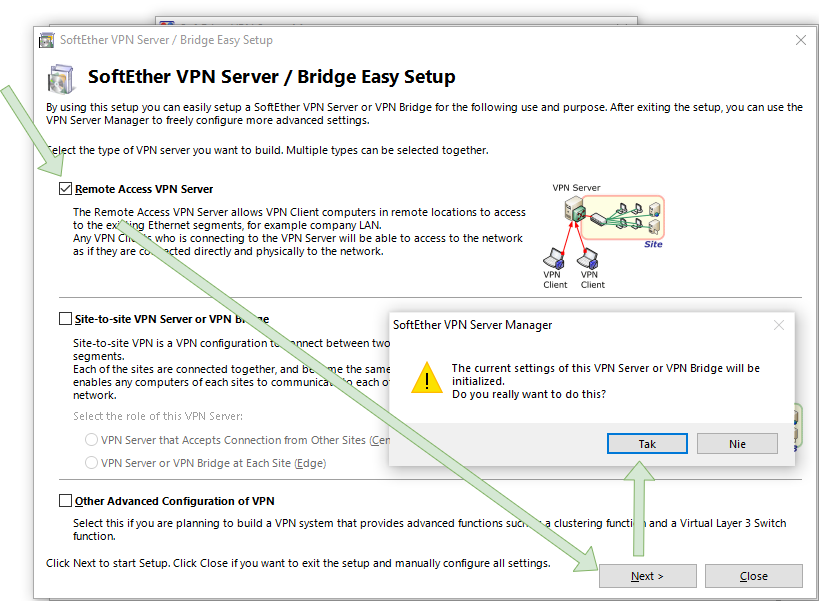

Zostaniemy poproszeni o podanie nazwy huba - możemy zostawić domyślną nazwę: VPN.

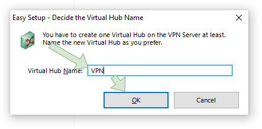

Zostaną nam też zaprezentowane opcje DNS, w których możemy wpisać pod jaką domeną będzie dostępna nasza wirtualna sieć biurowa. W tym przykładzie: walczakit.softether.net

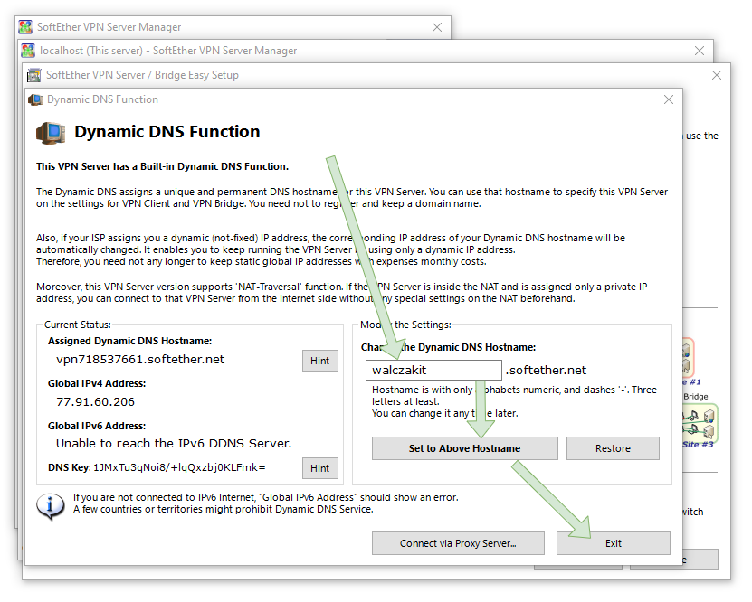

Na kolejnym oknie konfiguracyjnym zostaną nam zaprezentowane dodatkowe opcje, które mogą umożliwić nam połączenie się do naszej sieci wirtualnej przy pomocy wbudowanych klientów VPN w systemach Windows, Android oraz innych. My jednak skupimy się na kliencie *SoftEther VPN Client*, więc nie wybierzemy żadnych z tych opcji.

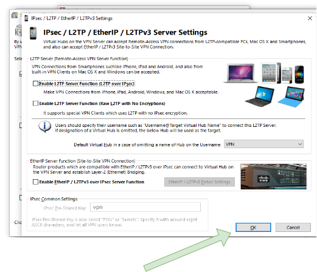

Jest też opcja instalacji dodatkowego komponentu w chmurze Azure ale nie będzie nam to potrzebne.

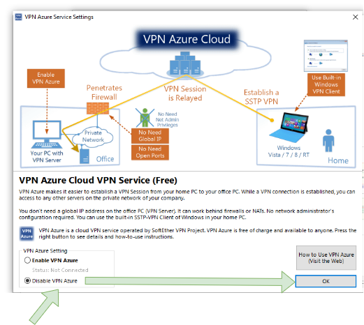

W następnym oknie konfiguracji możemy już zacząć dodawać użytkowników naszej sieci, ale najważniejszą opcją jest wybór odpowiedniej karty sieciowej - posłuży ona jako mostek przez który zdalne komputery będą komunikować się siecią firmową. Musi być to karta Ethernet, do której kablem jest podłączony router lub switch firmowej sieci LAN.

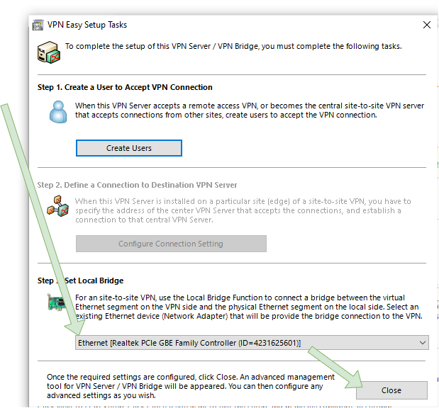

Jeżeli wszystko się powiodło powinniśmy widzieć naszego *Virtual Hub* na liście. Klikamy na niego dwukrotnie aby przejść do dodawania użytkowników.

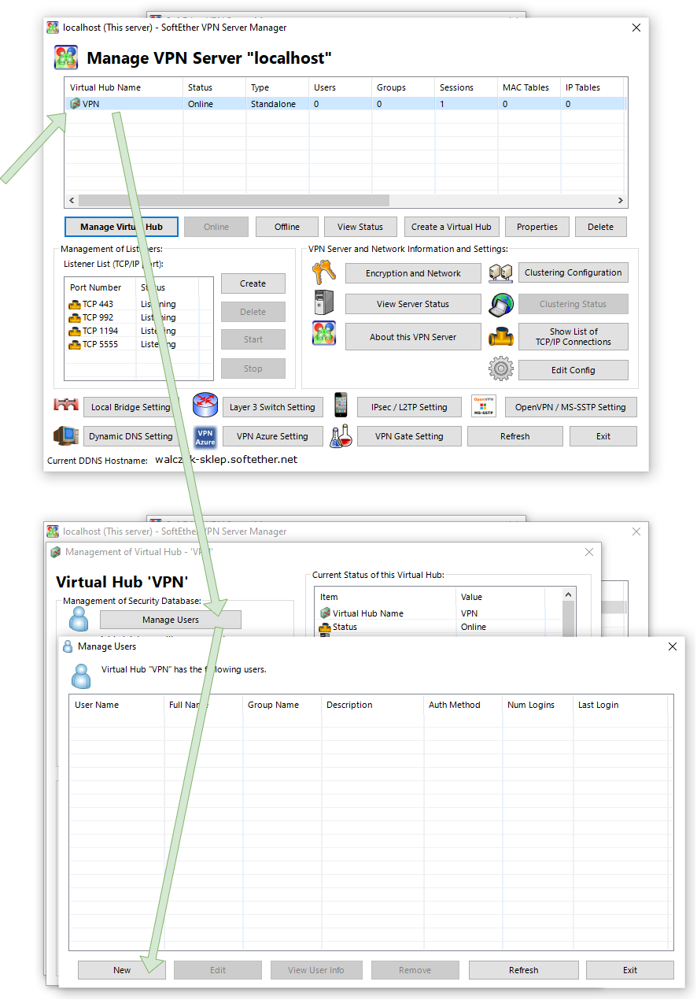

W oknie użytkownika nadajemy login oraz hasło, którymi będzie się posługiwał zdalny pracownik łączący się do sieci.

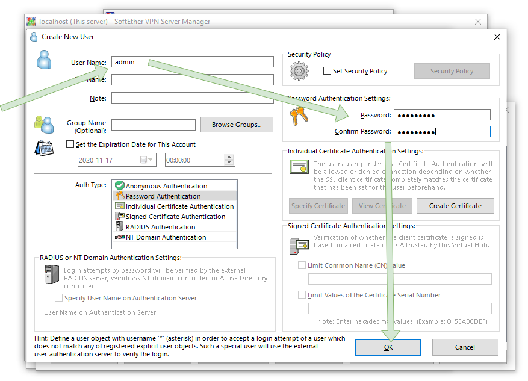

## VPN - klient łączący zdalny komputer z siecią naszego biura

Na komputerze pracownika, z którego będzie się on zdalnie łączył do biura, ściągamy instalator klienta VPN ze strony *Download* narzędzia [SoftEther](http://www.softether.org).

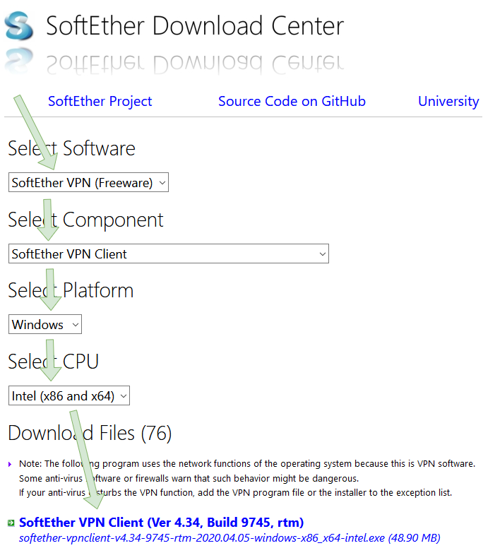

Uruchamiamy instalator i klikamy cały czas *Dalej / Next* pozostawiając domyślne opcje. Po uruchomieniu zainstalowanego klienta zobaczymy pustą listę połączeń VPN. Klikamy na opcje *Add VPN Connection*. Przy dodaniu pierwszego połączenia zostaniemy też zapytani czy dodać *Virtual Network Adapter* - klikam *Tak*.

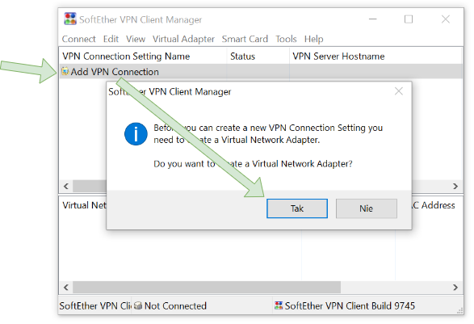

W opcjach nowego połączenia podajemy jakąś jego nazwę, adres internetowy ustawiony podczas konfiguracji serwera VPN oraz login i hasło użytkownika. Przed kliknięciem OK warto też ustawić parę zaawansowanych opcji, które usprawnią naszą pracę.

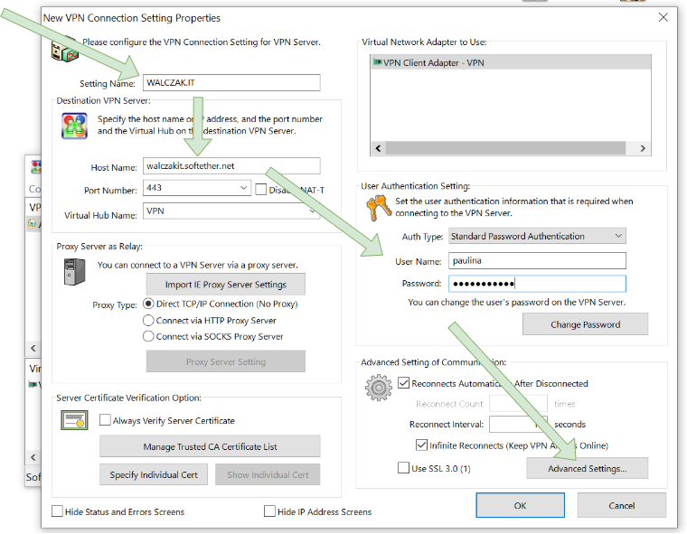

W opcjach zaawansowanych ustawiamy liczbę połączeń TCP na 4 oraz wybieramy opcje *No Adjust of Routing Table*. Dzięki tej opcji (oraz odpowiedniej konfiguracją adaptera co wykonamy za chwilę) przeglądanie stron WWW przez zdalny komputer nie będzie szło przez sieć biurową, więc nie zwolni ładowanie stron po połączeniu się do VPN.

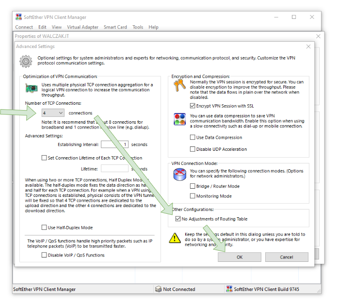

Musimy upewnić się że dodany przed chwilę *Virtual Network Adapter* ma odpowiednio niski priorytet aby nie zwolniły się strony WWW. Zrobimy to w ustawieniach systemu Windows: *Panel Sterowania \> Centrum sieci i udostępniania \> Zmień ustawienia karty sieciowej*.

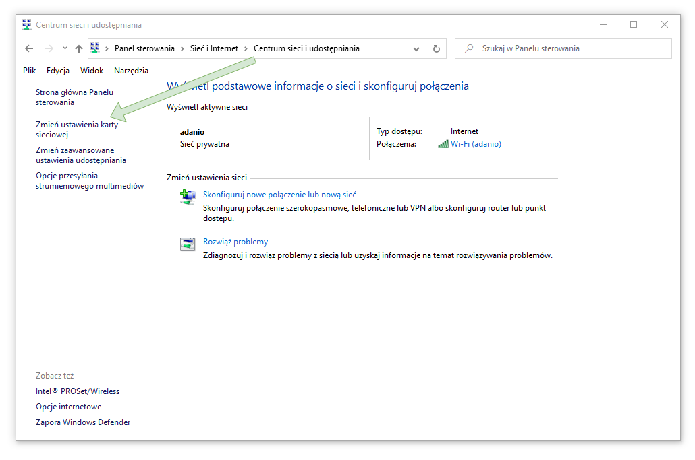

Tam odnajdujemy nasz adapter i klikamy na niego prawym przyciskiem myszy aby przejść do właściwości.

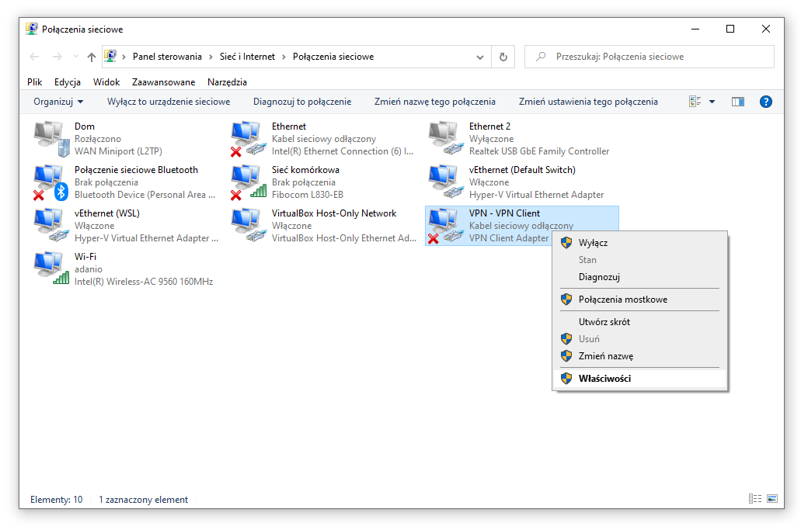

Wchodzimy w ustawienia protokołu IPv4 (lub IPv6 jeżeli wykorzystujemy 6tą wersje protokołu) i w zaawansowanych opcjach wyłączamy automatyczne wyznaczanie metryki aby na sztywno ustawić 999.

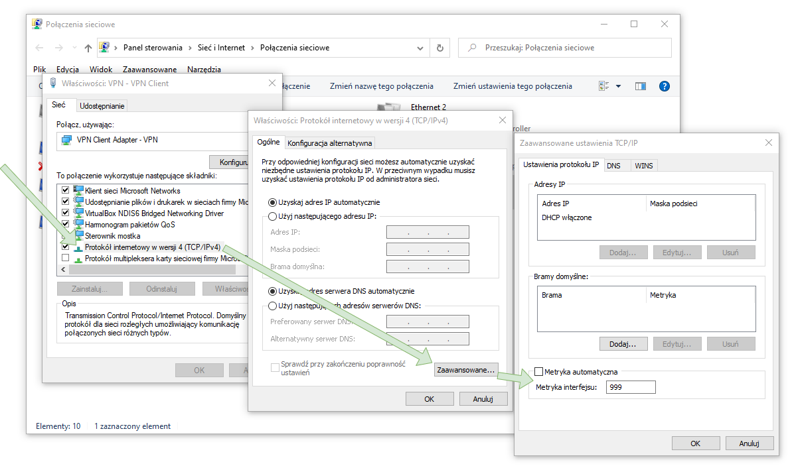

Mamy już teraz wykonaną konfigurację komputera do pracy zdalnej i możemy się połączyć do sieci. Robimy to poprzez dwukrotne kliknięcie na utworzone przez nas połączenie w tabeli. Otrzymamy pytanie czy zezwolić na połączenie poprzez NAT - zgadzamy się i odhaczamy, tak aby komunikat nie pojawiał się więcej. Jeżeli połączenie się powiedzie to zobaczymy status *Connected* w tabeli.

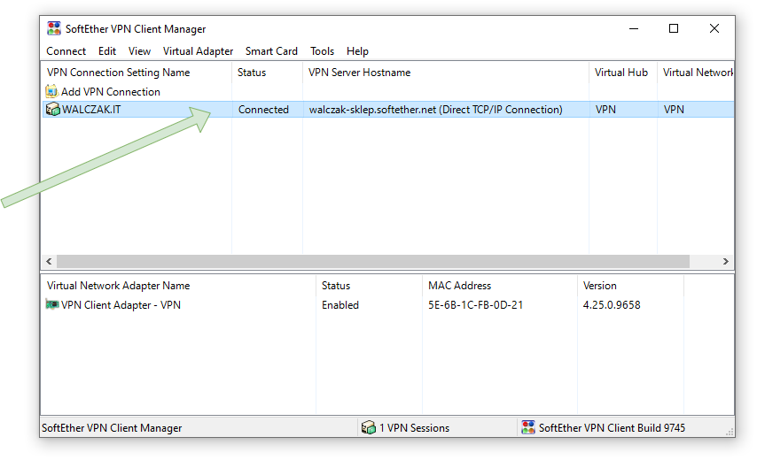

Powinniśmy wtedy zobaczyć w naszym otoczeniu sieciowych komputery i urządzenia, do których przywykliśmy widzieć będąc w biurze, mimo że jesteśmy w domu.

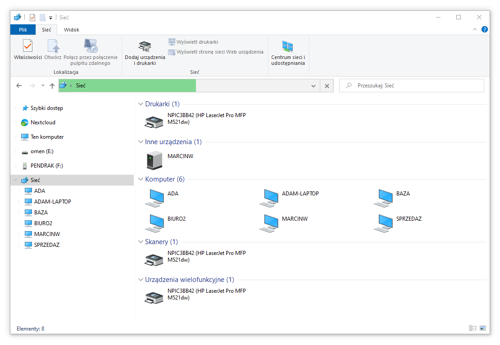

## VNC - przejmij zdalną kontrolę nad komputerem

Gdy wszystkie nasze komputery (zdalne i lokalne) funkcjonują już w ramach jednej wirtualnej sieci, wtedy możemy też zapewnić informatykowi zdalny dostęp do komputera, na którym pracowników pracujący z domu wymaga wsparcia technicznego. W tym celu na każdym komputerze do pracy zdalnej zainstalujemy oprogramowanie [TightVNC](https://www.tightvnc.com/). Na podstronie [Donwload TightVNC](https://www.tightvnc.com/download.php) ściągamy instalator dla naszego systemu operacyjnego.

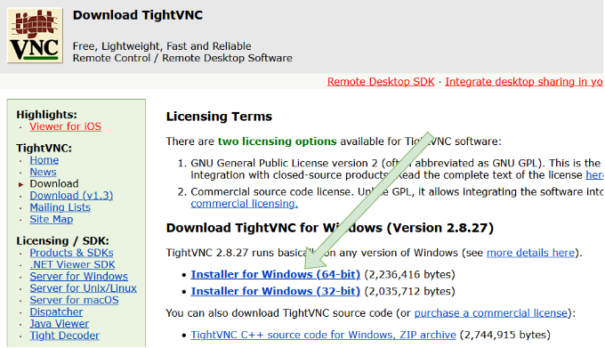

Uruchamiamy instalator oraz klikamy *Next*.

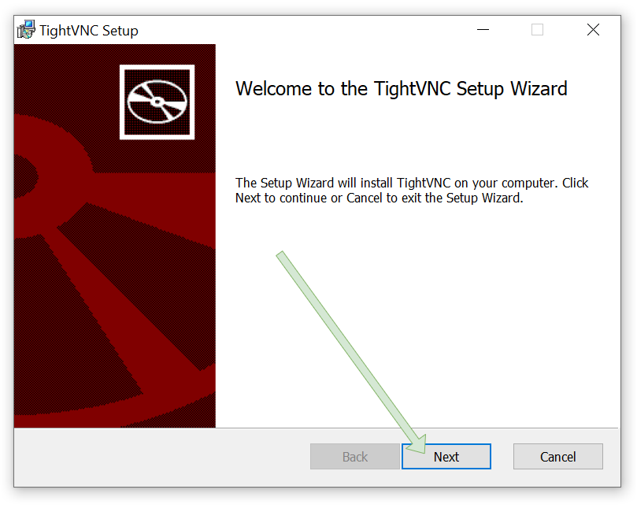

Wybieramy typ instalacji *Typical* - spowoduje to zarówno instalacje zarówno TightVNC Server umożliwiającego udostępnienie pulpitu danego komputera, jak i TightVNC Viewer, który umożliwi podłączenie się do innych komputerów, na których działa serwer TightVNC.

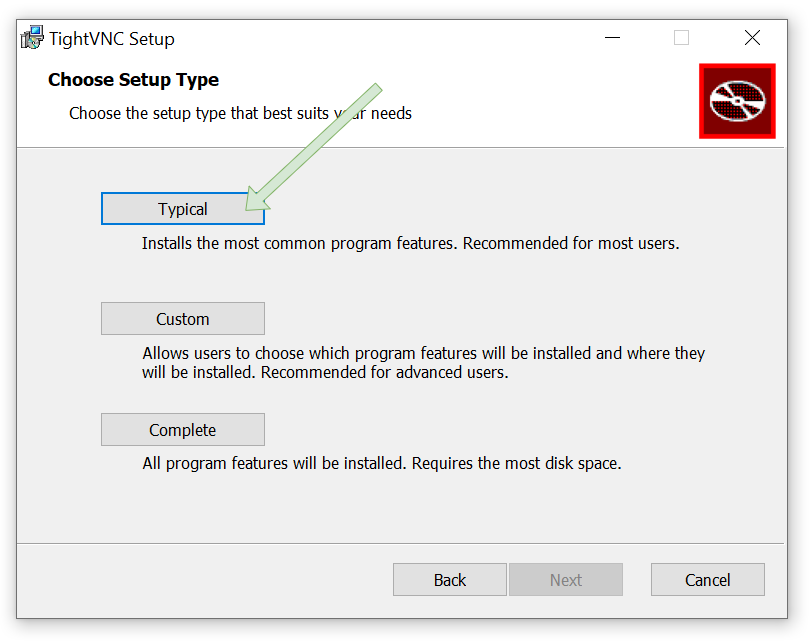

W następnych ekranach kliknij *Next* i *Install* akceptując domyślnie opcje. Na końcu instalacji zostaniesz poproszony o podanie hasła wymaganego do przejęcia kontroli nad pulpitem na danym komputerze - maksymalny i zalecana długość tego hasła to 8 znaków. Możesz też podać oddzielne hasło dostępu do ustawień serwera TightVNC - zabezpiecza to przez tym aby osoba co uzyskała dostęp do naszego pulpitu nie mogła zmienić ustawień samego TightVNC - my jednak pominiemy to zabezpieczenie.

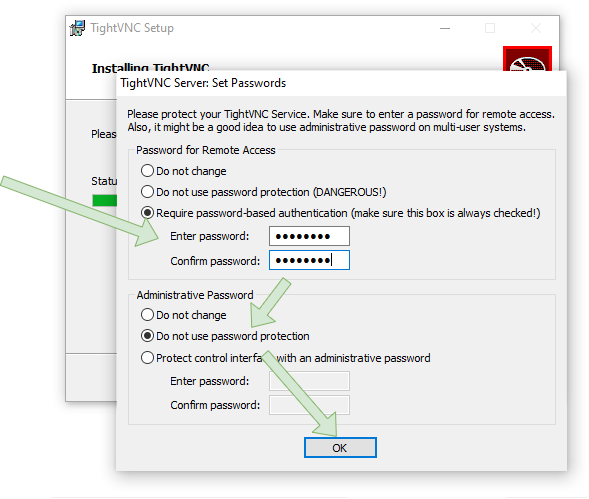

Po tej instalacji TightVNC Server będzie działał cały czas w tle jako usługa systemowa i oczekiwał na połączenia. Nie jest to jednak zbyt bezpieczna praktyka aby umożliwiał on przejęcie pulpitu cały czas. Protokół VNC jest dosyć leciwy i przy tak krótkim maksymalnym haśle podatny na długotrwałe ataki typu brute force. Z tego względu przygotowaliśmy skrypty, które posłużą nam to łatwego [wyłączania i włączania serwera Tight VNC](https://bitbucket.org/walczak_it/tightvnc-control/downloads/tightvnc-control-0.1.zip). Ściągnij [archiwum ze skryptami](https://bitbucket.org/walczak_it/tightvnc-control/downloads/tightvnc-control-0.1.zip), rozpakuj zawartość ściągniętego archiwum i przenieś katalog walczak-it na dysk C: żeby zawarte w nim pliki *bat* miały ścieżki

- C:\\walczak-it\\start-vnc.bat
- C:\\walczak-it\\stop-vnc.bat

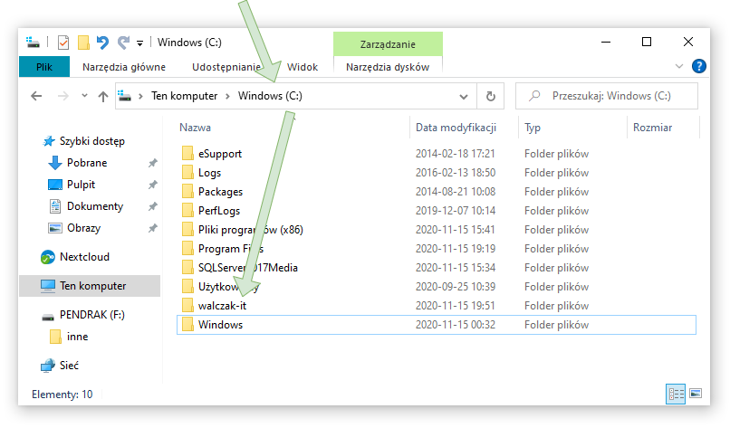

Natomiast skróty zawarte w katalogu walczak-it przenieś na pulpit.

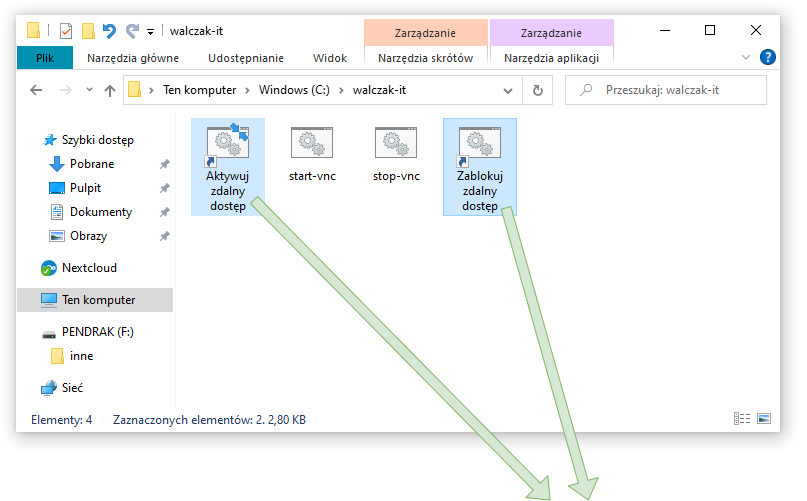

TightVNC Server obecnie działa w tle. Klikamy na "Zablokuj zdalny dostęp" i potwierdzamy Windowsowi, że chcemy uruchomić ten skrypt poprzez kliknięcie na link *Więcej informacji* oraz przycisk *Uruchom mimo to*.

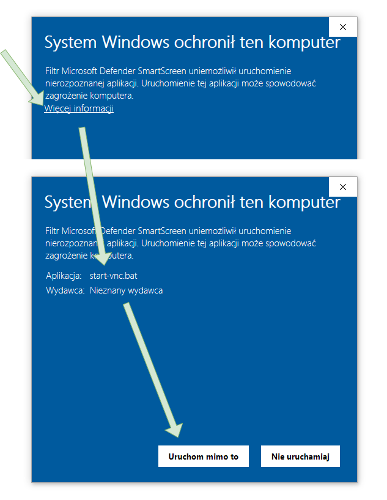

Windows traktuje w taki nieufny sposób każdy skrypt *bat*. Bez jednak obaw - przygotowane przez nas skrypty jedynie stopują / startują TightVNC Server. Możesz sam to sprawdzić otwierając skrypty *bat* w notatniku lub [w naszym repozytorium kodu](https://bitbucket.org/walczak_it/tightvnc-control/src/master/walczak-it/).

Komputer jest teraz przygotowany do tego by otrzymać zdalną pomoc. Jako informatyk, który chce pomóc danemu użytkownikowi, musimy:

1. Poinformować osobę, która wymaga pomocy, żeby uruchomiła skrót "Aktywuj zdalny dostęp".
2. Być w biurze lub być podłączonym do wirtualnej sieci poprzez VPN.
3. Uruchomić TightVNC Viewer na naszym komputerze.
4. Wprowadzić nazwę sieciową komputera do którego chcemy się połączyć oraz hasło jakie tam ustanowiliśmy podczas instalacji.

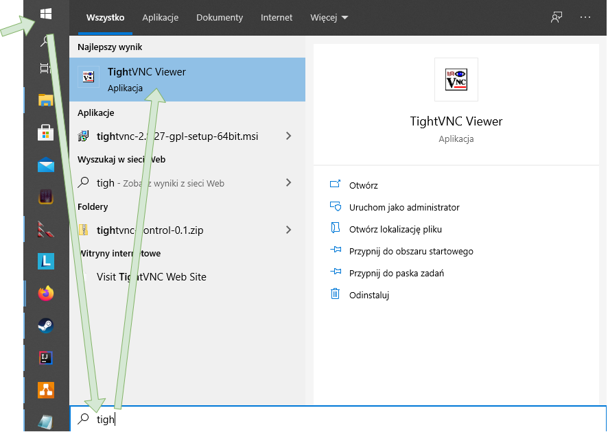

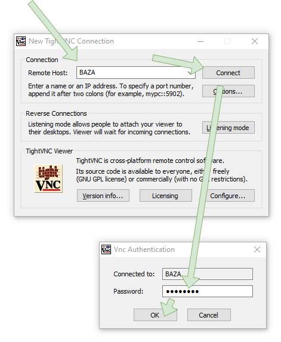

W oknie programu TightVNC Viewer ukaże nam się ekran komputera do którego się podłączyliśmy i nad którym możemy teraz sprawować kontrolę zdalnie.

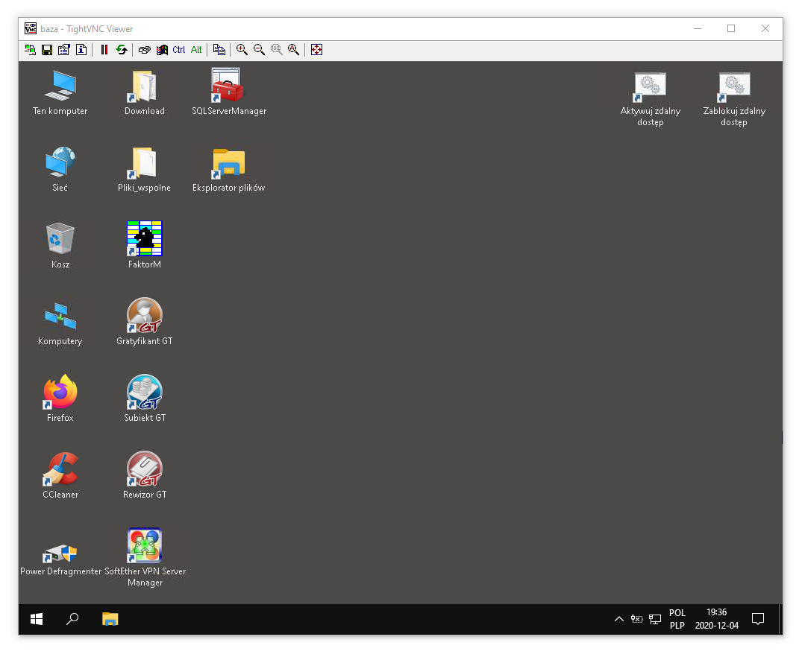

Łączyć się do danego komputera będziemy mogli nawet po restarcie, aż do momentu, w którym albo my, albo jego właściciel nie kliknie skrótu "Zablokuj zdalny dostęp".

## Podsumowanie

Przedstawiliśmy w tym artykule jak samemu zbudować wirtualną sieć umożliwiającą pracę zdalną w ramach sieci biura firmy oraz jak wspierać informatycznie zdalnych pracowników. Jak widać po ilości kroków jakie trzeba wykonać nie jest to zadanie łatwe - zwłaszcza jeżeli pośrodku instrukcji napotkamy jakiś problem sieciowy. Dlatego też warto się zastanowić czy jednak nie lepiej skorzystać z płatnego oprogramowania, które jest łatwiejsze w obsłudze lub zlecić konfigurację wirtualnej sieci oraz wsparcie technicznego pobliskiej firmie informatycznej.
