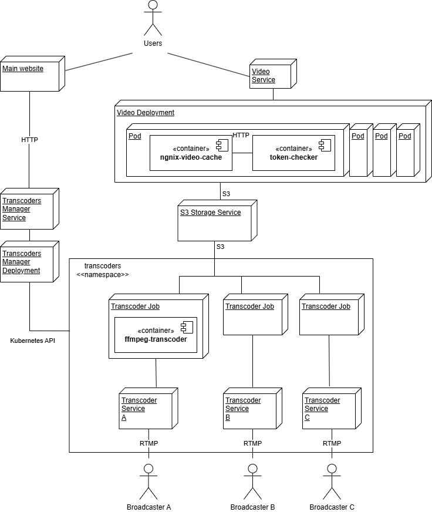
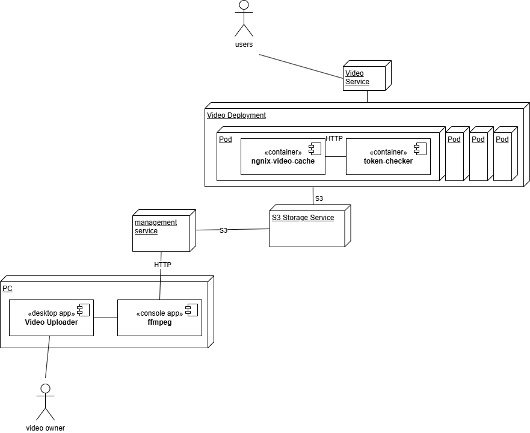

Przegląd i porównanie rozwiązań do udostępniania wideo na żądanie (VOD) oraz nadawania transmisji na żywo (live streaming) — od samych playerów, przez kompleksowe platformy SaaS, po serwery open source, które trzeba samemu skonfigurować.

## Sprawdzane rozwiązania

### INSYS

Strona: [insysvideotechnologies.com](https://insysvideotechnologies.com)

Na stronie opisują się jako kompleksowe rozwiązanie do nagrywania, VOD oraz nagrywania live materiałów audio / video jednak jako że opis ten jest stricte marketingowy i brak tam jakiejkolwiek dokumentacji technicznej albo przykładów wdrożonych przez nich rozwiązań to ciężko zweryfikować co naprawdę dostarczają. Niby robili jakąś platformę pod mojeekino.pl ale ja tam widzę tylko [nagrania rozmów z reżyserami](https://mojeekino.pl/show/strefa-rozmow) odtwarzane poprzez open sourceowy VIDEO JS. Pewnie trzeba by się z nimi zdzwonić żeby się dowiedzieć co faktycznie oferują - ze strony mało szczegółów można wyłapać.

### VIDEO JS

Strona: [videojs.com](https://videojs.com)

To tylko player. Choć całkiem rozbudowany oraz wykorzystuje aktualne technologie webowe. Do wielu funkcji jak dobieranie jakości strumienia do łącza albo live streaming potrzebuje serwera ze wsparciem dla odpowiednich protokołów.

### Plyr

Strona: [plyr.io](https://plyr.io)

To tylko player. Zakres funkcjonalności wydaje się na pierwszy rzut oka podobny do VIDEO JS ale z większym nastawieniem na odtwarzanie z video i eventów z platform typu YouTube lub Vimeo. Ma mniejszą społeczność developerów od VIDEO JS - z racji tego na razie się nie zagłębiałem w niego.

### JW Player

Strona: [www.jwplayer.com](https://www.jwplayer.com)

Pełna platforma do VOD i live streaming, czyli player + multum usług serwerowych potrzebnych do transkodowania, przechowywania i nadawania video. Tak przynajmniej twierdzą ich materiały na stronie WWW - są bardziej szczegółowe niż to co widziałem na INSYS ale nie są na tyle techniczne żebym mógł wstępnie zweryfikować czy trochę nie koloryzują swoich możliwości.

Mają też trochę ciekawszych opcji jak jednoczesny live streaming do własnej strony oraz Facebook, Youtube i Twitch + osadzanie w nich reklam z Google co mogłoby by być fajną opcji do darmowych przedstawień.

### Flowplayer

Strona: [flowplayer.com](https://flowplayer.com)

Platforma analogiczna do JW Player ale bardziej uboga w funkcje.

### Vimeo

Strona: [vimeo.com](https://vimeo.com)

SaaS dedykowany do twórców treści video. Można też wykorzystać jako platformę video jak JW Player choć trzeba zweryfikować czy jest to możliwa na tyle elastyczna integracja jak z typową platformą czy np. użytkownicy VOD będą musieli mieć konto na Vimeo.

### Wowza

Strona: [www.wowza.com](https://www.wowza.com/)

Platforma głównie nastawiona na live streaming dużych eventów. W materiałach JW Playerze i Vimeo jest dużo informacji jak przesyłać i publikować filmy ale enigmatycznie opisany jest sposób funkcjonowania live streamingu. W Wowza sytuacja jest zupełnie odwrotna: jest masa materiałów opisująca jak zapewnić przy pomocy live streaming od pół profesjonalnego setupu na aplikacji OSB po integracje z profesjonalnym sprzętem studyjnym, natomiast np. funkcjonalności potrzebnych do wsparcia VOD jest tyle jeden enigmatyczny filmik marketingowy. Ostatecznie otrzymałem jednak więcej dokumentacji i VOD jest też w pełni do ogarnięcia u nich.

Natomiast co do ich playera ze wszystkich sprawdzonych tutaj miałem z nim najgorsze doświadczenia. Przynajmniej oceniając na podstawie wideo jakie przy pomocy niego [serwują na swojej stronie](https://www.wowza.com/blog/category/videos). Zanim załaduje się film sprawuje wrażenie jak by się zaciął, też często zacina się na gorszym necie jak by automatyczne dostosowywanie jakości działało mozolnie.

Z drugiej strony wiemy że korzystali z tego systemu przez długi czas [streamonline.tv](https://streamonline.tv/) i spory ruch tym obsługiwali.

### Media Serwery Open Source

Wstępnie szukałem jakiś rozwiązań open source aby zapewnić dla VIDEO JS potrzebną infrastrukturę serwerową ale nic ciekawego nie znalazłem:

- [**Red5**](https://www.red5pro.com/) - parę lat temu dużo osób stosowało to do własnych rozwiązań z transmisją video, niestety wersja open source wspiera tylko przestarzały protokół RMTS, a HLS i DASH jest dopiero w wersji PRO od 109 USD per serwer
- **Ant Media** - analogicznie jak powyżej, współczesne protokoły wspierane przez przeglądarki bez wtyczek w wersji Enterprise od 49 USD za serwer
- **NGINX** - jest komponentem, który już teraz wykorzystujemy do routingu HTTP miedzy usługami oraz do serwowania statycznych plików dashboard i POS. Okazuje się że ma wsparcie dla serwowania plików [mp4 poprzez protokółw HLS](http://nginx.org/en/docs/http/ngx_http_hls_module.html) oraz jest [tutorial jak nadawać przy jego pomocy live stream dzięki OSB](https://www.youtube.com/watch?v=rA_06zRKE4c).

Zbadać by trzeba ile luk od strony serwerowej one wypełniają bo na pewno nie dadzą out of the box wszystkiego co daje platforma typu JW Player.

## Porównanie funkcjonalności

Legenda: ✅ tak / pełne wsparcie · ⚠️ częściowe lub wymaga dodatkowej pracy · ❌ brak · ❓ brak informacji / do weryfikacji.

### Video on demand

| Funkcja | INSYS | VIDEO JS | JW Player | Flow Player | Vimeo | Wowza |
| --- | --- | --- | --- | --- | --- | --- |
| Gotowe narzędzie do przekodowania plików do kodeków / kontenerów wspieranych przez player lub media serwer | ❓ | ❌ są podane wpierane formaty ale narzędzie trzeba sobie samemu dobrać / skonfigurować | ✅ twierdzą że przekonwertują niemal dowolny plik na odpowiednie formaty | ❌ film źródłowych musi być przekodowanych wg ich wytycznych przed wysłaniem na ich serwer | ✅ ❓ mówią że mają dedykowane narzędzie ale nie sprawdziłem dokładnie jakie | ✅ jest transkoder dostępny w API jednak ma [umiarkowany zakres wspieranych formatów](https://www.wowza.com/live-video-streaming/live-transcoding), a w przypadku statycznych plików kontenerem musi być mp4 lub flv |
| Player video, który można osadzić na własnej stronie | ❓ | ✅ | ✅ | ✅ | ✅ | ⚠️ ich własny player jest wycofywany i zalecają wykorzystanie VIDEO JS, więc poniższe funkcje zapewnia ten player w połączeniu z ich media serwerami |
| Buforowanie strumienia od początku | ❓ | ✅ | ✅ | ✅ | ✅ | ✅ |
| Buforowanie od dowolnego punktu czasowego | ❓ | ✅ | ✅ | ✅ | ✅ | ✅ |
| Możliwość wyboru jakości strumienia | ❓ | ⚠️ jest do tego [wsparcie od strony klienta](https://github.com/videojs/video.js/issues/5818#issuecomment-468785583) ale musimy zapewnić wsparcie dla HLS lub DASH od strony serwera | ✅ | ✅ | ✅ | ✅ |
| Automatyczne dostosowanie jakości do łącza użytkownika | ❓ | ⚠️ jak wyżej — wymaga HLS lub DASH po stronie serwera | ✅ pełne wsparcie dla HLS & DASH od strony ich media serverów | ✅ pełne wsparcie dla HLS & DASH od strony ich media serverów | ✅ nie opisują jak to techniczne zrealizowali ale pewnie też HLS lub DASH | ✅ HLS, DASH lub MS Smooth |
| Zabezpieczenie strumienia tokenem lub loginem i hasłem | ❓ | ❌ funkcjonalność stricte serwerowa, więc player nic tu nie zapewnia | ✅ | ❓ | ⚠️ jest ale dokumentacja sugeruje że user musi mieć konto i przejść przez ich system płatności? trzeba by to zweryfikować | ✅ |
| Zabezpieczenie przed wielokrotnym wykorzystaniem tokena lub loginu | ❓ | ❌ jak wyżej — funkcjonalność serwerowa | ❌ mają mechanizm szyfrowanych tokenów ale bez możliwości podania IP albo czegokolwiek innego co by identyfikowało użytkownika - zasugerowali zastosowanie ich usługi + InPlayer, który dostarcza gotowe PayWalle ale wątpie żeby to było hack proof jeżeli blokowanie nie jest na poziomie media serwera | ❓ | ❓ | ✅ szyfrowany token w którym można zawrzeć IP użytkownika |

### Live streaming

| Funkcja | INSYS | VIDEO JS | JW Player | Flow Player | Vimeo | Wowza |
| --- | --- | --- | --- | --- | --- | --- |
| Gotowe narzędzie do nadawania live streamu | ❓ | ❌ to tylko player | ✅ niby zapewniają choć nie pokazują jak wygląda | ✅ niby zapewniają choć nie pokazują jak wygląda | ✅ mówią że zapewniają ale na Youtube raczej są [filmiki gdzie bezpośrednio wpinali](https://www.youtube.com/watch?v=0FPQ6Z1b5r0) enkoder innej firmy z wysyłką RMPT | ✅ udokumentowane sposoby integracji z wieloma narzędziami oraz sprzętem studyjnym |
| Dostarczenie bieżącego live streamu do playera | ❓ | ⚠️ jest do tego wsparcie od strony klienta ale musimy zapewnić wsparcie dla HLS lub DASH od strony serwera | ✅ | ✅ | ✅ | ✅ |
| Możliwość rozpoczęcia oglądania live streamu od wcześniejszego momentu | ❓ | ❓ | ✅ prawdopodobnie tak skoro wspierają poniższe | ❓ | ❓ | ✅ prawdopodobnie tak skoro wspierają poniższe |
| Przechowanie streamu po jego zakończeniu do odtworzenia w VOD | ❓ | ❌ funkcjonalność stricte serwerowa | ✅ | ❓ | ❓ | ✅ |

### Licencje / subskrypcje

- **INSYS** — ❓ brak informacji
- **VIDEO JS** — ✅ open source
- **JW Player** — ❓ niby od 10 USD / m zaczyna się funkcjonalność pod VOD ale tylko do 500 GB transferu co mogło by wyczerpać jedno popularne przedstawienie, ceny wyższych panów nie podają
- **Flow Player** — ❓ niby od 100 USD / m zaczyna funkcjonalność pod VOD ale tylko do 600 GB, więc sytuacja jak po lewej
- **Vimeo** — ❓ niby limitują ilość przechowywanego materiału video ale nie jego transfer co brzmi na nierealne dobre warunki - trzeba zweryfikować: 170 zł / m za 5 TB filmów na dyskach pod VOD, 245 zł / m za 7 TB z wsparciem dla live streamingu
- **Wowza** — ❓ od 100 USD zaczyna się do 20 h nadawania live streamu + do ~1000 h odbioru - jak widać oferta jest targetowana pod duże wydarzenia nadawane live - brak info o planach bardziej pod VOD

## Czy może stworzyć własne rozwiązanie?

### Architektura pełna to live streaming i VOD

### Architektura okrojona pod tylko VOD

### Analiza możliwości ffmpeg

Tradycyjnie narzędzie ffmpeg głównie służyło do konwertowania plików audio / video z jednego formatu na drugi. Jednak wraz z powstaniem powszechnie akceptowalnych standardów serwowania strumieni video do przeglądarek dodano do niego także możliwość konwersji pojedynczych plików video do wielu małych plików (chunków + playlista) zgodnych ze standardem HLS. Owe pliki są gotowe do serwowania na przeglądarce, wystarczy je wrzucić na serwer FTP co mamy już przetrenowane w instrukcji do naszego prostego VOD. Co ciekawe program konsolowy może także działać jako [jednowątkowy serwer RTMP i konwertować strumień otrzymany od np. OBS od razu do plików HLS](https://www.martin-riedl.de/2018/08/24/using-ffmpeg-as-a-hls-streaming-server-part-1/). W wyniku tego na bieżąco aktualizuje pliki playlist więc można pod niego [podpiąć Video JS aby wyświetlał live stream](https://programmersought.com/article/96026458334/) (z małym opóźnieniem oczywiście). Samo narzędzie ffmpeg można też skonfigurować żeby zamiast zapisywać wynik swojej pracy do systemu plików wrzucał je od razu na serwer. Jest za to odpowiedzialny ich parametr `method` opisany w [dokumentacji HLS](https://ffmpeg.org/ffmpeg-all.html#hls-2).

### Analiza możliwości nginx

Mamy już przetarty szlak ze stosowaniem nginxu jako proxy cache. Da się też w niego [wpiąć jakąś zewnętrzną usługę, która będzie decydować czy dany request odrzucić czy nie](https://docs.nginx.com/nginx/admin-guide/security-controls/configuring-subrequest-authentication/) - dzięki temu można łatwo zaimplementować obsługę access tokenów. Nginx potrafi [czytać dane z S3](https://www.scaleway.com/en/docs/setting-up-object-proxy-object-storage/).
