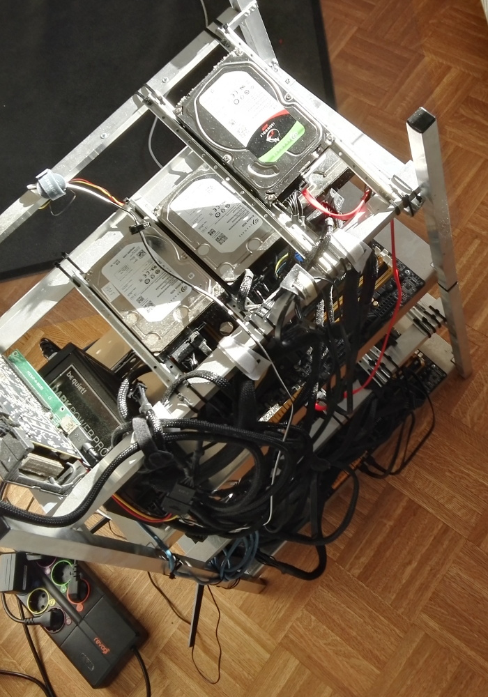
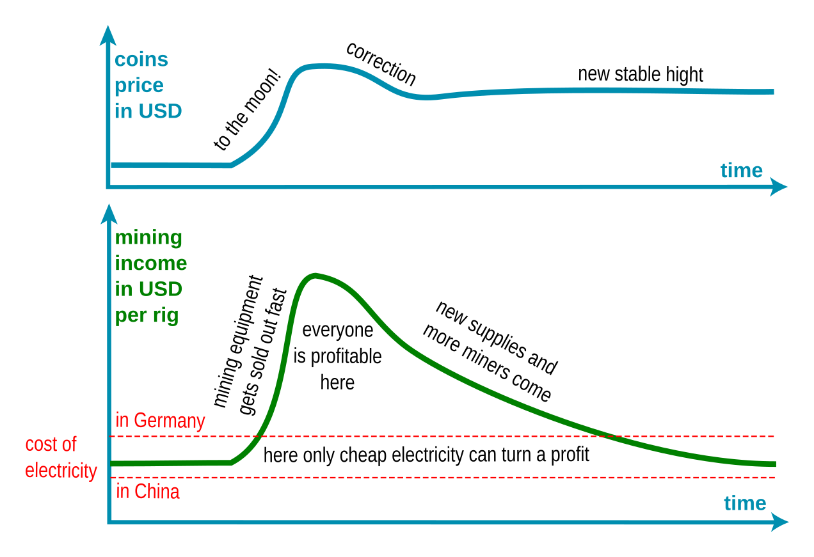
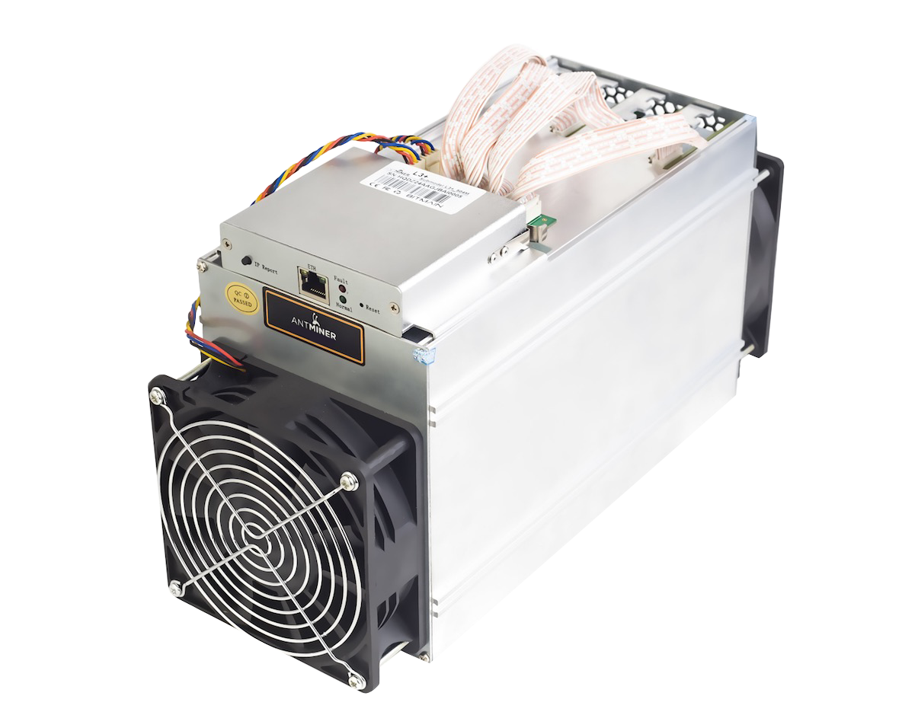

If you're interested in Bitcoin, Ethereum, etc. then you're probably tempted by ads with mining equipment or cloud mining contracts. Many of them promise you substantial passive income and a fast return of investment - usually under one year. Can it really be this easy? Here at WALCZAK.IT we experiment heavily with cryptocurrencies and we've also build our behemoth of a rig which mines three totally different coins at once. We've experienced firsthand that cryptocurrency mining is not trivial, nor is it passive or risk-free. Here are some cons you should consider before investing in it.

*The rig above uses GPUs to mine Ethereum, hard drives to mine BURST and CPUs/RAM are mostly utilized by Boinc research based mining of GridCoin. It consumes constantly about 2 kW of electricity.*

## Profitability changes month by month

Most ROI calculations in ads look spectacular... but only in the most profitable months. They assume that all the aspects of cryptocurrency mining will stay constant during the year but the facts are as follows:

- **You will get less coins each month** out of your rig / contract - if it's profitable then new miners join and the cryptocurrencies network will increase the difficulty of its algorithm to adjust to the added computational power.
- **Cryptocurrency prices are highly volatile** - it may drop below your profitability level every day, it may also rise but this will give you just a temporary profits boost because this will attract more miners and rise the difficulty mentioned above.

A popular coin that experienced a rapid increase in price usually follows this patter when it comes to mining profitability - Ethereum being the prime example.

PS. These charts are of course very simplified trend lines. Stable in cryptocurrency means that the price has a weakly ±10% fluctuation. Going to the moon can mean even more then +50% per week.

## Miners are in a constant arms race

Every now and then a new generation of GPU's or ASIC miners will be introduced to the market. When that happens your existing hardware may become obsolete fast. A new generation of hardware can often double or triple performance per Watt of electricity. The improvement is even more ground breaking if someone develops the first ASIC (application-specific integrated circuit) for a given cryptocurrency. Those can boost performance 100 times compared to CPU / GPU mining and therefore, in time, diminish income from older hardware to a fraction of their previous yeld. A good example of this was the recent D3 Antminer for the Dash cryptocurrency.

Improvement of preference was so great compared to previous mining solutions that the estimated return of investment was just 2 - 3 weeks. The first batches ware always sold out on the day of announcement. However only those who received them early made huge profits. As more D3s joined the network the difficulty rose exponentially and income per miner decreased. Two month after first people received their D3 miners the estimated ROI went up to a year... and this estimation presumes that nothing will change during that year but as you know by now... it will.

## Cloud mining contracts sell you the risk

So now you know that mining is a risky business. Owners of bigger mining facilities knew that a long time ago and asked them self - how can we sacrifice some of our profits for stability? The answer is: sell hashing power in a long term contract instead of profiting directly from it. By buying a cloud mining contract you don't have to know how to construct, install or manage mining hardware but you still expose your self to the risks we mentioned above. You get a constant amount of computing power so when the cryptocurrencies mining difficulty rises you will get less coin. Besides there is also the chance that your mine will bankrupt mid contract and some of them already did.

## So should I avoid mining all together?

If you're looking for passive income - avoid it. Just buying cryptocurrencies and holding them might be a better investment then mining but still, only do it if you have a good understanding of what you're getting yourself into. We offer some[traning courses](https://walczak.it/consulting-training-courses) that might help you with that. Mining can be a great startup idea if you have the time to acquire the required know-how and you have access to either cheap equipment or cheep electricity. Installing one rig in your home or buying a cloud contract is probably not worth effort nor the risk.

---

