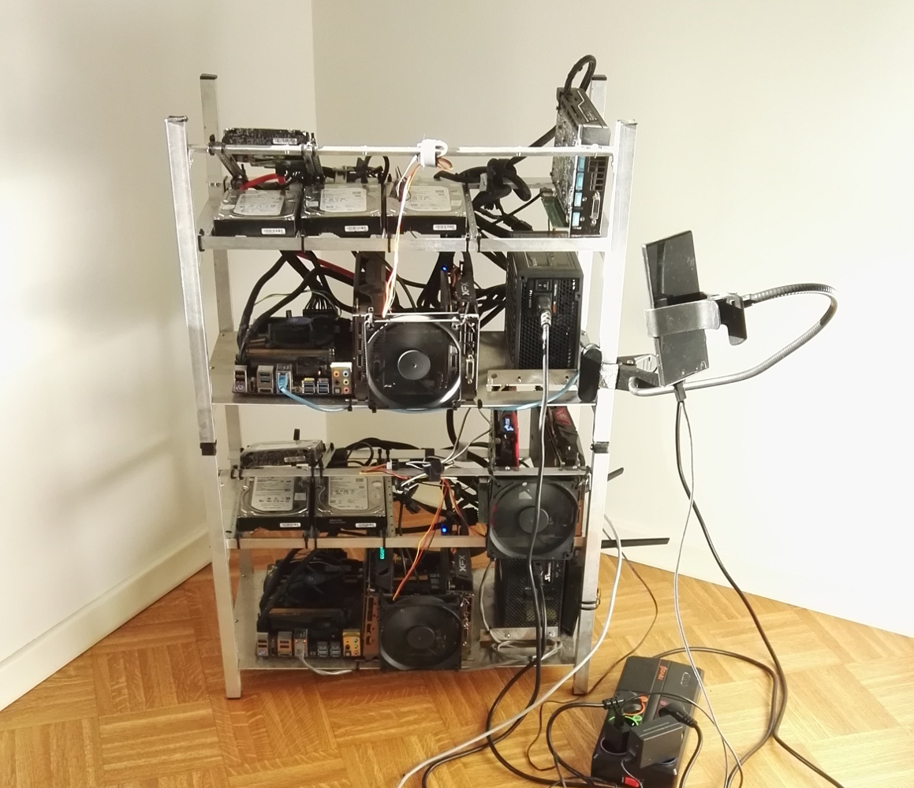
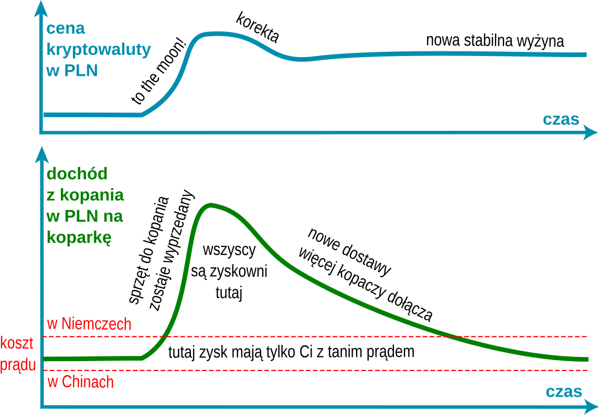

Jeżeli interesujesz się Bitcoin'em, Ethereum, itp. pewnie kuszą Cie liczne reklamy sprzętu do kopania kryptowalut lub kontrakty w chmurze. Wiele z nich oferuje wysoki pasywny dochód i szybki zwrot z inwestycji - zazwyczaj poniżej jednego roku. Czy to naprawdę może być takie łatwe? W naszej firmie intensywnie eksperymentujemy z kryptowalutami i zbudowaliśmy własną, dosyć pokaźną, koparkę pracującą jednocześnie nad trzema totalnie odmiennymi coin'ami. Na własnej skórze doświadczyliśmy że kopanie kryptowalut nie jest czymś banalnym, pasywnym, czy też pozbawionym ryzyka.

 

*Powyższa koparka wykorzystuje karty graficzne do kopania Ethereum, dyski twarde do BURST, a procesory i RAM są głównie wykorzystane przez badań naukowe Boinc biorących udział w kopaniu GridCoin.  
 Ciągłe wykorzystanie prądu jest w okolichach 2 kW.*

## Zyskowność zmienia sie z miesiąca na miesiąc

Większość kalkulacji ROI (zwrot z inwestycji) w reklamach wygląda spektakularnie... ale tylko w najbadziej dochodowych miesiącach. Zakładają że wszystkie aspekty kopania kryptowaluty pozostaną niezmienne w przeciagu roku, jednak fakty są takie:

- **Będziesz otrzymywać mniej kryptowaluty co miesiac** z Twojej koparki / kontraktu - jeżeli kopanie jest zyskowne wtedy dołączą nowi kopacze, a w konsekwencji sieć danej kryptowaluty podniesie trudność algorytmu adekwatnie do dodanej mocy obliczeniowej.
- **Kursy kryptowalut są bardzo zmienne** - może spaść poniżej Twojego progu zyskowności każdego dnia, może także wzrosnąć ale da Ci tylko tymczasowy pik w zyskach ponieważ fakt ten przyciągnie więcej kopaczy i w konsekwencji podniesie wspomnianą wcześniej trudność algorytmu.

Popularna kryptowaluta, która doświadczyła gwałtownego wzrostu ceny zazwyczaj wpada w poniższy schemat zyskowności kopania. Ethereum jest tego dobrym przykładem.

PS. Powyższy wykres to oczywiście mocno uproszczone linie trędu. Stabilność w kryptowalutach oznacza fluktuacje tygodniową ±10%. Lecenie na przysłowiowy księżyc do wzrost +50% co tydzień.

## Kopacze prowadzą ciągły wyścig zbrojeń

Co jakiś czas na rynek trafiają nowe generacje kart graficznych lub koparek ASIC. Z tą chwilą dni użyteczności dotychczasowego sprzętu mogą zostać policzone. Nowa generacja może zwiększyć wydajność w przeliczeniu na Watt energii elektrycznej dwu lub trzykrotnie. Postęp jest jeszcze bardziej rewolucyjny jeżeli ktoś opracuje pierwszą koparkę typu ASIC (specjalizowany układ scalony) dla danej kryptowaluty. Tego typu urządzenia potrawią być 100 razy bardziej wydajne w porównaniu z kopaniem na CPU / GPU i przez to, z czasem, potrafią zniwelować przychód z starszego sprzętu do ułamka jego poprzedniej wartości. Dobrym przykładem tego był ostatni D3 Antminer - koparka dla kryptowaluty Dash.

Poprawa wydajności była tak wielka w porównaniu do poprzednich rozwiązań, że szacowany zwrot z inwestycji wynosił 2 - 3 tygodni. Pierwsze partie były wyprzedawanie w dniu ich ogłoszenia. Jednak tylko ci co otrzymali koparki w pierwszym miesiącu osiągneli ogromne zyski. Z czasem jak do sieci dołączały kolejne D3'ki, trudność algorytmu rosła wykładniczo i przychód każdej koparki malał. Po dwóch miesiącach estymowanie ROI wzrosło do jednego roku... a i ta estymata zakłada że nic się nie zmieni w trakcie tego roku, a jak już sam wiesz... zmieni się.

## Kontrakty na kopanie w chmurze sprzedają Ci ryzyko

Teraz już wiesz że kopanie kryptowalut to ryzykowny interes. Właściciele większych kopalni wiedzieli to już od dawna i zadali sobie pytanie - jak moglibyśmy poświęcić część zysków na rzecz stabilności? Odpowiedzią jest: sprzedać moc haszującą w postaci kontraktów długoterminowych zamiast czerpać z niej zyski bezpośrednio. Poprzez zakup kontraktu na kopanie w chmurze omijasz wyzwania jakie czekały by Cię przy konstrukcji, instalacji i zarządzaniu koparkami ale nadal wystawiasz się na ryzyka opisane powyżej. Otrzymujesz stałą moc obliczeniową, więc gdy trudnosć algorytmu kryptowaluty wzrośnie otrzymasz mniej jednostek owej waluty. Poza tym, jest też szansa, że wybrana kopalnia zbankrutuje w środku kontraktu, co już parę razy miało miejsce w ostatnim roku.

## Czy powinienem zatem odpuścić temat kopania?

Jeżeli szukasz pasywnego dochodu - odpuść sobie. Zwykłe kupienie kryptowalut może być lepszą inwestycją aniżeli ich kopanie. Wielu twierdzi, że w tym roku najbardziej opłacało się kopać i spekulacyjnie trzymać wykopaną kryptowalutę. Spójrzmy jednak na przykład Ethereum - wartość waluty wzrosła 40-krotnie od 1 stycznia, a złożoność algorytmu 17-krotnie. Jak ktoś zainwestował 10'000 zł to ma teraz prawie pół miliona złotych - a ile Ethereum wykopała jedna koparka zakupiona 1 stycznia za 10'000 zł? Nawet nie 1/3 tej kwoty, nawet jak dodasz do tego kasę ze sprzedaży koparki, a jeszcze trzeba odjać koszt prądu. Kopanie może być dobrym pomysłem na startup jeżeli masz czas na pozyskanie wiedzy z tej dziedziny oraz masz, albo dostęp do taniego sprzętu, albo do taniego prądu. Uruchomienie jednej koparki w domu lub zakup kontraktu najprawdopodobniej nie są warte Twojego czasu oraz powiązanego z nimi ryzyka.

Czy zatem najzwyklejsze kupienie i trzymanie kryptowalut daje pewny zysk. Pewności nie ma - każdy musi samodzielnie ocenić jaki potencjał wzrostu mają jeszcze poszczególne coiny. Inwestuj tylko i wyłącznie jeżeli masz dobre zrozumienie w co się pakujesz. Pomóc w tym mogą nasze [warsztaty z inwestowania w kryptowaluty](https://walczak.it/pl/doradztwo-szkolenia) oraz serwis [kryptowalutownia.pl](http://kryptowalutownia.pl), gdzie znajdziesz porównanie kursów kryptowalut z wielu giełd.
